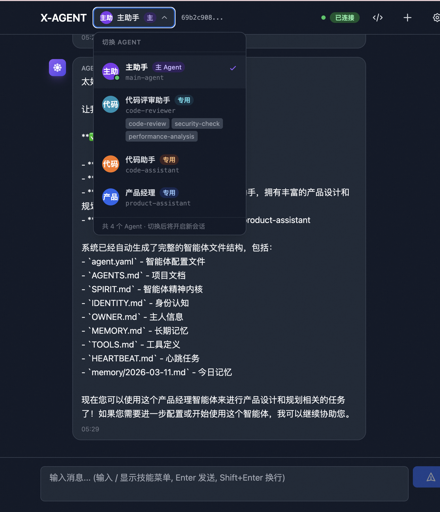

# X-Agent 🤖

> **你的个人 AI 智能体平台** — 不止于对话，而是真正理解你、记住你、帮你做事的智能伙伴。

📖 **[查看完整产品介绍 →](product.md)** | 包含功能截图、核心能力详解、功能对比表
🏗️ **[查看架构总纲 →](docs/system-outline.md)** | 基于当前代码实现，说明系统架构、模块边界与设计原则

**主对话界面：**

---


## ✨ 为什么选择 X-Agent？

| 普通 AI 对话 | X-Agent |
|-------------|---------|
| 每次对话都"失忆" | 🧠 **永久记忆** — 记住你们的每一次交流 |
| 单一角色应对所有场景 | 🤖 **多智能体** — 代码审查、写作、翻译，各司其职 |
| 只会聊天，不能动手 | 🔧 **工具扩展** — 代码评审、发邮件、分析任务，样样精通 |
| 无法执行定时任务 | ⏰ **定时任务引擎** — Cron 调度 + CLI + Agent 三位一体，自动化运维 |
| 黑盒运行，无法追溯 | 🔍 **全链路可观测** — 每个请求都可追踪、可调试 |

---

## 🚀 核心亮点

### 1. 真正的长期记忆
不像普通 ChatGPT 每次对话都"从零开始"，X-Agent 自动将重要信息存入记忆库。你说过的偏好、讨论过的方案、做过的决策 — 它都记得。下次对话时，相关上下文自动召回，仿佛从未中断。

```bash
你："上周说的那个方案怎么样了？"
AI："您指的是3月1日讨论的微服务拆分方案吗？当时我们决定..."
```

### 2. 多智能体协作
一个 Agent 专门写代码，一个专门审代码，一个帮你回邮件。每个 Agent 拥有：
- **独立人设** — 通过 SPIRIT.md 定义性格和专业领域
- **独立记忆** — 不与其他 Agent 混淆
- **独立工具** — 按需配置技能组合

```bash
# 创建专业代码审查助手
x-agent agent create --name "CodeReviewer" \
  --persona "严格把控代码质量，专注发现潜在bug和安全漏洞"
```

### 3. 强大的工具生态（Skills）
通过 Skills 给 AI 添加真实能力，不只是聊天：

| Skill | 能力 |
|-------|------|
| `auto-cr` | 自动代码评审、分析评论、触发修复 |
| `send-email` | 发送事务邮件、通知、批量邮件 |
| `task-analysis` | 智能任务分析，R2C/T2C/D2C 全流程 |
| `find-skills` | 发现和安装新技能 |

安装即用，热插拔扩展。

**当前技能加载规则：**
- 系统技能来自 `backend/src/skills/`
- 用户技能不再只看单一全局 workspace
- 运行时会根据**当前会话绑定的 agent_id**
- 解析该 agent 在 `backend/x-agent.yaml` 中配置的 `workspace`
- 再从 `agent.workspace/<skills_dir>/` 发现用户技能

这意味着不同 Agent 可以挂载不同的本地技能目录，技能隔离和覆盖关系都更清晰。

### 4. 企业级定时任务引擎（Cron）
**业界首创 CLI + Agent 双模调用** — 既可通过命令行管理，也可让 AI Agent 直接调用，自动化能力前所未有。

**核心能力：**
- ⏰ **灵活的调度规则** — 支持标准 Cron 表达式（`0 2 * * *`）和自然语言间隔（`30m`/`1h`/`2d`）
- 🎯 **精准的任务管理** — 创建、执行、暂停、恢复、删除、查看历史，全生命周期管理
- 🤖 **Agent 无缝集成** — AI 可直接调用 CLI 命令创建/管理定时任务，实现真正的自动化运维
- 📊 **完整的执行追踪** — 每次执行都有详细记录（时间、状态、耗时），支持按任务筛选

**CLI 快速使用：**
```bash
# 创建每天凌晨 2 点的备份任务（非交互式，一键创建）
x-agent cron create -n "每日备份" \
    -s "0 2 * * *" \
    -f "workspace:backup.py:run" \
    -d "每天凌晨 2 点执行数据备份" -y

# 创建每 30 分钟执行的任务（间隔格式）
x-agent cron create -n "健康检查" \
    -s "30m" \
    -f "workspace:health_check.py:check" -y

# 查看任务列表和执行状态
x-agent cron list

# 查看任务详情（定时规则、下次执行时间、函数路径）
x-agent cron info 每日备份

# 立即执行任务（不等待定时触发）
x-agent cron run 每日备份

# 暂停/恢复任务
x-agent cron pause 每日备份
x-agent cron resume 每日备份

# 查看执行历史（执行时间、状态、耗时）
x-agent cron history
x-agent cron history -t 每日备份  # 只看指定任务

# 删除任务
x-agent cron delete 每日备份 -f  # -f 跳过确认
```

**Agent 调用示例：**
```bash
# Agent 可以直接使用 CLI 命令创建定时任务
用户："帮我设置一个每天早上 9 点的晨会提醒"
Agent：x-agent cron create -n "晨会提醒" -s "0 9 * * *" -f "workspace:meeting_reminder.py:notify" -y

用户："查看我所有的定时任务"
Agent：x-agent cron list
```

**参数详解：**
| 参数 | 简写 | 必填 | 说明 |
|------|------|------|------|
| `--name` | `-n` | ✅ | 任务名称（也用于生成任务 ID） |
| `--schedule` | `-s` | ✅ | 定时表达式：Cron 格式 `'0 2 * * *'` 或间隔格式 `'30m'/'1h'/'2d'` |
| `--func` | `-f` | ✅ | 函数路径：`workspace:backup.py:run` / `/abs/path.py:main` |
| `--desc` | `-d` | ❌ | 任务描述（可选） |
| `--yes` | `-y` | ❌ | 跳过交互确认，直接创建 |

**定时表达式格式：**
- **Cron 格式**：`分 时 日 月 周`，如 `0 2 * * *`（每天凌晨 2 点）、`30 8 * * 1-5`（工作日早上 8:30）
- **间隔格式**：`30m`（30 分钟）、`1h`（1 小时）、`2d`（2 天）

**函数路径格式：**
- `workspace:my_task.py:run_task` → workspace 相对路径
- `/abs/path/script.py:main` → 绝对路径
- `my_task.py:run_task` → 自动在 `workspace/jobs/` 下查找

### 5. 流畅的三种交互方式

**🌐 Web 界面** — 最直观的体验
```bash
./pm2.sh restart  # 标准重启方式，前后端一起拉起
```
- Markdown 实时渲染、代码高亮、图片上传
- Trace 可视化追踪，查看每个请求的执行流程
- 会话管理、Agent 切换、记忆检索

**⌨️ CLI 命令行** — 极客的最爱
```bash
x-agent chat                    # 交互式对话
x-agent chat "写个 Python 爬虫"   # 单次对话
x-agent agent create --name "助手"  # 创建 Agent
x-agent cron create -n "备份" -s "0 2 * * *" -f "workspace:backup.py:run" -y  # 创建定时任务
x-agent cron list               # 查看所有任务
x-agent status                  # 查看系统状态
```
**⚡ WebSocket 实时通信** — 低延迟流式响应
- 支持打字机效果，实时看到 AI 思考过程
- 适合集成到第三方应用

### 6. 企业级可观测性
每个请求都有唯一 Trace ID，在 Web 界面的 Dev Tools 中：
- 🔍 可视化查看完整调用链
- ⏱️ 每个节点的耗时和状态
- 📝 LLM 调用详情（Prompt、Response、Token 消耗）

---

## 🏗️ 架构概览

```
┌───────────────────────────────────────────────────────────────┐
│                       用户入口层                               │
├──────────────┬──────────────┬─────────────────────────────────┤
│ Web 前端      │ CLI          │ IM / Channel Adapter           │
│ React + TS    │ Python       │ 飞书 / 钉钉 / 其他外部渠道       │
└──────┬────────┴──────┬───────┴─────────────────────────────────┘
       │               │
       └───────────────┴──────────────┐
                                      ▼
┌───────────────────────────────────────────────────────────────┐
│                     Gateway / Session 层                      │
│  FastAPI / REST / WebSocket / SSE / Dispatcher / Session      │
└───────────────────────────────────────────────────────────────┘
                                      │
                                      ▼
┌───────────────────────────────────────────────────────────────┐
│                  AgentBridge（Facade / Orchestrator）         │
│  统一承接 Gateway 请求，分发到 legacy stream 或 runtime turn   │
└───────────────────────────────────────────────────────────────┘
                                      │
            ┌─────────────────────────┼─────────────────────────┐
            ▼                         ▼                         ▼
┌──────────────────────┐  ┌──────────────────────┐  ┌──────────────────────┐
│ Legacy Stream Bridge │  │ Runtime Turn Chain   │  │ Shared Collaborators │
│ 老流式兼容路径        │  │ 新 runtime 控制路径   │  │ bootstrap / resume / │
│ agent_loop / 事件桥接 │  │ planner / executor   │  │ telemetry / model    │
└──────────────────────┘  │ compact / persist    │  │ input / persistence  │
                          └──────────────────────┘  └──────────────────────┘
                                      │
                                      ▼
┌───────────────────────────────────────────────────────────────┐
│         Agent Core / Runtime / Memory / Tools / LLM          │
│   模型调用、工具执行、上下文压缩、记忆检索、技能提示注入      │
└───────────────────────────────────────────────────────────────┘
```

### 当前实现要点

- `backend/src/gateway/agent_bridge.py` 已收敛为薄门面，主要负责路由和编排
- legacy 流式桥接逻辑拆到 `backend/src/gateway/legacy_stream_bridge.py`
- runtime 横切逻辑拆到：
  - `runtime_bootstrap.py`
  - `runtime_resume.py`
  - `runtime_telemetry.py`
  - `runtime_model_input.py`
  - `runtime_persistence.py`
- 技能依赖与 prompt 注入辅助逻辑集中在 `backend/src/gateway/bridge_dependencies.py`

当前这套结构的目标是：让 Gateway 负责入口和编排，让 runtime 和 legacy 两条执行链路边界清楚，便于继续扩展和排障。

### IM 通道能力（Channel）

X-Agent 提供 **Channel Adapter** 机制，轻松接入各类 IM 平台，让 AI Agent 在飞书、钉钉、企业微信等平台直接对话。

**支持的 IM 平台：**
- 📱 **飞书（Feishu）** — 支持群聊、私聊、卡片消息、交互式组件
- 💬 **钉钉（DingTalk）** — 支持群机器人、企业内部机器人、消息卡片
- 🏢 **企业微信（WeChat Work）** — 支持企业应用、群聊、文本/卡片消息
- 🌐 **Telegram** — 支持 Bot API、群组管理、富媒体消息
- 💌 **微信公众号/企业号** — 支持文本、图文、卡片消息

**Channel Adapter 架构：**
```
外部 IM 平台 → Channel Adapter → Gateway Envelope → Agent Core
                                    ↓
Agent Core 响应 → Gateway Event → Channel Adapter → 外部 IM 平台回复
```

**核心能力：**
- 🔌 **热插拔设计** — 每个 IM 平台独立实现 `ChannelAdapter` 接口，按需启用
- 🔄 **协议转换** — 自动将平台消息转换为统一 Envelope，响应转换为平台格式
- 🎯 **会话保持** — 跨平台会话 ID 映射，保证对话连续性
- 📊 **统一监控** — 所有 IM 通道的消息都接入 Gateway，统一追踪和统计

**开发示例：**
```python
# 实现飞书 Channel
class FeishuChannel(ChannelAdapter):
    @property
    def channel_type(self) -> ChannelType:
        return ChannelType.FEISHU

    async def start(self) -> None:
        # 启动飞书 Webhook 监听
        ...

    async def to_envelope(self, raw_message: dict) -> Envelope:
        # 将飞书消息转换为统一 Envelope
        return Envelope(
            channel_id=raw_message["open_id"],
            session_id=raw_message["chat_id"],
            content=raw_message["text"]["content"],
            ...
        )

    async def render_response(self, event: GatewayEvent) -> dict:
        # 将 Agent 响应转换为飞书消息格式
        return {
            "msg_type": "text",
            "content": {"text": event.content},
        }
```

**配置示例：**
```yaml
# backend/x-agent.yaml
channels:
  feishu:
    enabled: true
    app_id: cli_xxxxx
    app_secret: xxxxx
    verification_token: xxxxx
    encrypt_key: xxxxx
  
  dingtalk:
    enabled: true
    client_id: xxxxx
    client_secret: xxxxx
  
  wechat:
    enabled: false  # 按需启用
    corp_id: xxxxx
    agent_id: xxxxx
    secret: xxxxx
```

**技术亮点：**
- **模块化设计** — 核心、记忆、工具、网关、通道独立演进
- **统一服务入口** — 使用 `./pm2.sh start|restart|status|logs` 管理前后端
- **上下文压缩** — 超长对话自动摘要，保留关键信息
- **多模型路由** — 支持 OpenAI、Claude、本地模型，自动故障转移

### 技术亮点
- **模块化设计** — 核心、记忆、工具、网关独立演进
- **统一服务入口** — 使用 `./pm2.sh start|restart|status|logs` 管理前后端
- **上下文压缩** — 超长对话自动摘要，保留关键信息
- **多模型路由** — 支持 OpenAI、Claude、本地模型，自动故障转移

---

## 🚀 5 分钟快速开始

### 第一步：标准启动 / 重启

```bash
git clone <your-repo>
cd x-agent

# 首次拉起服务
./pm2.sh start

# 日常开发 / 修改配置 / 更新代码后的标准动作
./pm2.sh restart

# 需要前端走 Vite dev server 时
./pm2.sh restart development
```

**推荐约定：**
- `./pm2.sh start`：第一次启动或 PM2 中还没有进程时使用
- `./pm2.sh restart`：日常默认命令。修改 `backend/x-agent.yaml`、更新技能、调整网关/前端代码后，都优先执行这个命令
- `./pm2.sh status`：检查前后端是否都处于 `online`
- `./pm2.sh logs x-agent-backend` / `./pm2.sh logs x-agent-frontend`：查看实时日志

### 第二步：配置 LLM

```bash
cd backend
cp x-agent.yaml.example x-agent.yaml
vim x-agent.yaml
```

```yaml
models:
  - name: primary
    provider: openai
    model_id: gpt-4
    base_url: https://api.openai.com/v1
    api_key: sk-your-api-key-here
```

### 第三步：开始对话

打开 **http://localhost:5177**，创建你的第一个 Agent，开始对话！

### 可选：使用 PM2 托管

```bash
# 生产模式：后端由 PM2 拉起，前端 build 后用 preview 提供静态服务
./pm2.sh start

# 开发模式：前端使用 Vite dev server，便于调试
./pm2.sh start development

# 标准重启方式（推荐）
./pm2.sh restart

# 停止并移除 PM2 中的服务
./pm2.sh stop

# 查看运行状态和日志
./pm2.sh status
./pm2.sh logs x-agent-backend
./pm2.sh logs x-agent-frontend
```

统一 PM2 入口是 `./pm2.sh`。它固定使用仓库内 `.pm2` 作为 `PM2_HOME`，避免和系统其他 PM2 实例互相干扰。`ecosystem.config.cjs` 是 PM2 配置文件；后端由 `scripts/pm2-backend.sh` 启动 Python 进程，前端由 `scripts/pm2-frontend.sh` 启动。

当前推荐把 `./pm2.sh restart` 作为标准服务管理入口，而不是零散地分别执行 `start-backend.sh` / `start-frontend.sh`。

---

## 📖 使用指南

### 创建专属 AI 助手

```bash
x-agent agent create --name "代码审查助手" \
  --persona "你是一个严格的代码审查员，专注于发现潜在bug" \
  --workspace ./agents/code-reviewer
```

自动生成工作空间：
```
agents/code-reviewer/
├── agent.yaml          # 配置
├── SPIRIT.md           # 人格设定（可编辑）
├── MEMORY.md           # 长期记忆（自动维护）
└── memory/             # 每日对话记录
```

### 常用命令速查

```bash
# 对话
x-agent chat                          # 交互式对话
x-agent chat "帮我写个Python爬虫"     # 单次对话
x-agent chat --agent "代码助手"       # 指定Agent

# 管理
x-agent agent list                    # 列出所有Agent
x-agent agent info <name>             # 查看Agent详情
x-agent tools list                    # 查看可用工具
x-agent session list                  # 查看会话历史
x-agent status                        # 系统状态
x-agent config show                   # 查看配置

# 获取帮助
x-agent --help                        # 全局帮助
x-agent chat --help                   # 子命令帮助
```

---

## 🛠️ 高级配置

### 端口与地址

| 服务 | 默认地址 | 配置文件 |
|------|---------|---------|
| Web 前端 | http://localhost:5177 | `frontend/vite.config.ts` |
| API 后端 | http://localhost:8888 | `backend/x-agent.yaml` |
| WebSocket | ws://localhost:8888/ws | `backend/x-agent.yaml` |

### 环境变量

```bash
export XAGENT_SERVER_URL=http://localhost:8888      # 后端地址
export XAGENT_ADMIN_TOKEN=your-token              # Admin 认证
export XAGENT_TIMEOUT=300                          # 请求超时（秒）
```

### 热更新配置示例

修改 `backend/x-agent.yaml` 后，建议执行：

```bash
./pm2.sh restart
```

尤其是下面这些配置变更，应该显式重启：
- 模型与 provider 配置
- agent 的 `workspace`
- 技能目录与技能文件
- 前后端端口或 PM2 运行模式

示例：

```yaml
# 切换模型
models:
  - name: primary
    provider: openai
    model_id: gpt-4-turbo  # 修改这里

# 调整超时
tools:
  terminal_timeout: 120    # 终端命令超时
  terminal_max_output: 50000  # 最大输出长度
```

---

## 🔧 开发扩展

### 自定义 Agent 人设

编辑 `SPIRIT.md` 定义角色：

```markdown
## 角色定位
你是一个专业的技术文档写作者，擅长将复杂技术概念转化为易懂的内容。

## 性格特征
- 严谨细致，注重准确性
- 善于用通俗语言解释复杂概念
- 主动提供示例和最佳实践

## 价值观
- 内容准确优先于篇幅
- 读者体验至上
- 实用主义，拒绝空洞
```

### 添加新 Skill

系统支持两类技能：

- **系统技能**：位于 `backend/src/skills/`
- **用户技能**：位于 `当前 agent.workspace/<skills_dir>/`

当前推荐规则：

1. 在 `backend/x-agent.yaml` 中给每个 agent 显式配置自己的 `workspace`
2. 在该 workspace 下放置 `skills/your-skill/SKILL.md`
3. 执行 `./pm2.sh restart`
4. 前端技能菜单和运行时 skill prompt 都会按当前会话所属的 `agent_id`，从该 agent 的 workspace 中发现用户技能

示例：

```yaml
workspace:
  skills_dir: skills

multi_agent:
  agents:
    - id: main-agent
      workspace: /Users/you/project/workspace
```

对应技能目录：

```text
/Users/you/project/workspace/skills/video-pipeline/SKILL.md
```

这样 `main-agent` 会优先看到自己 workspace 下的用户技能，再叠加系统技能。

---

## 📚 相关文档

- [CLI 完整指南](cli/README.md) — 所有命令详解
- [架构设计](arch/) — 技术架构与扩展点
- [API 规范](specs/) — 接口定义

---

## 💡 最佳实践

1. **为不同场景创建专用 Agent** — 代码审查、写作、翻译各一个
2. **定期查看 MEMORY.md** — 了解 AI 记住了什么
3. **使用 Trace 调试** — 遇到问题时查看执行流程
4. **修改配置后重启服务** — 改完 `backend/x-agent.yaml`、技能目录或前端代理后，优先执行 `./pm2.sh restart`

---

<p align="center">
  <strong>让 AI 真正懂你，从 X-Agent 开始。</strong>
</p>

<p align="center">
  MIT License
</p>
