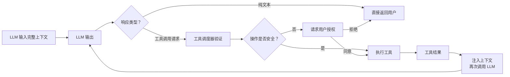
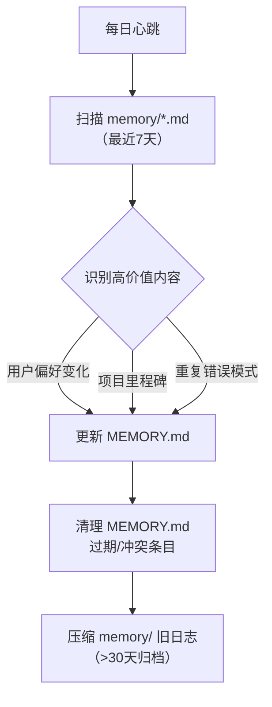

以下是基于 `AGENTS.md` 行为规范设计的 **Agent 请求处理全生命周期流程图**，清晰展示每次用户请求时各模块的交互时序与决策逻辑：

```mermaid
flowchart TD
    A[用户新请求到达] --> B{会话类型判断}
    
    B -->|主会话<br/>（与OWNER私聊）| C[初始化上下文]
    B -->|共享上下文<br/>（群聊/第三方）| D[安全沙箱初始化]
    
    C --> C1[读取 SPIRIT.md]
    C1 --> C2[读取 OWNER.md]
    C2 --> C3[读取 MEMORY.md<br/>（长期记忆）]
    C3 --> C4[读取 memory/今日+昨日.md<br/>（短期记忆）]
    C4 --> E[混合记忆检索]
    
    D --> D1[仅读取 SPIRIT.md<br/>（禁用 MEMORY.md）]
    D1 --> D2[读取 memory/今日.md<br/>（仅限当日）]
    D2 --> E
    
    E[混合记忆检索<br/>（向量+关键词）] --> E1[重排序 top-k]
    E1 --> F[上下文组装器]
    
    F --> F1[系统角色: SPIRIT.md]
    F1 --> F2[用户画像: OWNER.md]
    F2 --> F3[长期记忆: MEMORY.md 精炼摘要]
    F3 --> F4[检索记忆: top-k 条]
    F4 --> F5[短期对话: 最近3轮]
    F5 --> F6[当前用户输入]
    
    F6 --> G[LLM 推理决策]
    
    G --> H{是否需要工具？}
    
    H -->|否| I[生成最终响应]
    H -->|是| J[工具调度器]
    
    J --> J1[查阅 SKILL.md<br/>匹配可用技能]
    J1 --> J2{操作类型判断}
    
    J2 -->|安全操作<br/>（读/查/整理）| J3[直接执行工具]
    J2 -->|需授权操作<br/>（发邮件/删文件）| J4[向用户请求确认]
    J4 -->|用户同意| J3
    J4 -->|用户拒绝| I
    
    J3 --> J5[工具执行结果]
    J5 --> K[工具结果注入上下文]
    K --> G
    
    I --> L[响应输出]
    
    L --> M{是否值得记忆？}
    
    M -->|是| N[写入 memory/今日.md<br/>（原始日志）]
    M -->|否| O[结束本次请求]
    
    N --> P{是否需提炼？}
    
    P -->|是| Q[异步：定期摘要任务]
    P -->|否| O
    
    Q --> Q1[回顾近期 memory/*.md]
    Q1 --> Q2[识别重要事件/偏好/教训]
    Q2 --> Q3[更新 MEMORY.md<br/>（长期记忆精华）]
    Q3 --> Q4[清理过期记忆]
    Q4 --> O
    
    O --> R[本次请求完成]
    
    %% 后台任务（独立心跳触发）
    S[每日心跳任务] -.-> T[记忆维护流程]
    T -.-> Q
    
    classDef main fill:#e1f5fe,stroke:#01579b
    classDef safe fill:#f3e5f5,stroke:#4a148c
    classDef memory fill:#e8f5e8,stroke:#1b5e20
    classDef tool fill:#fff3e0,stroke:#e65100
    classDef async fill:#f5f5f5,stroke:#616161,stroke-dasharray: 5 5
    
    class C,C1,C2,C3,C4,E,E1,F,F1,F2,F3,F4,F5,F6,G,H,I,J,J1,J2,J3,J4,J5,K,L,M,N,O,R main
    class D,D1,D2 safe
    class E,E1,Q,Q1,Q2,Q3,Q4 memory
    class J,J1,J2,J3,J4,J5,K tool
    class S,T,Q async
```



---

## 🔑 核心交互阶段详解

### 阶段 1：上下文初始化（每次请求必做）
| 步骤 | 主会话 | 共享上下文 | 说明 |
|------|--------|------------|------|
| 读 `SPIRIT.md` | ✅ | ✅ | 身份与气质基础 |
| 读 `OWNER.md` | ✅ | ❌ | 仅主会话加载用户画像 |
| 读 `MEMORY.md` | ✅ | ❌ | **安全红线**：共享上下文禁用长期记忆 |
| 读 `memory/今日+昨日.md` | ✅ | ✅（仅今日） | 短期记忆降级使用 |

> 💡 **安全设计**：`AGENTS.md` 明确要求共享上下文中禁止加载 `MEMORY.md`，流程图通过分支隔离实现此约束。

---

### 阶段 2：记忆检索 → 上下文组装
```python
# 伪代码：上下文组装器
def build_context(user_input, session_type):
    context = []
    context.append(load("SPIRIT.md"))  # 系统角色
    
    if session_type == "main":
        context.append(load("OWNER.md"))          # 用户画像
        context.append(summarize(MEMORY.md, k=5)) # 长期记忆摘要
    
    # 混合检索：向量 + 关键词
    retrieved = hybrid_search(
        query=user_input,
        sources=["MEMORY.md", "memory/*.md"],
        top_k=5
    )
    context.append(f"【相关记忆】\n{retrieved}")
    
    # 短期对话历史（滑动窗口）
    context.append(get_last_n_turns(n=3))
    
    context.append(f"用户当前输入：{user_input}")
    return "\n\n".join(context)
```

---

### 阶段 3：LLM 决策循环（带工具调用）


> ✅ **关键设计**：工具调用采用 **ReAct 模式**（Reason + Act），LLM 可多次迭代直至生成最终响应。

---

### 阶段 4：记忆写入策略（异步优先）
| 事件类型 | 写入位置 | 时机 | 示例 |
|----------|----------|------|------|
| 用户明确指令 | `memory/今日.md` | 同步 | “记住我明天开会” → 立即记录 |
| 重要偏好/决策 | `memory/今日.md` | 同步 | “我讨厌 Redux” → 记录原始语句 |
| 经验教训/洞察 | `memory/今日.md` | 同步 | “这次调试发现缓存问题” |
| **长期记忆提炼** | `MEMORY.md` | **异步**（每日心跳） | 每日汇总“用户偏好”“项目进展” |

> 💡 **拒绝“脑记”原则**：所有需保留的信息必须写入文件，**绝不依赖 LLM 的临时上下文记忆**。

---

## ⚙️ 后台维护任务（独立心跳触发）



---

## ✅ 与 `AGENTS.md` 规范的对齐

| 规范要求 | 流程图实现 |
|----------|------------|
| 主会话加载 `MEMORY.md` | 阶段1 分支判断 |
| 共享上下文禁用长期记忆 | 阶段1 安全沙箱分支 |
| “动手写下来”原则 | 阶段4 强制文件写入 |
| 优先 `trash` 而非 `rm` | 工具调度器内置安全策略 |
| 避免三连击 | LLM 输出层合并碎片响应 |
| 表情反应轻量社交 | 响应生成后附加（非核心流程） |

---

## 💎 一句话总结架构哲学

> **“初始化时加载记忆，推理前检索记忆，响应后沉淀记忆，后台定期提炼记忆”** —— 让记忆流动起来，而非静态堆砌，才能实现 `AGENTS.md` 所倡导的“有灵魂的连续性”。