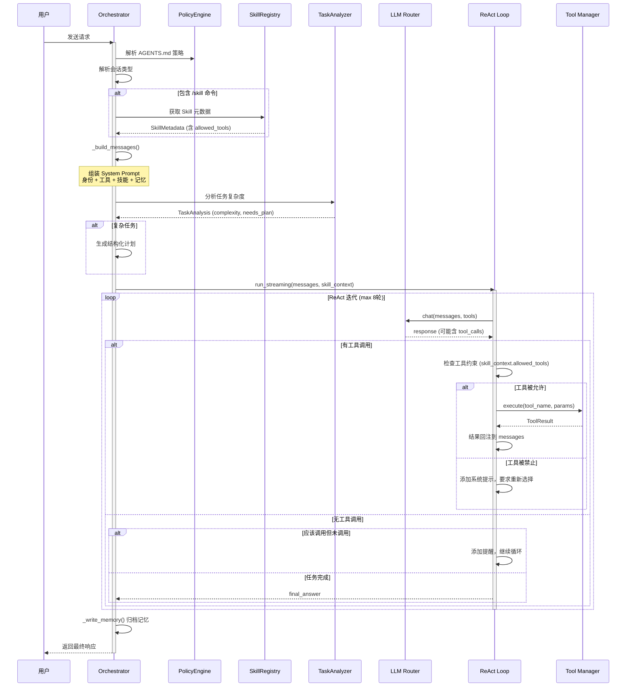

我来分析当前项目的 Agentic 编排流程。首先让我搜索相关的核心代码和架构文档。
让我继续深入分析 ReAct Loop、工具管理和 LLM 路由的实现细节。
现在让我查看 Skill Registry 的实现和更多工具定义：
现在我已经收集了足够的信息，让我为您生成一份完整的 Agentic 编排流程分析报告。

---

## X-Agent Agentic 编排流程分析报告

### 一、整体架构概览

X-Agent 采用 **三层规范架构** 设计：

| 层级 | 载体 | 控制方 | 更新方式 |
|------|------|--------|----------|
| **硬约束层** | Orchestrator 执行逻辑 | 系统 | `AGENTS.md` 热重载 |
| **软引导层** | System Prompt | LLM | 每次请求注入 |
| **身份层** | `SPIRIT.md` / `OWNER.md` | 混合 | 文件变更热重载 |

核心流程图：

```
用户请求 → Orchestrator → 任务分析 → [计划生成] → ReAct Loop → LLM决策
                                              ↓
                                        工具调用/Skill调用
                                              ↓
                                        结果回注 → 循环直至完成
```

---

### 二、核心编排组件详解

#### 1. Orchestrator 引擎 ([`engine.py`](file:///Users/xuan.lx/Documents/x-agent/x-agent/backend/src/orchestrator/engine.py))

**初始化流程：**
```python
# 核心组件初始化
self.policy_engine = PolicyEngine(workspace_path)      # AGENTS.md 策略解析
self.session_guard = SessionGuard()                    # 会话安全
self.response_guard = ResponseGuard()                  # 响应后处理
self._llm_router = LLMRouter(config.models)           # LLM 路由
self._tool_manager = get_tool_manager()               # 工具管理
self._react_loop = ReActLoop(llm_router, tool_manager) # ReAct 循环
self._skill_registry = SkillRegistry(workspace_path)   # Skill 注册表
```

**主处理流程** (`process_request`)：
1. **Skill 命令解析** - 检测 `/skill_name args` 格式
2. **Fast Path 执行** - CLI 风格命令直接执行
3. **上下文构建** - 加载 SPIRIT.md、OWNER.md、MEMORY.md
4. **混合检索** - 向量+关键词检索相关记忆
5. **任务分析** - TaskAnalyzer 判断复杂度
6. **计划生成** - 复杂任务生成结构化计划
7. **ReAct 执行** - LLM 自循环推理
8. **记忆写入** - 归档到 memory/今日.md

---

#### 2. System Prompt 组装流程 ([`_build_messages`](file:///Users/xuan.lx/Documents/x-agent/x-agent/backend/src/orchestrator/engine.py#L1185))

**组装顺序：**

```python
system_parts = [
    # 1. P0 级行为准则 (来自 AGENTS.md)
    guidelines,  # build_system_prompt_guidelines()
    
    # 2. 身份定义
    f"你的名字是「{context.identity.name}」",
    f"你是{context.spirit.role}",
    f"用户画像: {context.owner.name}",
    
    # 3. 工具声明
    f"可用工具: {tool_names}",
    
    # 4. 工作目录与文件分类
    f"工作目录: {self.workspace_path}",
    "文件分类存储规则...",
    
    # 5. 时间敏感指令
    "当用户询问包含'今天'的问题时，必须调用 get_current_time...",
    
    # 6. 技能声明 (Phase 2)
    f"可用技能: {skill_descriptions}",
    "技能使用说明...",
    
    # 7. 特殊绑定规则 (如 pptx 技能)
    "⚠️ 关键规则：pptx 技能专用工具...",
    
    # 8. 计划状态 (如适用)
    plan_state.to_prompt(),
    
    # 9. 相关记忆
    relevant_memories,
]

# 最终合并
system_message = {"role": "system", "content": "\n\n".join(system_parts)}
```

---

#### 3. ReAct Loop 实现 ([`react_loop.py`](file:///Users/xuan.lx/Documents/x-agent/x-agent/backend/src/orchestrator/react_loop.py))

**核心循环逻辑：**

```python
for iteration in range(max_iterations):  # 默认 8 轮
    # 1. 调用 LLM (带 tools 参数启用 Function Calling)
    response = await llm_router.chat(messages, tools=openai_tools)
    
    # 2. 提取工具调用
    tool_calls = self._extract_tool_calls(response)
    
    if tool_calls:
        # 3. 工具约束检查 (Phase 2)
        if skill_context and tool_name not in skill_context.allowed_tools:
            # 阻止调用，提示 LLM 重新选择
            continue
            
        # 4. 执行工具
        result = await tool_manager.execute(tool_name, args, skill_context)
        
        # 5. 结果回注
        messages.append({"role": "tool", "content": result.output})
        
    else:
        # 6. 检查是否需要工具但未调用
        if self._requires_tool_call_but_none_made(messages):
            # 添加系统提示，要求 LLM 调用工具
            continue
            
        # 7. 最终答案
        yield {"type": "final_answer", "content": response.content}
        return
```

**工具调用提取支持：**
- OpenAI 标准 Function Calling 格式
- XML 格式 (`<function=name><parameter=key>value</parameter></function>`)

---

#### 4. LLM 路由系统 ([`router.py`](file:///Users/xuan.lx/Documents/x-agent/x-agent/backend/src/services/llm/router.py))

**故障转移机制：**

```python
providers_to_try = [primary] + backups  # 主备切换

for provider in providers_to_try:
    # 1. 熔断器检查
    if not await breaker.can_execute():
        continue
    
    # 2. 健康检查
    if not await provider.health_check():
        continue
    
    # 3. 执行请求
    result = await provider.chat(messages, stream=stream, tools=tools)
    
    # 4. 记录统计和日志
    await breaker.record_success()
    prompt_logger.log_interaction(...)
    
    return result
```

**支持的 Provider：**
- OpenAI Provider
- Bailian (阿里云百炼) Provider

---

#### 5. 工具管理系统 ([`manager.py`](file:///Users/xuan.lx/Documents/x-agent/x-agent/backend/src/tools/manager.py))

**内置工具列表：**

| 工具 | 功能 |
|------|------|
| `read_file` | 读取文件内容 |
| `write_file` | 写入文件 |
| `list_dir` | 列出目录 |
| `search_files` | 文件搜索 |
| `run_in_terminal` | 执行终端命令 |
| `get_terminal_output` | 获取后台进程输出 |
| `kill_process` | 终止进程 |
| `get_current_time` | 获取当前时间 |
| `aliyun_web_search` | 阿里云网页搜索 |
| `fetch_web_content` | 获取网页内容 |

**工具约束检查 (Phase 2)：**
```python
if skill_context and skill_context.allowed_tools:
    if tool_name not in skill_context.allowed_tools:
        raise ToolNotAllowedError(
            f"Tool '{tool_name}' is not allowed by skill '{skill_context.name}'"
        )
```

---

#### 6. Skill 系统 ([`skill_registry.py`](file:///Users/xuan.lx/Documents/x-agent/x-agent/backend/src/services/skill_registry.py))

**Skill 发现路径 (优先级高→低)：**
1. User-level: `workspace/skills/` (配置中指定)
2. System-level: `backend/src/skills/`

**Skill 元数据结构：**
```python
@dataclass
class SkillMetadata:
    name: str
    description: str
    path: Path
    has_scripts: bool          # 是否有可执行脚本
    has_references: bool       # 是否有参考资料
    has_assets: bool           # 是否有资源文件
    allowed_tools: list[str]   # 允许使用的工具列表 (Phase 2)
    user_invocable: bool       # 用户是否可直接调用
    argument_hint: str         # 参数提示
```

**Skill 调用链路：**
```
用户输入: /pptx create presentation.pptx
    ↓
解析 skill_name + arguments
    ↓
判断是否为 CLI 命令 → Fast Path 直接执行
    ↓
否则 → 加载 Skill 上下文 → ReAct Loop 执行
    ↓
工具约束检查 (allowed_tools)
    ↓
执行完成
```

---

#### 7. 策略引擎 ([`policy_engine.py`](file:///Users/xuan.lx/Documents/x-agent/x-agent/backend/src/orchestrator/policy_engine.py))

**AGENTS.md 解析：**
- **硬约束** (`hard_constraints`): 由 Orchestrator 强制执行
- **软引导** (`soft_guidelines`): 注入 System Prompt
- **身份规则** (`identity_rules`): 首次启动等

**System Prompt 指南构建：**
```python
def build_system_prompt_guidelines():
    parts = ["# 行为准则", "以下是你需要遵循的行为规范（P0级硬约束）："]
    
    # 提取 P0 标记的规则
    for rule in policy.hard_constraints + policy.soft_guidelines:
        if has_p0_marker(rule.source_section):
            parts.append(rule.prompt_text)
    
    return "\n".join(parts)[:800]  # 长度限制
```

---

### 三、完整请求时序图



---

### 四、优化建议

#### 1. **Prompt 组装优化**
- **现状**: System Prompt 在每次请求时动态组装，部分内容重复计算
- **建议**: 
  - 缓存不变的组件（如工具列表、技能列表）
  - 使用模板引擎预编译常用 Prompt 片段
  - 对 AGENTS.md 的 P0 规则建立索引，避免全量扫描

#### 2. **ReAct Loop 优化**
- **现状**: 固定 8 轮迭代上限，部分简单任务可能浪费轮次
- **建议**:
  - 根据任务复杂度动态调整 max_iterations
  - 引入早期退出机制（如检测到任务完成信号）
  - 优化工具调用失败的 retry 策略

#### 3. **Skill 调用链路优化**
- **现状**: Fast Path 和 ReAct Path 的判断逻辑较复杂
- **建议**:
  - 统一 Skill 调用接口，简化路径判断
  - Skill 元数据增加 `invocation_mode` 字段显式声明调用方式
  - 建立 Skill 调用缓存，避免重复解析 SKILL.md

#### 4. **工具约束优化**
- **现状**: 工具约束检查在 ReAct Loop 和 ToolManager 两处进行
- **建议**:
  - 统一约束检查入口，避免重复逻辑
  - 支持更细粒度的约束（如参数级别、路径级别）
  - 约束变更时实时通知 LLM（通过 system message）

#### 5. **LLM 调用优化**
- **现状**: 每次迭代都传递完整 messages 历史
- **建议**:
  - 引入上下文压缩机制（已部分实现）
  - 对早期轮次进行摘要，减少 Token 消耗
  - 根据工具调用结果智能选择是否携带完整历史

#### 6. **可观测性优化**
- **现状**: 日志分散在多个组件
- **建议**:
  - 建立统一的 Trace 系统，追踪完整调用链
  - 增加 Prompt/Response 的持久化存储
  - 提供可视化调试界面（Trace Viewer）