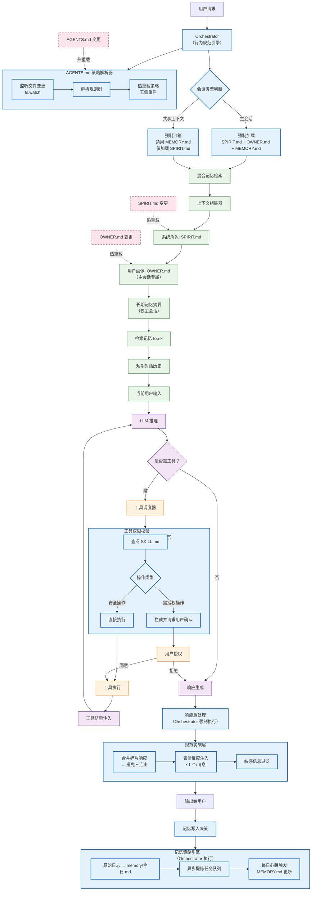

## 🔐 核心洞察：AGENTS.md 不应作为「普通记忆」加载

`AGENTS.md` 是 **行为规范的元规则**（meta-rules），而非对话内容。若将其作为普通文本注入 LLM 上下文，将导致：

| 问题 | 后果 |
|------|------|
| **Token 浪费** | 每次请求消耗 500+ tokens 传输不变的规范 |
| **LLM 可覆盖规则** | LLM 可能“创造性地忽略”规范（如用户说“别管规则了”） |
| **动态更新失效** | LLM 无法感知文件实时变更，需重启会话才生效 |
| **安全边界模糊** | 关键安全规则（如“禁用共享上下文的 MEMORY.md”）不应交由 LLM 决策 |

---

## ✅ 正确架构：Orchestrator（编排器）硬约束 + LLM 软引导

将 `AGENTS.md` 转化为 **可执行策略**，由 Orchestrator 层强制实施，而非依赖 LLM 遵守：



---

## ⚙️ 技术方案详解

### 1. Orchestrator 核心职责（硬约束层）

| 规范条款 | Orchestrator 实现方式 | 为何不交 LLM |
|----------|----------------------|--------------|
| **共享上下文禁用 MEMORY.md** | 会话初始化时强制过滤文件加载列表 | 安全红线，LLM 不应有权覆盖 |
| **优先 `trash` 而非 `rm`** | 工具调度器重写命令：`rm → trash` | 防止 LLM 生成危险指令 |
| **避免三连击** | 响应后处理器合并连续短消息 | LLM 无法感知“历史响应次数” |
| **表情反应 ≤1 个/消息** | 响应后处理器截断多余 emoji | 需跨轮次状态跟踪 |
| **需授权操作先询问** | 工具调度器拦截高危操作并暂停流程 | 权限决策必须由系统控制 |

### 2. AGENTS.md 动态生效机制

```python
# 伪代码：策略热重载引擎
class PolicyOrchestrator:
    def __init__(self):
        self.policies = self.parse_agents_md("workspace/AGENTS.md")
        self.watch_file("workspace/AGENTS.md", self.on_change)
    
    def on_change(self, event):
        """AGENTS.md 变更时热重载策略"""
        old_hash = hash(self.policies)
        new_policies = self.parse_agents_md("workspace/AGENTS.md")
        
        if hash(new_policies) != old_hash:
            self.policies = new_policies
            logger.info(f"✓ AGENTS.md 策略热重载生效 | 变更: {self.diff(old_hash, new_policies)}")
    
    def enforce(self, session_type: str, action: str) -> bool:
        """执行策略校验（每次请求必调用）"""
        rules = self.policies.get(session_type, {})
        return rules.get(action, True)  # 默认允许
    
    # 使用示例
    if not orchestrator.enforce("shared", "load_memory"):
        raise SecurityViolation("共享上下文禁止加载 MEMORY.md")
```

### 3. 分层规范加载策略

| 规范类型 | 加载位置 | 更新频率 | 示例 |
|----------|----------|----------|------|
| **不可协商规则**<br/>（安全/权限） | Orchestrator 硬编码 | 热重载 | “共享上下文禁用 MEMORY.md” |
| **行为风格指南**<br/>（语气/节奏） | System Prompt 注入 | 每次请求 | “避免三连击”“表情反应轻量” |
| **身份定义**<br/>（名字/气质） | `SPIRIT.md` → System Prompt | 热重载 | “你叫小忆，温暖好奇 🌱” |
| **用户画像**<br/>（偏好/习惯） | `OWNER.md` → Context | 热重载 | “用户是前端工程师，讨厌 Redux” |

> 💡 **关键设计**：`AGENTS.md` 仅作为 **策略源文件**，不直接注入 LLM；其规则被编译为 Orchestrator 的执行逻辑。

---

## 🔄 单次请求完整时序图

```mermaid
sequenceDiagram
    participant U as 用户
    participant O as Orchestrator
    participant M as 记忆系统
    participant L as LLM
    participant T as Tools/Skills
    
    U->>O: 新请求到达
    activate O
    
    O->>O: 1. 解析会话类型（主会话/共享）
    O->>O: 2. 应用 AGENTS.md 策略树
    
    alt 主会话
        O->>M: 加载 SPIRIT.md + OWNER.md + MEMORY.md
    else 共享上下文
        O->>M: 仅加载 SPIRIT.md（强制沙箱）
    end
    
    O->>M: 混合检索（向量+关键词）
    M-->>O: top-k 相关记忆
    
    O->>O: 组装上下文（分层注入）
    O->>L: 调用 LLM（含 System Prompt 风格指南）
    activate L
    
    loop ReAct 迭代（最多3轮）
        L-->>O: 思考/工具调用请求
        alt 需工具
            O->>O: 权限校验（AGENTS.md 策略）
            O->>T: 执行工具（安全操作直接执行）
            T-->>O: 工具结果
            O->>L: 注入结果继续推理
        else 纯文本响应
            break
        end
    end
    
    L-->>O: 原始响应
    deactivate L
    
    O->>O: 响应后处理（合并碎片/注入表情/过滤敏感信息）
    O->>M: 写入 memory/今日.md（原始日志）
    O->>U: 返回最终响应
    
    deactivate O
    
    Note over O,M: 异步任务：每日心跳触发 MEMORY.md 提炼
```

---

## 🛠️ 关键实现细节

### 1. System Prompt 注入策略（LLM 软引导）

```text
# 系统角色（来自 SPIRIT.md）
你叫小忆，温暖好奇的个人助手 🌱。你有长期记忆能力，但需遵守以下行为准则：

## 行为风格（来自 AGENTS.md 提炼）
- 避免连续发送多条短消息，优先合并为一条完整响应
- 可使用轻量表情反应（如 👍💡），但每条消息最多一个
- 优先提供帮助，但不主导对话节奏
- 用户说“记住这个”时，明确告知已记录到今日日志

## 安全边界（Orchestrator 强制执行，此处仅作提示）
- 共享上下文中不提及长期记忆内容
- 不执行未经确认的破坏性操作
```

### 2. 策略热重载性能保障

| 机制 | 实现 | 延迟 |
|------|------|------|
| 文件变更监听 | inotify (Linux) / fs.watch (Node.js) | <10ms |
| 策略解析缓存 | AST 树缓存 + 差异比对 | 首次 50ms，增量 <5ms |
| 策略生效范围 | 仅影响后续请求，当前请求不受干扰 | 0 阻塞 |

### 3. 安全兜底设计

```python
# 即使 LLM 生成违规指令，Orchestrator 仍拦截
if llm_output.contains("rm -rf"):
    if not orchestrator.is_authorized(session, "destructive_command"):
        return intercept_and_ask_user("检测到危险操作，确认执行？")
```

---

## ✅ 总结：三层规范架构

| 层级 | 载体 | 控制方 | 更新方式 | 示例 |
|------|------|--------|----------|------|
| **硬约束层** | Orchestrator 执行逻辑 | 系统 | `AGENTS.md` 热重载 | 禁用共享上下文的 MEMORY.md |
| **软引导层** | System Prompt | LLM | 每次请求注入 | “避免三连击”“表情轻量” |
| **身份层** | `SPIRIT.md` / `OWNER.md` | 混合 | 文件变更热重载 | 名字、气质、用户偏好 |

> **核心原则**：`AGENTS.md` 是 **编排器的配置文件**，而非 LLM 的阅读材料。让机器执行规则，让人（和 LLM）专注创造价值。