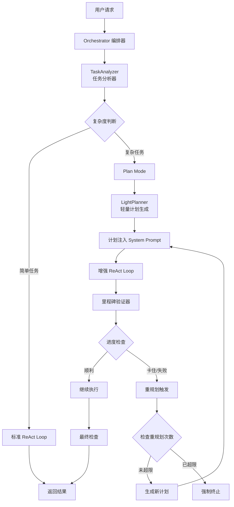
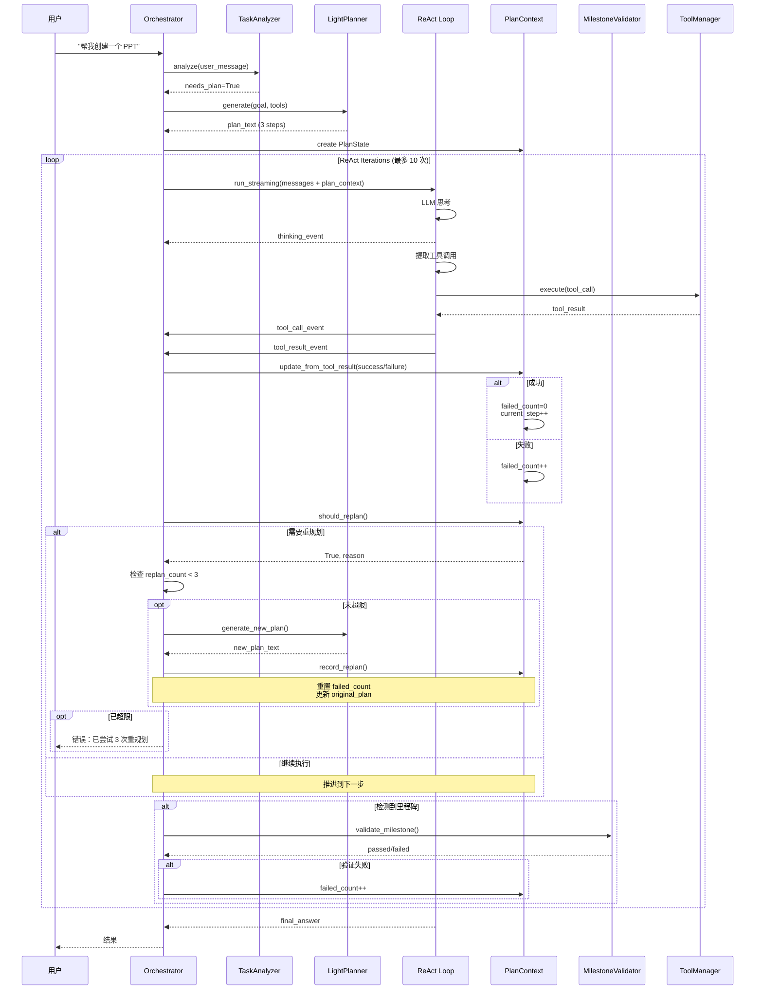

我来为你详细分析和呈现 Agentic AI 的核心编排流程，特别是 ReAct Loop 和 Plan Mode 的切换机制。


现在让我基于代码分析和项目架构，为你呈现完整的 Agentic AI 编排流程：

## 🧠 **Agentic AI 核心编排流程全景图**

### **一、整体架构概览**



---

### **二、核心组件详解**

#### **1️⃣ TaskAnalyzer - 任务分析器**

**职责**: 快速判断任务是否需要计划

**实现位置**: `backend/src/orchestrator/task_analyzer.py`

**判断逻辑**:
```python
# 规则匹配（无需 LLM）
indicators = {
    "multi_step_keywords": ["创建", "制作", "开发", "实现"],
    "file_operations": ["PPT", "PDF", "Excel", "脚本"],
    "complexity_score": 0.75,  # 基于匹配模式数量
    "needs_plan": True/False
}
```

**触发条件**:
- ✅ 需要 Plan: "帮我创建一个 PPT，包含 3 个部分..."
- ❌ 不需要 Plan: "今天天气怎么样？"

---

#### **2️⃣ ReAct Loop - 标准执行引擎**

**职责**: 思考 → 行动 → 观察的迭代循环

**核心流程**:
```python
for iteration in range(MAX_ITERATIONS):  # 默认 8 次
    # Step 1: LLM 推理
    response = await llm_router.chat(
        messages,
        tools=available_tools
    )
    
    # Step 2: 提取工具调用
    tool_calls = extract_tool_calls(response)
    
    if tool_calls:
        # Step 3: 执行工具
        for tool_call in tool_calls:
            result = await tool_manager.execute(tool_call)
            
            # Step 4: 记录结果
            working_messages.append({
                "role": "tool",
                "content": result.output
            })
    else:
        # Step 5: 最终回答
        yield {"type": "final_answer", "content": response.content}
        break
```

**关键机制**:
- **重试检测** (iteration < 2): 前 3 次机会纠正幻觉
- **最大迭代**: 8 次（防止无限循环）
- **流式输出**: 实时反馈思考和执行过程

---

#### **3️⃣ Plan Mode - 复杂任务处理**

**触发时机**:
1. TaskAnalyzer 判断需要计划（前置触发）
2. ReAct Loop 达到最大迭代次数（后置触发）

**核心流程**:
```python
# Step 1: 生成计划
plan_text = await light_planner.generate(
    goal=user_message,
    tools=available_tools
)
# 输出示例:
# """
# 1. 读取 pdf 技能文档了解 API
# 2. 创建 Python 脚本使用 reportlab 生成 PDF
# 3. 运行脚本并验证输出
# """

# Step 2: 构建计划上下文
plan_state = PlanState(
    original_plan=plan_text,
    current_step=1,
    total_steps=len(plan_text.split("\n"))
)

# Step 3: 注入 System Prompt
system_message += build_react_context(plan_state)
"""
【当前计划】
1. 读取 pdf 技能文档了解 API ← 当前步骤
2. 创建 Python 脚本使用 reportlab 生成 PDF
3. 运行脚本并验证输出

【进度】1/3 (33%)
"""

# Step 4: 增强 ReAct Loop
max_iterations = 10  # 临时增加到 10 次
async for event in react_loop.run_streaming(
    messages,  # 包含计划注入
    tools=tools
):
    yield event
```

---

#### **4️⃣ PlanContext - 计划管理器**

**职责**: 跟踪进度、判断重规划、验证里程碑

**核心状态机**:
```python
@dataclass
class PlanState:
    original_plan: str          # 原始计划文本
    current_step: int           # 当前步骤 (1-based)
    total_steps: int            # 总步骤数
    completed_steps: list[str]  # 已完成步骤
    failed_count: int           # 连续失败次数
    replan_count: int           # 重规划次数 (上限 3 次)
    milestones_validated: list  # 已验证里程碑
```

**重规划触发条件**:
```python
def should_replan(state: PlanState) -> tuple[bool, str]:
    # 条件 1: 连续失败 ≥ 3 次
    if state.failed_count >= 3:
        return True, f"连续失败 {state.failed_count} 次"
    
    # 条件 2: 迭代 ≥ 10 次但无进展
    if state.iteration_count >= 10 and not state.completed_steps:
        return True, f"迭代 {state.iteration_count} 次但无进展"
    
    # 条件 3: 已达最大重规划次数
    if state.replan_count >= 3:
        return False, ""  # 不再重规划
    
    return False, ""
```

---

#### **5️⃣ Milestone Validator - 里程碑验证器**

**职责**: 硬验证关键步骤是否真正完成

**验证关键词**:
```python
MILESTONE_KEYWORDS = [
    "创建", "create", "write file", "保存",      # 文件创建
    "语法检查", "syntax", "compile", "编译",     # 语法检查
    "导入", "import", "模块加载",               # 导入测试
    "测试", "test", "验证", "verify",           # 验证
]
```

**验证逻辑**:
```python
if should_validate_milestone(step_description):
    passed, msg = validate_milestone(
        milestone_name=current_step_desc,
        context={"file_path": "/path/to/file"}
    )
    
    if not passed:
        # 标记失败并可能触发重规划
        state.failed_count += 1
```

---

### **三、完整执行流程图**



---

### **四、关键切换模式**

#### **模式 A: 标准 ReAct → Plan Mode（升级）**

**触发条件**:
```python
# 在 ReAct Loop 中
if "Maximum iterations" in error_msg:
    # 达到最大迭代次数 → 切换到 Plan Mode
    yield {"type": ORCH_EVENT_PLAN_ADJUSTMENT}
    
    # 生成计划
    plan_text = await light_planner.generate(...)
    
    # 注入计划并重启 ReAct
    messages = build_messages(plan_state=plan_state)
    max_iterations = 10  # 增加迭代次数
```

**特点**:
- 从自由探索 → 有计划指导
- 迭代次数增加 (8 → 10)
- 添加进度追踪和重规划机制

---

#### **模式 B: Plan Mode → 标准 ReAct（降级）**

**触发条件**:
```python
# 计划完成后或重规划超限
if plan_state.is_complete() or replan_count >= MAX_REPLAN_COUNT:
    # 移除计划上下文，回到标准 ReAct
    messages = build_messages(plan_state=None)
    max_iterations = 8  # 恢复默认
```

**特点**:
- 从有计划 → 自由探索
- 迭代次数恢复默认
- 不再触发重规划

---

#### **模式 C: Plan Mode 内部循环（自修正）**

**触发条件**:
```python
while should_replan(state):
    # 保持 Plan Mode，但更新计划
    new_plan = await light_planner.generate(...)
    record_replan(state, reason)
    
    # 注入新计划继续执行
    messages = build_messages(plan_state=state)
```

**特点**:
- 计划内容更新，但模式不变
- 重规划次数 +1
- 最多 3 次机会

---

### **五、防御幻觉的多层机制**

| 层级 | 机制 | 触发条件 | 效果 |
|------|------|----------|------|
| **L1: System Prompt** | 防幻觉指令 | 始终生效 | 预防性提醒 |
| **L2: 重试检测** | iteration < 2 | 未调用工具 | 给 3 次机会 |
| **L3: 模式检测** | `_requires_tool_call_but_none_made()` | 检测到需要工具 | 强制提醒 |
| **L4: 里程碑验证** | `validate_milestone()` | 关键词触发 | 硬验证完成度 |
| **L5: 重规划** | `should_replan()` | 连续失败 3 次 | 调整策略 |
| **L6: 强制终止** | `replan_count >= 3` | 超限 | 防止无限循环 |

---

### **六、性能优化点**

1. **懒加载**: 所有组件按需初始化
2. **流式输出**: 实时反馈，避免等待
3. **上下文压缩**: 超过阈值自动压缩历史
4. **技能优化**: 明确调用 skill 时不注入所有技能（节省 575 tokens）
5. **计划增量更新**: 只修改变化部分

---

这就是 X-Agent 的完整 Agentic 编排流程！核心思想是：**简单任务快速执行，复杂任务有计划指导，遇到困难灵活调整**。你想深入了解哪个部分？