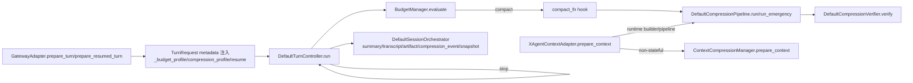
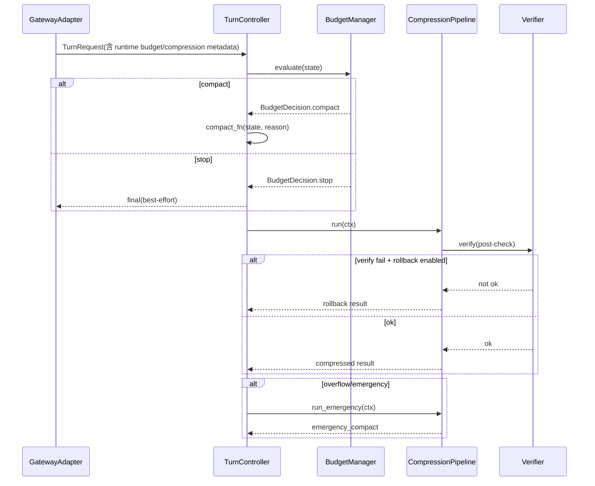
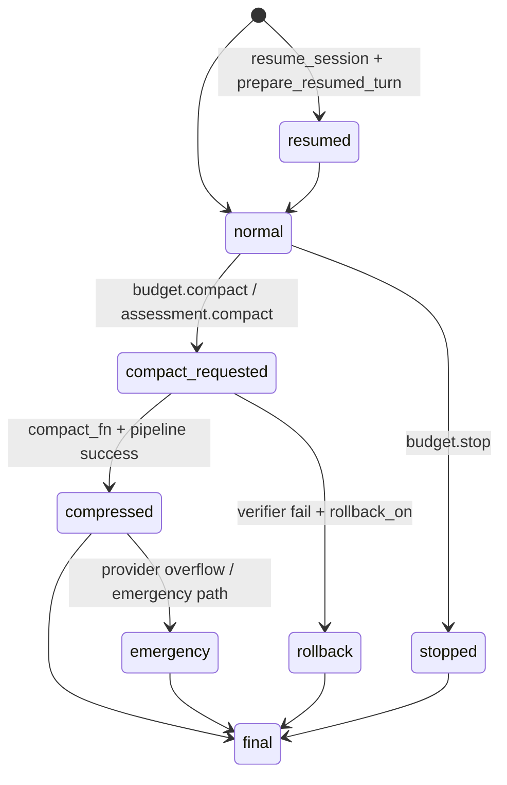

# 压缩机制代码现状分析（以当前代码为准）

## 1. 背景与范围

本文只基于当前仓库代码与单测，回答三个问题：

1. 当前压缩链路到底怎么跑。
2. 当前机制已经实现了什么、还没实现什么。
3. 在不脱离现有代码结构的前提下，下一步应如何收敛。

证据范围（仅代码/测试）：

- `backend/src/runtime/context/compression_pipeline.py`
- `backend/src/runtime/context/compression_verifier.py`
- `backend/src/runtime/turn/budget.py`
- `backend/src/runtime/turn/controller.py`
- `backend/src/runtime/adapters/gateway_adapter.py`
- `backend/src/runtime/session/orchestrator.py`
- `backend/src/services/compression/manager.py`
- `backend/src/agent_core/adapters/context_adapter.py`
- `backend/tests/unit/test_runtime_compression_pipeline.py`
- `backend/tests/unit/test_runtime_turn_controller.py`
- `backend/tests/unit/test_runtime_gateway_adapter.py`
- `backend/tests/unit/test_runtime_budget_controls.py`

---

## 2. 当前代码中的压缩相关链路总览

### 2.1 三条并存链路（当前事实）

1. **runtime 链路**（预算决策 + 分阶段压缩 + 校验/回滚）
   - 预算触发：`DefaultBudgetManager.evaluate()` 在 token 达到阈值时返回 `compact`（`backend/src/runtime/turn/budget.py:17-34`）。
   - 控制器挂载点：`DefaultTurnController.run()` 在 budget/assessment 两处调用 `compact_fn`（`backend/src/runtime/turn/controller.py:69-76`, `backend/src/runtime/turn/controller.py:118-121`）。
   - 分阶段压缩：`DefaultCompressionPipeline.run()`（`backend/src/runtime/context/compression_pipeline.py:126-210`）。

2. **legacy/service 链路**（ContextCompressionManager）
   - 触发条件：轮次阈值、token 阈值、dynamic trigger/hard limit（`backend/src/services/compression/manager.py:168-173`）。
   - 主入口：`prepare_context()`（`backend/src/services/compression/manager.py:116-237`）。

3. **agent_core 适配桥接链路**（runtime + legacy 叠加）
   - `XAgentContextAdapter.prepare_context()` 先做清洗/截断，可选 stateful/hybrid 组装，再可选 runtime pipeline，最后（非 stateful）调用 legacy manager（`backend/src/agent_core/adapters/context_adapter.py:67-170`）。

### 2.2 架构链路图（代码映射）

---

## 3. runtime 压缩链路

### 3.1 触发与控制

**当前代码已实现**

- Budget compact 触发：`compact_trigger_tokens` 达到后返回 `BudgetDecision.compact(...)`（`backend/src/runtime/turn/budget.py:27-34`）。
- Budget stop 触发：时间/轮次/总 token/成本/工具调用/spawn 等硬阈值（`backend/src/runtime/turn/budget.py:47-119`）。
- Controller 两类 compact 挂载点：
  - budget compact（`backend/src/runtime/turn/controller.py:73-75`）
  - assessment compact（`backend/src/runtime/turn/controller.py:118-121`）

**当前代码未实现/未收敛**

- `compact_fn` 默认实现仅写 metadata，不直接执行 runtime pipeline（`backend/src/runtime/turn/controller.py:45-50`）。
- 因此“预算触发 compact”与“真实上下文压缩执行”仍可能解耦，取决于外部注入的 `compact_fn`。

### 3.2 pipeline 阶段顺序与语义

**当前代码已实现**（严格顺序）

1. `persist`：大 tool 结果外置为 artifact 引用（`backend/src/runtime/context/compression_pipeline.py:243-273`）
2. `aggregate_budget`：tool 结果总量超限后聚合裁剪（`backend/src/runtime/context/compression_pipeline.py:275-301`）
3. `ttl_prune`：超 TTL 且满足条件的旧 tool 内容清空（`backend/src/runtime/context/compression_pipeline.py:303-331`）
4. `microcompact`：高压下对大 tool 内容做头尾保留（`backend/src/runtime/context/compression_pipeline.py:368-397`）
5. `collapse`：历史折叠为 `[Collapsed history]`（`backend/src/runtime/context/compression_pipeline.py:333-367`）
6. `autocompact`：继续高压时折叠为 `[Auto-compacted history]`（`backend/src/runtime/context/compression_pipeline.py:399-445`）
7. `memory_flush`：达到阈值时触发 memory flusher（`backend/src/runtime/context/compression_pipeline.py:168-177`）

测试证据：
- persist：`backend/tests/unit/test_runtime_compression_pipeline.py:11-36`
- collapse：`backend/tests/unit/test_runtime_compression_pipeline.py:39-58`
- persist 后重算压力：`backend/tests/unit/test_runtime_compression_pipeline.py:61-85`
- microcompact：`backend/tests/unit/test_runtime_compression_pipeline.py:263-289`
- autocompact：`backend/tests/unit/test_runtime_compression_pipeline.py:292-313`

**当前代码未实现/未收敛**

- token 估算是字符数/4 的近似，不是 provider tokenizer 级精算（`backend/src/runtime/context/compression_pipeline.py:456-458`）。
- 历史折叠摘要为规则拼接（`_summarize_messages`），并非任务语义抽取器（`backend/src/runtime/context/compression_pipeline.py:446-454`）。

### 3.3 verifier 与回滚边界

**当前代码已实现**

- verifier 检查项：`objective/unresolved/recent_failures/artifact_refs/role_ordering`（`backend/src/runtime/context/compression_verifier.py:37-43`）。
- post-check 失败 + 开启回滚时，pipeline 返回原始 messages/artifacts 并追加 `rollback` 操作（`backend/src/runtime/context/compression_pipeline.py:179-202`）。

**当前代码未实现/未收敛**

- `objective_out_of_band=True` 时 objective 检查直接通过（`backend/src/runtime/context/compression_verifier.py:89-90`；调用处 `backend/src/runtime/context/compression_pipeline.py:188-193`）。
- unresolved/recent_failures 主要依赖 metadata 对比，语义层校验仍偏弱（`backend/src/runtime/context/compression_verifier.py:59-71`）。

### 3.4 emergency 链路

**当前代码已实现**

- `run_emergency()`：保留 leading system（若存在）+ 注入 `[Emergency context summary]` + 保留最近 tail（`backend/src/runtime/context/compression_pipeline.py:212-241`）。
- 返回 `operations=["emergency_compact"]`，并写入 `fallback_summary_used/rollback_ready`（同上）。

测试证据：
- emergency 基本行为：`backend/tests/unit/test_runtime_compression_pipeline.py:155-175`
- 不重复 leading system：`backend/tests/unit/test_runtime_compression_pipeline.py:177-201`
- 包含 artifact refs：`backend/tests/unit/test_runtime_compression_pipeline.py:204-228`

**当前代码未实现/未收敛**

- emergency 仍是独立兜底函数，尚未与 normal compact 形成统一状态机对象。

### 3.5 正常/应急时序图

---

## 4. legacy/service 压缩链路

### 4.1 触发与执行

**当前代码已实现**

- `ContextCompressionManager.prepare_context()` 判断是否压缩：
  - 新增消息轮次阈值
  - 新增消息 token 阈值
  - dynamic trigger
  - dynamic hard limit
  （`backend/src/services/compression/manager.py:168-173`）
- 不需要压缩时可复用缓存并拼接新增消息（`backend/src/services/compression/manager.py:192-206`）。
- 需要压缩时调用 `_compress_context()`，并更新缓存（`backend/src/services/compression/manager.py:219-236`）。

**当前代码未实现/未收敛**

- 该链路与 runtime pipeline 并行存在，是否触发由 adapter 模式和调用路径共同决定；系统层“唯一生效链路”尚不单一。

---

## 5. agent_core 适配桥接链路

### 5.1 适配层行为

**当前代码已实现**

- 输入清洗与 tool 内容截断（`backend/src/agent_core/adapters/context_adapter.py:87-91`, `backend/src/agent_core/adapters/context_adapter.py:285-299`）。
- hybrid/stateful 下调用 context assembler（`backend/src/agent_core/adapters/context_adapter.py:95-112`）。
- 若注入 runtime builder + runtime pipeline，则先走 `_prepare_runtime_context()`（`backend/src/agent_core/adapters/context_adapter.py:201-255`）。
- `mode=="stateful"` 时直接返回，不再调用 legacy manager（`backend/src/agent_core/adapters/context_adapter.py:126-137`）。
- 非 stateful 时继续调用 legacy manager（`backend/src/agent_core/adapters/context_adapter.py:139-145`）。

测试证据：
- hybrid 先 assembler：`backend/tests/unit/test_runtime_budget_controls.py:146-189`
- stateful 绕过 legacy manager：`backend/tests/unit/test_runtime_budget_controls.py:191-232`
- tool 消息截断：`backend/tests/unit/test_runtime_budget_controls.py:108-144`

**当前代码未实现/未收敛**

- adapter 同时承载 runtime 预处理与 legacy 压缩接入，最终上下文治理权仍分散在多层。

---

## 6. 恢复与持久化链路

### 6.1 网关注入与恢复输入

**当前代码已实现**

- `prepare_turn()` 注入 `_runtime_budget_profile`、`_runtime_compression_profile_name`、`runtime_timeout_ms`、`runtime_announcements`（`backend/src/runtime/adapters/gateway_adapter.py:54-65`）。
- `prepare_resumed_turn()` 在上述基础上注入 `resume=True`、`summary_chain_count`、`recent_entry_count`（`backend/src/runtime/adapters/gateway_adapter.py:105-119`）。

测试证据：
- 常规 metadata 注入：`backend/tests/unit/test_runtime_gateway_adapter.py:25-51`
- resumed metadata 注入：`backend/tests/unit/test_runtime_gateway_adapter.py:64-117`

### 6.2 编排器持久化与恢复

**当前代码已实现**

- 持久化入口：summary、transcript、artifact、compression_event、snapshot（`backend/src/runtime/session/orchestrator.py:139-170`）。
- `resume_session()` 读取 latest snapshot、latest summary、summary chain、recent entries 并返回组合状态（`backend/src/runtime/session/orchestrator.py:172-196`）。

**当前代码未实现/未收敛**

- 恢复后 active context 的统一裁剪边界仍分散在 gateway/adapter/controller/pipeline 各层，没有单一“恢复输入治理中心”。

### 6.3 状态图（按现状抽象）

---

## 7. 现状评估：哪些地方合理，哪些地方未收敛

### 7.1 结构合理性

- 合理：runtime 已有 budget/controller/pipeline/verifier 分层（`backend/src/runtime/turn/budget.py`, `backend/src/runtime/turn/controller.py`, `backend/src/runtime/context/compression_pipeline.py`, `backend/src/runtime/context/compression_verifier.py`）。
- 未收敛：runtime、legacy manager、agent_core adapter 三处共同影响最终上下文。

### 7.2 语义保真性

- 合理：已有 post-check + rollback（`backend/src/runtime/context/compression_pipeline.py:179-202`）。
- 未收敛：大量压缩仍是字符级裁剪/历史折叠，语义单元保护有限（`backend/src/runtime/context/compression_pipeline.py:289-297`, `backend/src/runtime/context/compression_pipeline.py:394-395`, `backend/src/runtime/context/compression_pipeline.py:354-363`）。

### 7.3 运行成本与可控性

- 合理：分阶段退化优于一次性全局摘要。
- 未收敛：budget compact 钩子默认不执行真实压缩，且 legacy 预算/runtime 预算并存。

### 7.4 演进一致性

- 合理：runtime 新路径已具备关键骨架与测试覆盖。
- 未收敛：配置与执行入口双轨（runtime profile + legacy `CompressionConfig`），外部难以回答“本次到底哪条压缩链路生效”。

### 7.5 本节结论

1. 方向是对的（runtime 分层已成型）。
2. 局部机制有效（阶段化压缩、verifier、rollback、emergency 均有代码与测试证据）。
3. 系统级尚未收敛为单一压缩架构（治理权分散、链路并存）。

---

## 8. 基于当前代码的改造建议

### 建议 1：设立单一上下文治理中心

- 现状入口建议以 `XAgentContextAdapter.prepare_context()` 作为过渡观测点（`backend/src/agent_core/adapters/context_adapter.py:67-170`）。
- 目标：收敛为单一 runtime context authority，统一负责输入装配、预算压力分级、阶段选择、校验、回滚、持久化副作用、emergency fallback。

### 建议 2：明确 runtime 与 legacy 迁移边界

- 显式定义：哪些模式继续走 `ContextCompressionManager`，哪些模式只走 runtime pipeline。
- 先把“可并行生效”的双重压缩路径改为“互斥生效”路径，消除链路歧义。

### 建议 3：强化 verifier

- 保留现有结构项（objective/unresolved/recent_failures/artifacts/role ordering）。
- 新增语义层校验：任务目标覆盖率、工具事务连续性、压缩收益达标（最小收益阈值可直接复用 profile/quality 结构）。
- 减少对可同源写入 metadata 的依赖。

### 建议 4：统一恢复链路的压缩输入边界

- 固化 `summary_chain/recent_entries/snapshot/artifact_refs` 合成 active context 的唯一位置（当前散落在 orchestrator + gateway + adapter）。

### 建议 5：把 emergency compact 纳入统一状态机

- 将 `run_emergency()` 从独立兜底函数升级为同一治理状态机下的明确状态与转移规则。

---

## 9. 案例（基于当前实现）

### 案例 1：单个超长 tool 结果外置为 artifact preview

- 场景：某次 tool 输出超出 `single_result_chars`。
- 当前代码怎么处理：`_persist_large_results()` 外置内容，原消息替换为 `[Persisted large tool result: ...] + Preview`（`backend/src/runtime/context/compression_pipeline.py:255-272`）。
- 暴露的问题：preview 仍是字符级截断，语义压缩不稳定。
- 推荐如何改：引入“结构化 preview 模板 + 关键字段保留规则”。
- 为什么更优：减少关键参数丢失风险，同时保留可追溯 artifact id。

### 案例 2：多个 tool 结果累计过大触发 aggregate budget

- 场景：tool 输出总字符超 `aggregate_result_chars`。
- 当前代码怎么处理：`_aggregate_budget()` 逐条头尾裁剪直到回到预算（`backend/src/runtime/context/compression_pipeline.py:283-300`）。
- 暴露的问题：按字符串长度裁剪，不区分“关键证据/次要噪音”。
- 推荐如何改：增加按消息类型/错误状态/任务相关性排序裁剪。
- 为什么更优：同样压缩比下，任务有效信息保留率更高。

### 案例 3：长会话恢复后注入 summary/snapshot/recent

- 场景：会话恢复继续执行。
- 当前代码怎么处理：`resume_session()` 返回 latest snapshot + latest summary + summary_chain + recent_entries（`backend/src/runtime/session/orchestrator.py:172-196`）；`prepare_resumed_turn()` 注入 resume metadata（`backend/src/runtime/adapters/gateway_adapter.py:105-119`）。
- 暴露的问题：恢复输入治理边界跨多层，行为解释成本高。
- 推荐如何改：定义单点恢复上下文组装器，其他层仅传递原始恢复材料。
- 为什么更优：可测试性、可观测性和回归稳定性更高。

### 案例 4：预算达到 compact / stop 的行为分叉

- 场景：budget 接近或达到阈值。
- 当前代码怎么处理：
  - compact：`BudgetDecision.compact` -> controller 调用 `compact_fn`（`backend/src/runtime/turn/budget.py:27-34`, `backend/src/runtime/turn/controller.py:73-75`）
  - stop：`BudgetDecision.stop` -> `_finish_from_budget()` 走最佳努力摘要输出（`backend/src/runtime/turn/controller.py:150-159`, `backend/src/runtime/turn/controller.py:170-184`）
- 暴露的问题：compact 默认仅 metadata 标记，不保证真实压缩发生。
- 推荐如何改：强制注入 runtime pipeline-backed compact_fn，并把 compact 产物回写状态。
- 为什么更优：budget 决策与上下文压缩执行闭环一致。

---

## 10. 验证备注

本次结论可由当前单测直接支撑的部分：

- runtime pipeline 阶段与 emergency 行为：`backend/tests/unit/test_runtime_compression_pipeline.py`
- turn controller 在 stop/compact 分支的行为：`backend/tests/unit/test_runtime_turn_controller.py`
- gateway metadata/resume 注入：`backend/tests/unit/test_runtime_gateway_adapter.py`
- adapter 的 hybrid/stateful 分叉与 legacy bypass：`backend/tests/unit/test_runtime_budget_controls.py`

环境侧已知限制：若本地缺少 `x-agent.yaml`，部分 pytest 运行会在配置加载阶段失败；该问题属于测试环境依赖，不改变上述代码路径事实。
