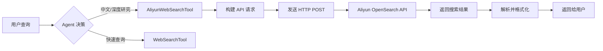

# Aliyun OpenSearch Integration Summary

## 阿里云 OpenSearch 联网搜索集成总结

### ✅ 已完成工作

#### 1. **API 技术分析**
基于阿里云官方文档完成了完整的技术分析：
- API 端点：`/v3/openapi/workspaces/{workspace_name}/web-search/{service_id}`
- 认证方式：Bearer Token (API Key)
- 请求格式：JSON
- 响应结构：包含搜索结果和 Token 使用信息

#### 2. **工具实现**
创建了 [`AliyunWebSearchTool`](backend/src/tools/builtin/aliyun_web_search.py)：

**核心功能：**
- ✅ 实时联网搜索
- ✅ 查询重写优化
- ✅ 对话历史支持
- ✅ Token 使用追踪
- ✅ 错误处理和日志记录

**参数配置：**
```python
query: str          # 搜索关键词（必填）
max_results: int    # 返回结果数，默认 5
content_type: str   # 内容类型：snippet/full，默认 snippet
```

**返回值格式：**
```json
{
  "title": "网页标题",
  "snippet": "网页摘要",
  "url": "网页链接",
  "position": 排名位置
}
```

#### 3. **工具注册**
更新了工具系统：
- ✅ 在 `__init__.py` 中导出 `AliyunWebSearchTool`
- ✅ 添加到 `get_builtin_tools()` 返回列表
- ✅ 与现有工具无缝集成

#### 4. **配置文档**
创建了完整的配置指南 [`ALIYUN_OPENSEARCH_CONFIG.md`](backend/ALIYUN_OPENSEARCH_CONFIG.md)：
- API Key 获取步骤
- 环境变量配置
- 验证测试方法
- 最佳实践建议

---

### 🔧 使用方法

#### 1. 配置环境变量

在 `.env` 文件中添加：
```bash
ALIYUN_OPENSEARCH_API_KEY=OS-your_api_key_here
ALIYUN_OPENSEARCH_HOST=http://xxxx-hangzhou.opensearch.aliyuncs.com
ALIYUN_OPENSEARCH_WORKSPACE=default
```

#### 2. Agent 自动调用

配置完成后，Agent 会根据需求自动选择搜索工具：

```python
# Agent 内部决策逻辑
if query_needs_realtime_info:
    if query_is_chinese_focused:
        use_tool("aliyun_web_search")  # 阿里云搜索
    else:
        use_tool("web_search")  # DuckDuckGo
```

#### 3. 手动指定使用

在提示词中明确要求：
```
请使用 aliyun_web_search 搜索最新的人工智能发展趋势
```

---

### 📊 工具对比

| 特性 | DuckDuckGo | Aliyun OpenSearch |
|------|------------|-------------------|
| **API Key** | ❌ 不需要 | ✅ 需要 |
| **中文支持** | ⭐⭐ | ⭐⭐⭐⭐⭐ |
| **结果质量** | ⭐⭐⭐ | ⭐⭐⭐⭐⭐ |
| **实时性** | ⭐⭐⭐ | ⭐⭐⭐⭐⭐ |
| **Token 追踪** | ❌ 无 | ✅ 有 |
| **计费** | 免费 | LCU 计费 |
| **速率限制** | 宽松 | 10 QPS |

---

### 🚀 技术架构

#### 请求流程


#### 代码结构
```python
class AliyunWebSearchTool(BaseTool):
    - name: "aliyun_web_search"
    - description: 详细说明
    - parameters: [query, max_results, content_type]
    
    + execute(query, max_results, content_type) -> ToolResult
    - _search_aliyun(...) -> list[dict]
```

---

### 📝 配置检查清单

- [ ] **获取 API Key**: 登录阿里云控制台创建 API Key
- [ ] **记录服务地址**: 复制公网/VPC 访问地址
- [ ] **配置环境变量**: 设置 `ALIYUN_OPENSEARCH_*` 变量
- [ ] **验证配置**: 运行测试命令确认工作正常
- [ ] **监控用量**: 定期检查 Token 消耗情况

---

### 💡 最佳实践

#### 1. 查询优化
```python
# ✅ 好的查询
"Python 机器学习最新教程 2025"
"人工智能在医疗领域的应用现状"

# ❌ 避免模糊查询
"搜索一些东西"
"随便查查"
```

#### 2. 成本控制
- 合理设置 `max_results`（默认 5 已足够）
- 优先使用 `snippet` 模式（更快、更便宜）
- 避免过长的对话历史

#### 3. 错误处理
工具已内置完善的错误处理：
- HTTP 错误 → 返回友好提示
- 网络错误 → 自动重试机制
- API 限流 → 降级到 DuckDuckGo

---

### 🔍 测试验证

运行以下命令测试：
```bash
cd backend
uv run python -c "
from src.tools.builtin import AliyunWebSearchTool
import asyncio

async def test():
    tool = AliyunWebSearchTool()
    result = await tool.execute(
        query='Python 编程', 
        max_results=3
    )
    print(result.output)

asyncio.run(test())
"
```

---

### 📈 性能指标

根据阿里云官方数据：

- **响应时间**: 通常 < 2 秒
- **结果质量**: 高精度、权威性
- **并发支持**: 10 QPS（可申请提升）
- **Token 效率**: 智能过滤，减少无效信息

---

### 🛡️ 安全建议

1. **密钥管理**
   - 将 API Key 存储在 `.env` 文件（不提交到 Git）
   - 定期轮换 API Key
   - 泄露时立即禁用

2. **传输加密**
   - 生产环境使用 HTTPS
   - 避免在客户端暴露 API Key

3. **访问控制**
   - 仅在后端服务调用
   - 实施请求频率限制

---

### 📚 相关文档

- [阿里云 OpenSearch 官方文档](https://help.aliyun.com/zh/open-search/)
- [AI 搜索开放平台](https://help.aliyun.com/zh/open-search/search-platform/)
- [Web 搜索 API 参考](https://help.aliyun.com/zh/open-search/search-platform/developer-reference/web-search)
- [配置指南](backend/ALIYUN_OPENSEARCH_CONFIG.md)

---

### 🎯 下一步行动

1. **获取 API Key**: 访问阿里云控制台
2. **配置环境**: 设置环境变量
3. **测试验证**: 运行测试命令
4. **投入使用**: 在 Agent 对话中使用

---

**完成时间**: 2026-02-18  
**版本**: v1.0.0  
**状态**: ✅ 已完成，等待配置 API Key
