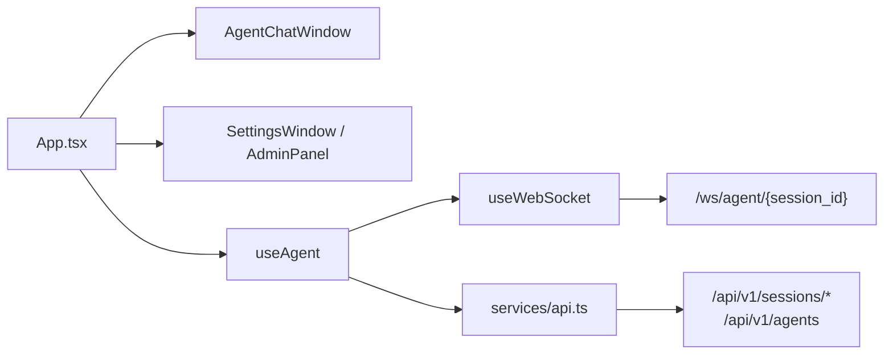
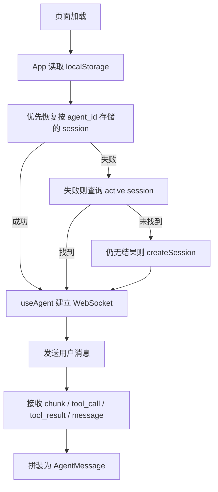
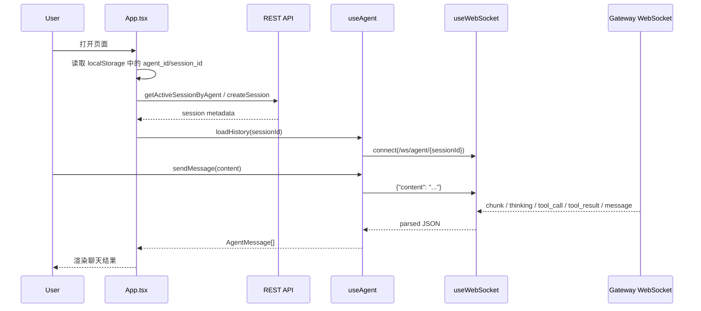
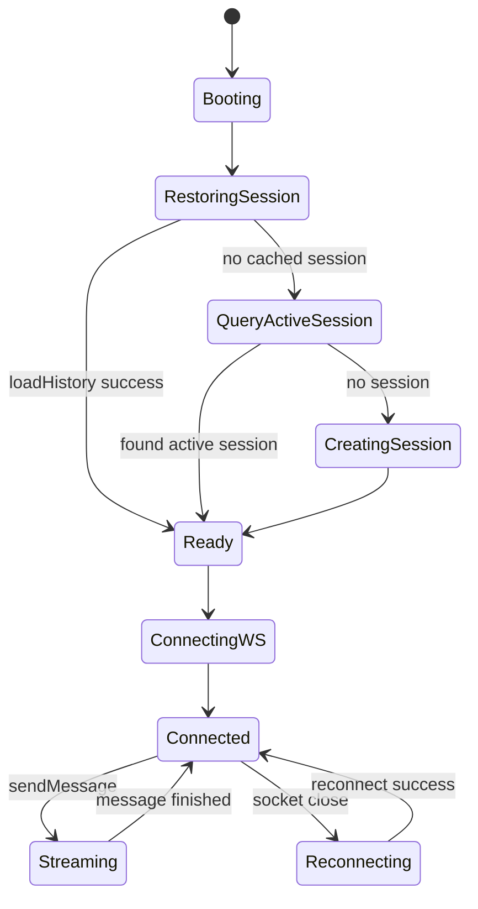

# 01. Web 前端架构分析与 Review

## 1. 模块定位

Web 前端是用户最直接接触的入口，承担：

- 页面级视图切换：聊天、设置、管理
- 当前 Agent 与 Session 的选择、恢复与切换
- 通过 REST 拉取会话/历史
- 通过 WebSocket 接收流式回复
- 把后端的字符串事件协议重建为前端消息模型

核心文件：

- `frontend/src/App.tsx`
- `frontend/src/hooks/useAgent.ts`
- `frontend/src/hooks/useWebSocket.ts`
- `frontend/src/services/api.ts`
- `frontend/src/services/websocket.ts`

## 2. 当前实现总架构图

## 3. 核心链路图

## 4. 关键时序图

## 5. 状态图

## 6. 职责与边界

| 组件 | 责任 | 现状判断 |
| --- | --- | --- |
| `App.tsx` | 视图切换、agent/session 恢复、localStorage 策略 | 过重，承担了页面与会话编排双重职责 |
| `useAgent.ts` | 聊天状态机、消息归并、工具调用态 | 是真正的聊天客户端核心 |
| `useWebSocket.ts` | 连接管理、心跳、重连、StrictMode 复用 | 连接层设计较完整 |
| `services/api.ts` | REST API 封装 | 能力覆盖广，但协议差异较多 |

## 7. 数据与控制流观察

- 会话恢复策略是“本地优先，后端兜底”：
  - 先读取 `x-agent-session-{agentId}`
  - 再查 `/sessions/active-by-agent/{agentId}`
  - 最后调用 `createSession`
- 前端明确把“切换 Agent”和“新建会话”区分开：
  - 切换 Agent 时尽量复用现有 session
  - 只有用户显式点击“New Session”才传 `close_existing=true`
- 聊天消息并不是后端直接返回结构化 `assistant message`，而是前端在 `useAgent.ts` 中把 `chunk`、`thinking`、`tool_call`、`tool_result`、`message` 拼起来

## 8. 关键代码锚点

| 入口 | 文件 | 说明 |
| --- | --- | --- |
| 页面级调度 | `frontend/src/App.tsx` | 管理当前视图、session 初始化、agent 切换 |
| 聊天协议处理 | `frontend/src/hooks/useAgent.ts` | 解析 WebSocket 事件并生成前端消息模型 |
| 连接管理 | `frontend/src/hooks/useWebSocket.ts` | 心跳、重连、缓存连接 |
| REST 客户端 | `frontend/src/services/api.ts` | session、agent、trace、memory、cron 等 API |

## 9. 架构 Review

| 级别 | 发现 | 影响 | 建议 |
| --- | --- | --- | --- |
| M | `App.tsx` 同时管理视图路由、Agent 切换、session 恢复、本地存储策略 | 页面组件承担了明显的应用编排职责，后续扩展容易继续堆积 | 把 session/agent lifecycle 抽到独立 app service 或 custom hook |
| M | 事件协议是字符串驱动，前后端缺少统一共享 schema | 后端事件名变更时，前端只能靠运行时发现错误 | 为 `chunk/tool_call/message/error` 建立共享协议定义和版本约束 |
| M | REST 与 WebSocket 双通道并存，但客户端抽象未统一 | 会话拉取、流式响应、错误处理规则分散 | 建立前端侧统一 transport facade，屏蔽 REST/WS 差异 |
| L | 路由是手写 `window.location` 切换而不是正式路由器 | 简单直接，但页面增多后可维护性下降 | 当页面继续增长时，引入正式路由层 |

## 10. 与目标态的差距

- 前端已经感知多 Agent、多会话，但尚未感知 runtime lane、child session、announcement 等更细粒度状态。
- 当前协议更偏“流式文本聊天客户端”，还不是“运行时控制台客户端”。
- 如果未来 runtime 成为主执行路径，前端需要补充：
  - runtime result kind 展示
  - child task/announcement 展示
  - artifact 与 summary chain 的可视化入口
