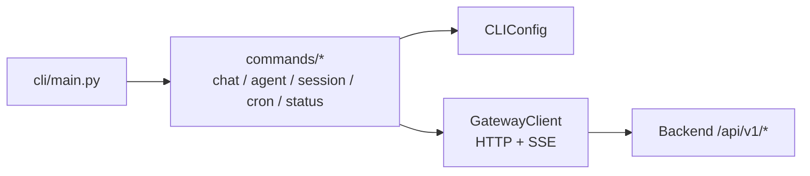
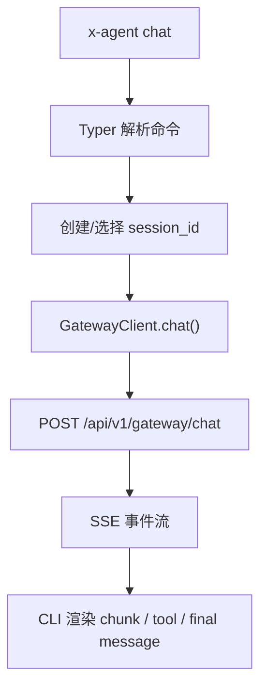
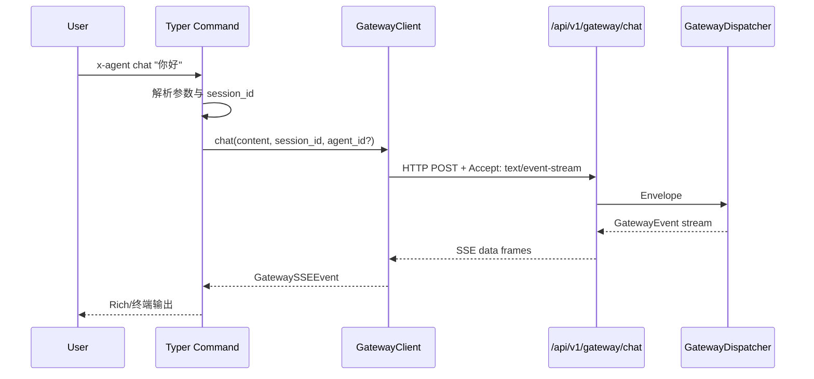
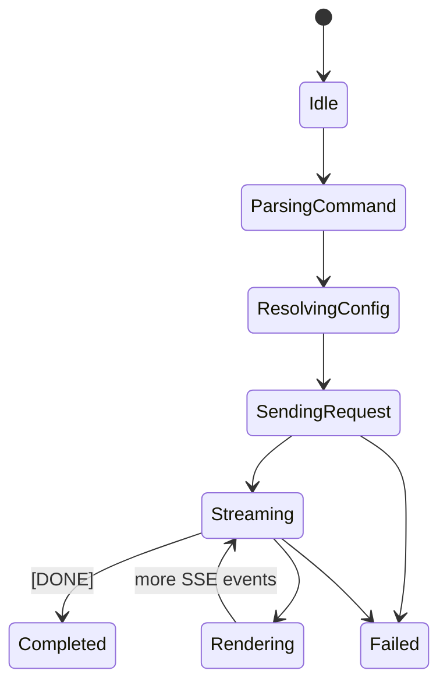

# 02. CLI 架构分析与 Review

## 1. 模块定位

CLI 是后端能力的命令行入口，负责：

- 将聊天、会话、Agent、Cron、状态检查等功能暴露为命令
- 通过 HTTP + SSE 连接 Gateway REST 端点
- 把流式事件渲染为终端输出

核心文件：

- `cli/main.py`
- `cli/commands/*.py`
- `cli/adapters/gateway_client.py`
- `cli/config.py`

## 2. 当前实现总架构图

## 3. 核心链路图

## 4. 关键时序图

## 5. 状态图

## 6. 职责与边界

| 组件 | 责任 | 现状判断 |
| --- | --- | --- |
| `cli/main.py` | 注册命令组 | 足够薄，职责清晰 |
| `commands/*.py` | 参数解析与用户交互 | 主要是后端能力的薄封装 |
| `GatewayClient` | 与 Gateway REST/SSE 交互 | 是 CLI 的关键适配层 |
| `CLIConfig` | 环境变量配置 | 简单直接，但偏进程级 |

## 7. 控制流观察

- CLI 聊天不走 WebSocket，而走 `POST /api/v1/gateway/chat + SSE`。
- CLI 用 `channel_id = "cli_channel"` 表明来源渠道，与 Web 的 WebSocket/SSE 区分开。
- 会话 ID 生成策略由 CLI 本地控制：
  - 显式传入 `--session`
  - 或读取默认配置
  - 或本地新生成 UUID

## 8. 关键代码锚点

| 入口 | 文件 | 说明 |
| --- | --- | --- |
| 命令总入口 | `cli/main.py` | Typer 命令注册 |
| 聊天命令 | `cli/commands/chat.py` | 交互式与单次对话入口 |
| SSE 适配器 | `cli/adapters/gateway_client.py` | POST + SSE 解析 |
| 配置 | `cli/config.py` | 服务地址、超时、默认 session 等 |

## 9. 架构 Review

| 级别 | 发现 | 影响 | 建议 |
| --- | --- | --- | --- |
| M | CLI 使用 SSE，而 Web 使用 WebSocket，存在两套流协议消费端 | 协议字段或事件类型修改时，CLI 与 Web 可能不同步 | 统一 Gateway 事件 schema，尽量收敛为共享转换层 |
| M | CLI 的很多命令本质是后端 API 的直通封装 | CLI 本身轻量，但也更依赖后端接口稳定性 | 明确 CLI 作为“远程控制台”而非“独立运行时”的定位 |
| L | 默认会话和行为大量依赖环境变量 | 对自动化友好，但用户侧体验偏隐式 | 增加 `config show/check` 的可观测信息并保持默认值透明 |

## 10. 与目标态的差距

- 目前 CLI 更像“远程聊天和管理客户端”，不是 runtime 控制面板。
- 若要充分承接 runtime 新能力，需要进一步支持：
  - child session / announcement 展示
  - artifact 引用与摘要链展示
  - 更细粒度的 turn result / finish reason 显示
