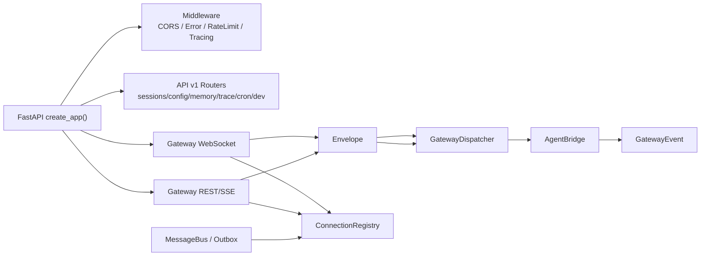
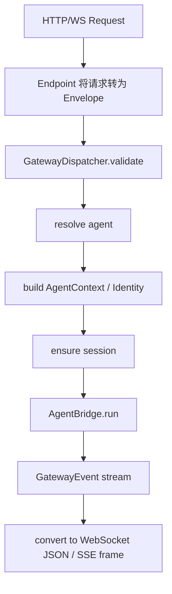
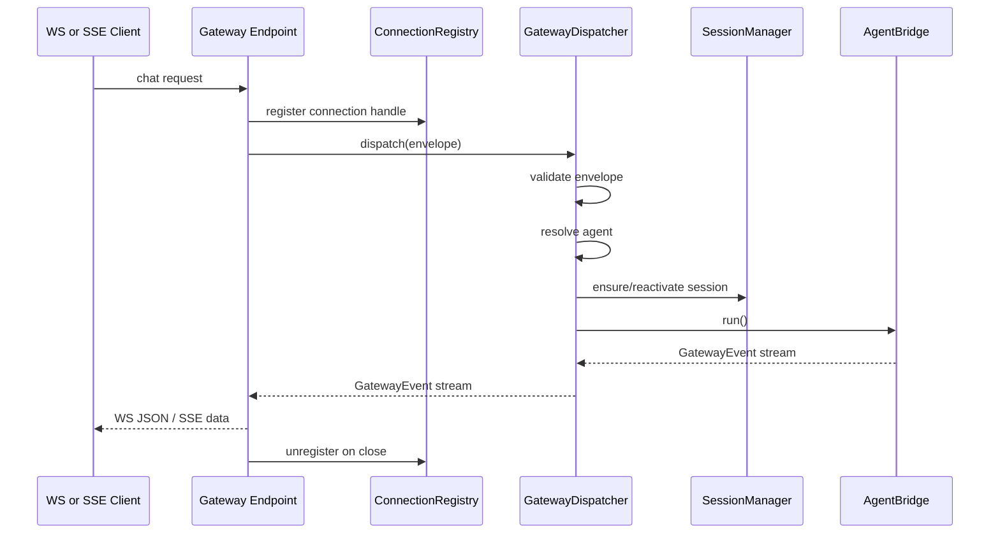
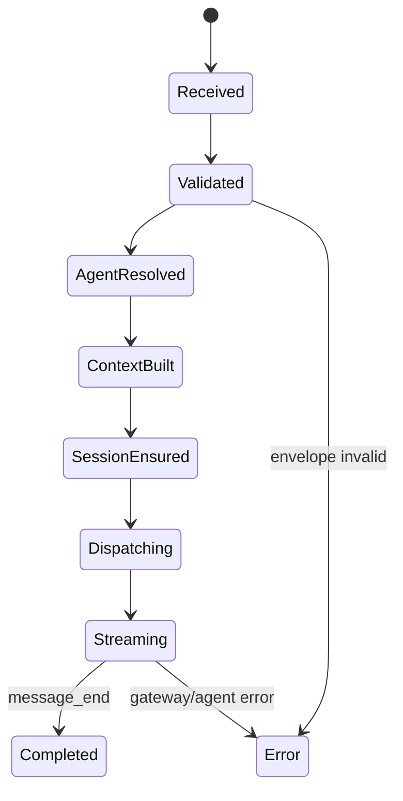

# 03. API 与 Gateway 架构分析与 Review

## 1. 模块定位

这一层是系统的流量汇入口，负责：

- 在 `FastAPI` 中装配 middleware、router 和生命周期
- 暴露 REST API、WebSocket、SSE 流式接口
- 通过 `Envelope` 与 `GatewayEvent` 统一上行/下行协议
- 将各入口请求收敛到 `GatewayDispatcher`

核心文件：

- `backend/src/main.py`
- `backend/src/api/v1/*.py`
- `backend/src/gateway/dispatcher.py`
- `backend/src/gateway/endpoints/websocket.py`
- `backend/src/gateway/endpoints/rest.py`
- `backend/src/gateway/response.py`
- `backend/src/gateway/connection_registry.py`
- `backend/src/gateway/message_bus.py`

## 2. 当前实现总架构图

## 3. 核心链路图

## 4. 关键时序图

## 5. 状态图

## 6. 关键实现判断

### 6.1 装配方式

`backend/src/main.py` 中的 `create_app()` 统一装配：

- Middleware：CORS、错误处理、限流、Tracing
- REST Router：health、config、stats、memory、trace、skills、sessions、admin、cron
- Gateway 入口：
  - WebSocket：`/ws/agent/{session_id}`
  - REST/SSE：`/api/v1/gateway/chat`

### 6.2 Gateway 统一抽象

- 上行统一为 `Envelope`
- 下行统一为 `GatewayEvent`
- `GatewayDispatcher` 负责 agent 解析、identity/context 构建、session 管理、请求分发

### 6.3 在线/离线消息处理

- 在线推送：`ConnectionRegistry.push()`
- 离线兜底：`MessageBus -> OutboxStore`
- 重连补发：WebSocket 连接建立时触发 outbox drain

## 7. 关键代码锚点

| 入口 | 文件 | 说明 |
| --- | --- | --- |
| FastAPI 装配 | `backend/src/main.py` | middleware、router、lifespan |
| Dispatcher | `backend/src/gateway/dispatcher.py` | Gateway 主编排 |
| WS 端点 | `backend/src/gateway/endpoints/websocket.py` | WebSocket 协议层 |
| REST/SSE 端点 | `backend/src/gateway/endpoints/rest.py` | 无状态流式入口 |
| 在线连接表 | `backend/src/gateway/connection_registry.py` | session -> connection handle |
| 在线/离线消息桥 | `backend/src/gateway/message_bus.py` | push + outbox |

## 8. 架构 Review

| 级别 | 发现 | 影响 | 建议 |
| --- | --- | --- | --- |
| H | Gateway 层已统一入口，但真正的业务复杂度被继续压进 `AgentBridge` | Gateway 看似清晰，核心耦合却没有真正下降 | 让 Dispatcher 只做路由，Bridge 只做桥接，持久化/技能/runtime 分离成独立服务 |
| M | WebSocket 与 SSE 连接都使用 `DEFAULT_CHANNEL_ID` 注册连接句柄 | 同一 session 下若同时存在 WS/SSE，连接句柄会互相覆盖，影响推送一致性 | 为每个连接生成唯一 channel_id，而不是复用统一默认值 |
| M | REST `/gateway/abort/{session_id}` 仍是未实现接口 | 协议表面存在能力，但运行时无法中止 | 补齐 abort 语义或移除未兑现接口 |
| M | 协议层并非完全“纯协议”，WS 端点仍处理 reactivation、outbox drain、agent 关联恢复 | 端点层继续吸附业务逻辑，削弱 Gateway 中台价值 | 把连接生命周期副作用下沉到统一 connection/session service |

## 9. 与目标态的差距

- 目标态希望 `Session Orchestrator + Turn Controller` 成为 Gateway 下游主路径。
- 当前现状是 Gateway 已经统一，但执行内核仍通过 `AgentBridge` 兼容 legacy 与 runtime。
- 因此 Gateway 层已经完成“入口统一”，还没有完成“下游执行语义统一”。
