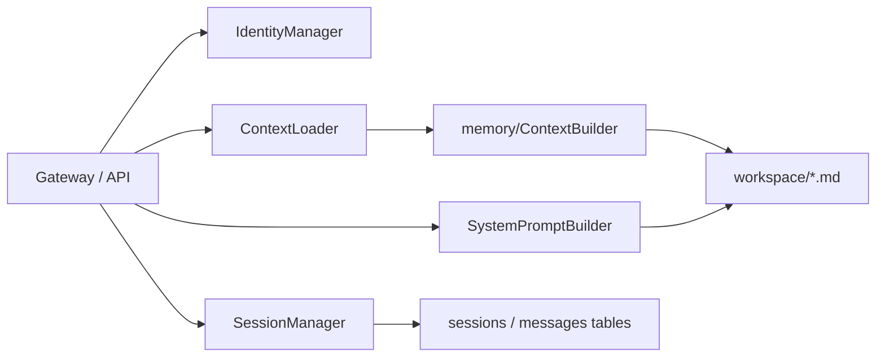
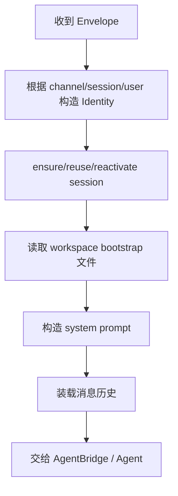
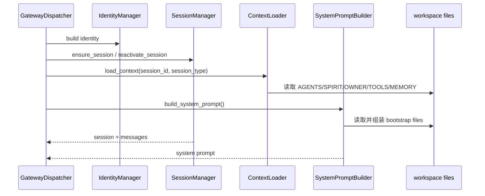
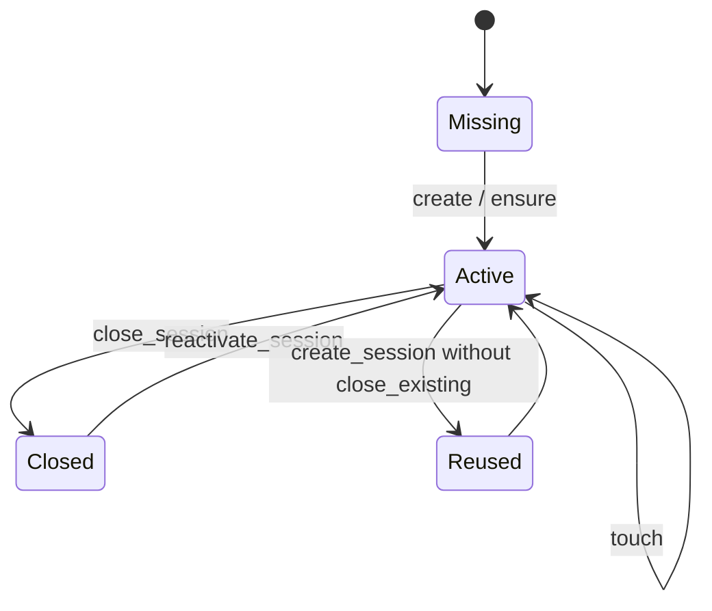

# 04. 会话、身份与上下文架构分析与 Review

## 1. 模块定位

`conversation/` 目录负责把“用户一次输入”放进正确的会话、身份和上下文里。它连接：

- Web/CLI/Gateway 的请求身份
- `sessions` 数据表与消息历史
- workspace 中的 `AGENTS.md`、`SPIRIT.md`、`OWNER.md`、`TOOLS.md`、`MEMORY.md`
- system prompt 构建逻辑

核心文件：

- `backend/src/conversation/session.py`
- `backend/src/conversation/identity.py`
- `backend/src/conversation/context_loader.py`
- `backend/src/conversation/system_prompt_builder.py`
- `backend/src/conversation/multi_agent_context_loader.py`

## 2. 当前实现总架构图

## 3. 核心链路图

## 4. 关键时序图

## 5. 状态图

## 6. 现状拆解

### 6.1 Session 语义

`SessionManager` 既负责：

- 创建/复用会话
- 查询消息与分页
- 重新激活会话
- 关闭会话
- 在创建新会话时异步触发上一会话总结

这意味着它不是“纯存储管理器”，而是带业务副作用的会话编排器。

### 6.2 Context 与 Prompt 是两条并行装配链

- `ContextLoader` 负责 session-aware context loading，并委托 `memory.context_builder.ContextBuilder`
- `SystemPromptBuilder` 负责从 workspace bootstrap 文件构造 system prompt

两者都在访问 workspace 文件，但职责切分并不完全一致：

- `ContextLoader` 更偏“上下文 bundle”
- `SystemPromptBuilder` 更偏“模型提示词拼装”

### 6.3 多 Agent workspace

`SystemPromptBuilder` 与多 Agent 上下文加载器都已经支持按 Agent workspace 装载不同文件，这为多 Agent 独立人格和记忆打下了基础。

## 7. 关键代码锚点

| 入口 | 文件 | 说明 |
| --- | --- | --- |
| 会话总入口 | `backend/src/conversation/session.py` | 创建、查询、复用、关闭、重激活 |
| 身份模型 | `backend/src/conversation/identity.py` | trace/session/channel/user/agent 身份统一表示 |
| 上下文加载 | `backend/src/conversation/context_loader.py` | AGENTS 热更新、session-aware context |
| system prompt 构建 | `backend/src/conversation/system_prompt_builder.py` | bootstrap 文件装配 |

## 8. 架构 Review

| 级别 | 发现 | 影响 | 建议 |
| --- | --- | --- | --- |
| H | 会话语义分散在前端、API、Gateway、SessionManager 多处，并且规则并不完全一致 | 难以回答“何时创建新会话、何时复用旧会话、何时关闭/激活”这类基础问题 | 明确 session lifecycle 的唯一控制点，其他层只发意图 |
| M | `SessionManager.create_session()` 带有“总结上一会话并写入长期记忆”的异步副作用 | 会话层与记忆层耦合，创建会话不再是纯粹操作 | 把总结动作转为明确的 domain event 或后台任务 |
| M | `ContextLoader`、`memory.ContextBuilder`、`SystemPromptBuilder` 都在读取 workspace 文件 | workspace 文件装配逻辑分散，容易重复读取和职责交叉 | 收敛为统一 bootstrap/context service，再按 prompt/context 两种视图输出 |
| L | `get_session` 接口通过 `ensure_session()` 自动补建缺失 session | 兼容性好，但 API 语义不够纯 | 对“查询”和“自动补建”场景做显式区分 |

## 9. 与目标态的差距

- 目标态 runtime 希望 session 是显式的 `SessionDescriptor`，lane、route、budget profile 都是一级属性。
- 当前 conversation 层仍以传统 chat session 为主，runtime session descriptor 是下游适配对象。
- 迁移时最关键的工作不是“再造一层 session”，而是统一当前 session 的控制语义，再映射到 runtime。
