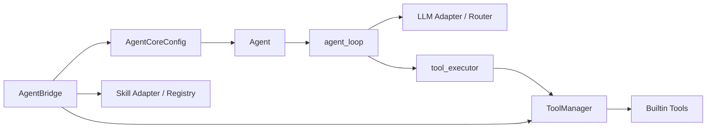
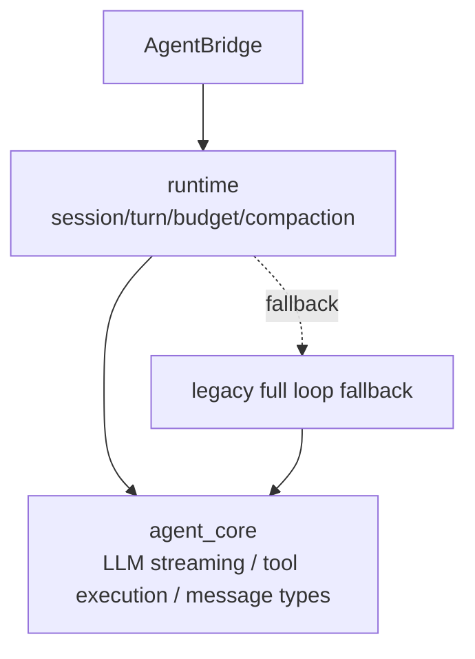
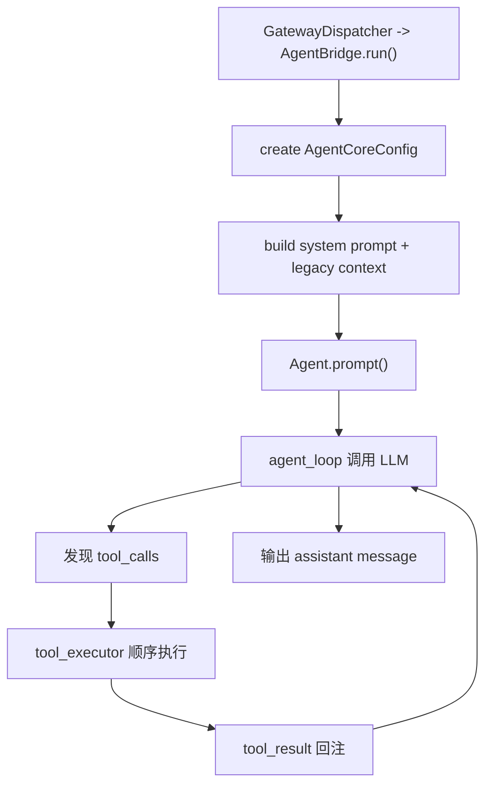
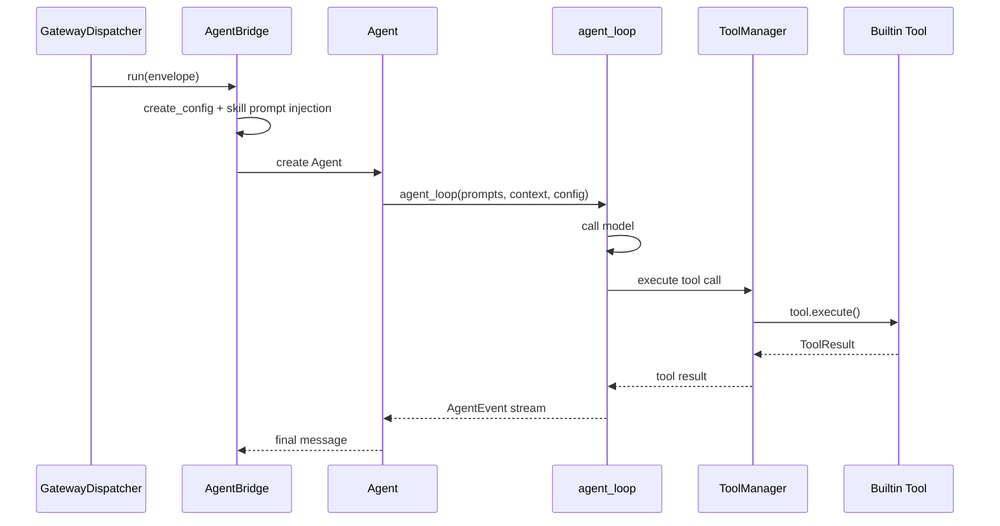
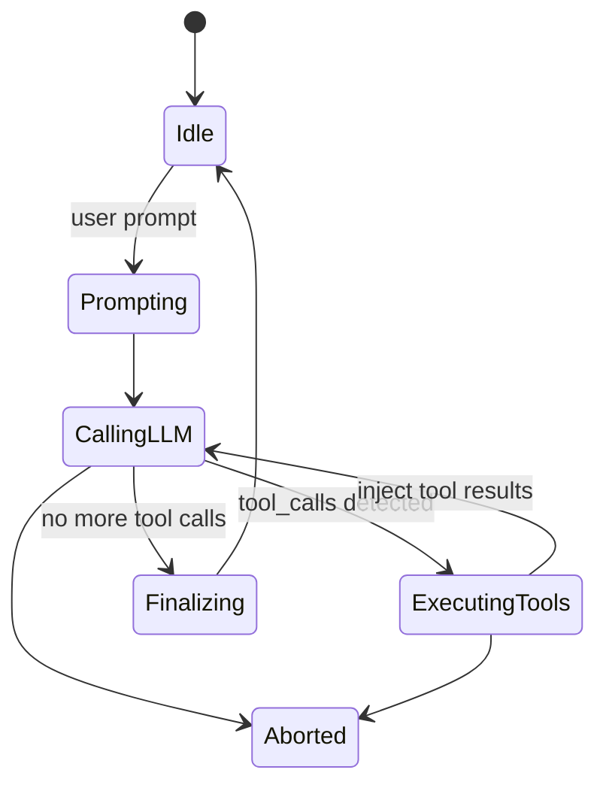

# 05. Agent Core 与工具系统架构分析与 Review

## 1. 模块定位

这一层不是已经被 runtime 替代掉的旧包袱，而是当前系统仍被 runtime 复用的执行实现层，负责：

- 维护 Agent 的消息状态与流式执行状态
- 执行 `agent_loop`
- 解析 LLM 输出中的工具调用
- 通过 `ToolManager` 和内置工具执行实际外部动作
- 注入技能（skill）相关 prompt 和约束

核心文件：

- `backend/src/agent_core/agent.py`
- `backend/src/agent_core/agent_loop.py`
- `backend/src/agent_core/tool_executor.py`
- `backend/src/tools/manager.py`
- `backend/src/tools/builtin/*`
- `backend/src/services/skill/registry.py`
- `backend/src/gateway/agent_bridge.py`

## 2. 当前实现总架构图

## 2.1 与 runtime 的关系图

`agent_core` 与 `runtime` 当前不是简单替代关系，而是“执行实现层”与“控制平面”的关系：

## 3. 核心链路图

## 4. 关键时序图

## 5. 状态图

## 6. 现状拆解

### 6.1 `Agent` 是薄封装，`agent_loop` 才是真执行器

`agent.py` 更多负责：

- 维护 state
- 提供 `prompt()` / `abort()` / `steer()` / `follow_up()`
- 转发事件

真正的执行逻辑在 `agent_loop.py` 中，包含：

- 双层循环
- turn index
- abort 处理
- LLM 调用
- tool call 检测与执行

### 6.1.1 它当前仍被 runtime 直接复用

虽然默认入口已切到 runtime，但 runtime 仍直接复用 `agent_core` 的关键实现：

- 调模型时复用 `agent_loop` 内的流式 LLM 调用能力
- 执行工具时复用 `tool_executor.execute_tool_calls`
- 继续使用 `AssistantMessage`、`ToolResultMessage` 等消息类型

因此 `agent_core` 当前更像 runtime 下方的执行库，而不是完全独立、也不是已经退出历史舞台的旧系统。

### 6.2 工具执行是当前执行链路的重要能力

`tool_executor.py` 当前的主实现是顺序执行工具调用，带：

- abort 检查
- middleware
- steering
- 跳过事件

虽然文件内也提供了并行执行辅助函数，但主流程仍以顺序执行为主。

### 6.3 Skill 系统主要在 Bridge 侧注入

Skill registry 具备：

- `USER > SYSTEM` 两级来源覆盖
- TTL 缓存
- manifest 发现

但实际 skill prompt 的注入和命令解析仍由 `AgentBridge` 主导。

### 6.4 完整 legacy loop 仍可被 runtime 回退调用

除了复用执行原语，`runtime` 还保留了完整回退能力：

- 创建 `Agent`
- 加载 session history
- 调用 `self.run()`
- 最终进入 `agent.prompt() -> agent_loop()`

这说明当前关系是：

- 默认入口：runtime
- 低层执行原语：大量来自 `agent_core`
- 完整回退路径：仍然存在

## 7. 关键代码锚点

| 入口 | 文件 | 说明 |
| --- | --- | --- |
| Agent 封装 | `backend/src/agent_core/agent.py` | prompt/abort/state |
| 主循环 | `backend/src/agent_core/agent_loop.py` | 双层循环执行器 |
| 工具执行 | `backend/src/agent_core/tool_executor.py` | tool call 执行 |
| 工具注册表 | `backend/src/tools/manager.py` | tool registry 与执行入口 |
| Skill 注册表 | `backend/src/services/skill/registry.py` | USER/SYSTEM 技能发现 |
| 兼容桥 | `backend/src/gateway/agent_bridge.py` | 技能、runtime、legacy 汇合点 |

## 8. 架构 Review

| 级别 | 发现 | 影响 | 建议 |
| --- | --- | --- | --- |
| H | `agent_core` 目前既是 legacy loop 内核，又是 runtime 复用的执行原语库 | 很容易被误解成“旧链路”或“已废弃模块”，实际并非如此 | 明确将其定义为执行实现层，并规划哪些能力继续保留、哪些最终迁出 |
| H | `AgentBridge` 不只是桥，它还负责技能注入、运行时持久化、tool governance、legacy fallback | 桥接层演变成执行中枢，边界失真 | 把 skill/runtime/persistence 逻辑拆出独立 service |
| M | 工具主路径仍以顺序执行为主 | 对多工具回合的时延不友好，且难与 runtime 并行预算治理统一 | 将并行执行策略与 tool policy 统一到 runtime governor 语义下 |
| M | `ToolManager` 同时处理注册、验证、参数纠偏、执行和 skill allowed-tools 约束 | 管理器过于全能，后续扩展更多策略时会继续膨胀 | 将 policy/validation/execution 拆开 |

## 9. 与目标态的差距

- 目标态希望 `TurnController` 掌控 budget、tool policy、compaction、finish reason。
- 目标态不必然要求 `agent_core` 整个消失，但至少要把它从“半执行框架、半库、半回退路径”的混合身份里解放出来。
- 因此这个模块的核心问题不是“功能缺失”，而是“控制权与模块身份尚未统一”。
