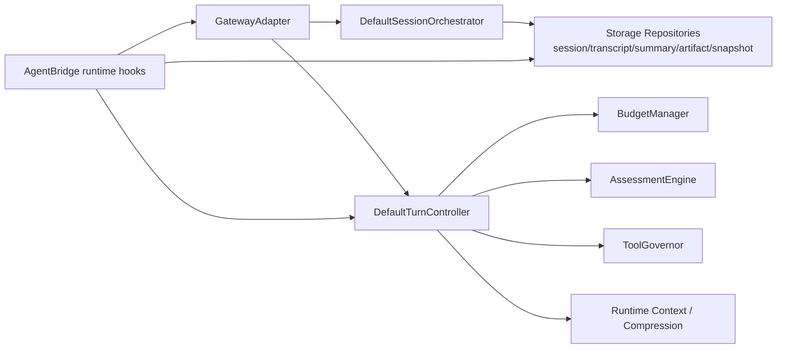
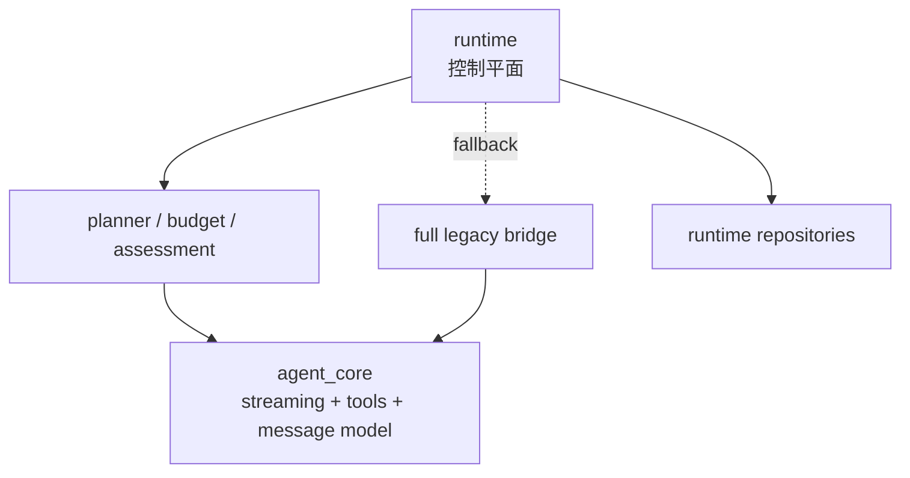
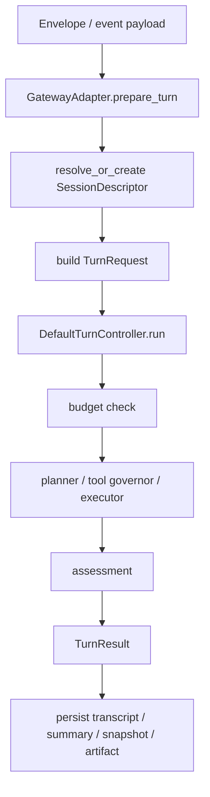
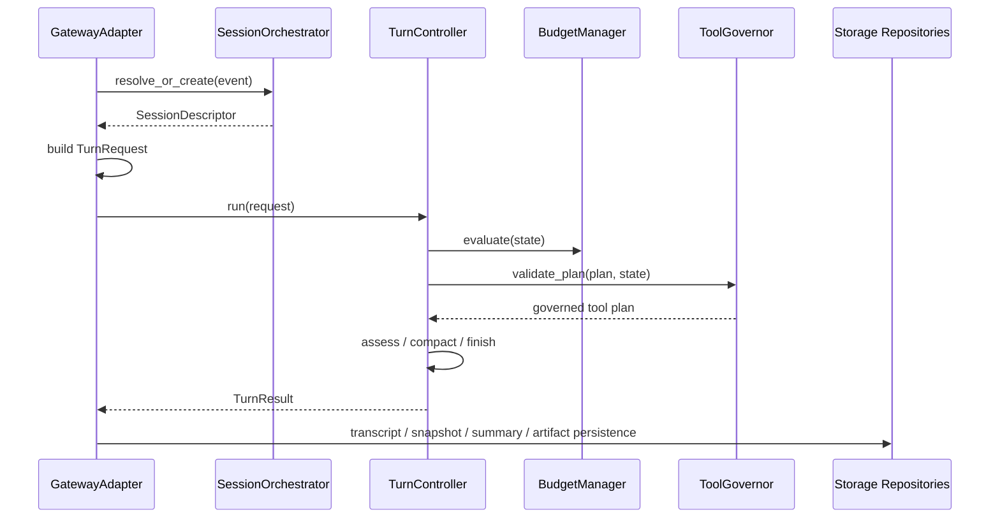
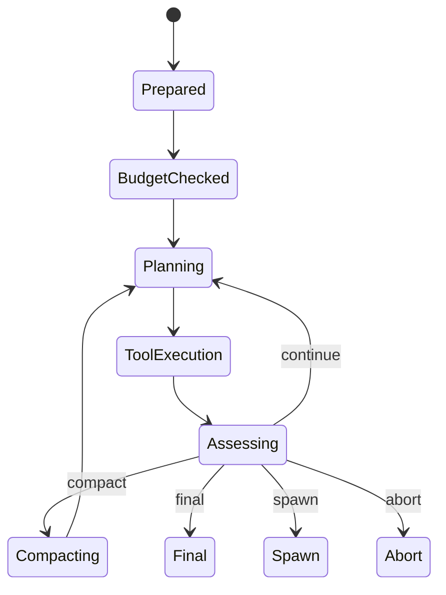

# 06. Runtime 编排架构分析与 Review

## 1. 模块定位

`runtime/` 是当前仓库里最重要的演进方向，但它现在并不是与 `agent_core` 平行替代的第二套系统，而是新的控制平面：

- bounded turn controller
- session orchestration
- transcript / summary / artifact / state snapshot 持久化
- child session / announcement / lane 调度

核心文件：

- `backend/src/runtime/service.py`
- `backend/src/runtime/session/orchestrator.py`
- `backend/src/runtime/turn/controller.py`
- `backend/src/runtime/adapters/gateway_adapter.py`
- `backend/src/runtime/adapters/conversation_adapter.py`
- `backend/src/services/context/*`
- `backend/src/services/compression/*`

## 2. 当前实现总架构图

## 2.1 与 agent_core 的关系图

当前 `runtime` 与 `agent_core` 的关系更接近“上层编排 + 下层执行实现”：

## 3. 核心链路图

## 4. 关键时序图

## 5. 状态图

## 6. 现状拆解

### 6.1 runtime 已接真实存储，而不只是内存玩具

`runtime/service.py` 会构造：

- `StorageSessionRepository`
- `StorageTranscriptRepository`
- `StorageSummaryRepository`
- `StorageArtifactRepository`
- `StorageCompressionEventRepository`
- `StorageStateSnapshotRepository`

说明 runtime 的持久化方向已经接到主存储服务上，而不是只停留在内存 mock。

### 6.2 runtime 默认入口已成立，但底层仍复用 agent_core

当前默认聊天链路已经先进入 runtime controller，但 runtime 仍直接复用：

- `agent_core.agent_loop` 中的流式模型调用实现
- `agent_core.tool_executor` 中的工具执行实现
- `agent_core` 的消息类型与部分上下文转换工具

所以现在更准确的判断是：

- 默认入口：runtime
- 默认低层执行原语：仍大量来自 `agent_core`
- 这不是替代完成，而是“控制层已切换、执行层尚未完全去耦”

### 6.3 但 controller 仍是 skeleton 化实现

`DefaultTurnController` 具备真实接口与控制流：

- budget manager
- assessment engine
- tool governor
- compact hook
- spawn / abort / final 等结果类型

但默认 planner、executor、compact 仍是 stub，真正有业务含义的执行目前主要还是在 `AgentBridge` 中补齐。

### 6.4 `AgentBridge` 是 runtime 落地的关键连接器

当前 runtime 并不是直接由 Gateway 独立驱动，而是通过 `AgentBridge`：

- 准备 runtime config
- 补历史
- 记录 transcript / snapshot / summary
- 必要时回退到 legacy bridge

因此 runtime 已“成为默认入口”，但尚未“彻底摆脱 agent_core 和 AgentBridge 的深度依赖”。

## 7. 关键代码锚点

| 入口 | 文件 | 说明 |
| --- | --- | --- |
| runtime services | `backend/src/runtime/service.py` | 运行时配置与仓储装配 |
| session orchestrator | `backend/src/runtime/session/orchestrator.py` | session/child/announcement 编排 |
| turn controller | `backend/src/runtime/turn/controller.py` | bounded loop 框架 |
| gateway adapter | `backend/src/runtime/adapters/gateway_adapter.py` | Gateway -> TurnRequest |
| context assembler | `backend/src/services/context/context_assembler.py` | runtime 兼容上下文拼装 |
| compression manager | `backend/src/services/compression/manager.py` | 旧式 context compression 管理 |

## 8. 架构 Review

| 级别 | 发现 | 影响 | 建议 |
| --- | --- | --- | --- |
| H | runtime 已接入真实持久化，但核心控制器仍保留大量 stub / skeleton 语义 | 容易出现“看起来已接管，实则仍靠 legacy bridge 执行”的认知偏差 | 明确 runtime ready checklist，区分“接入”与“接管” |
| H | runtime 不是与 `agent_core` 已完成替代切换，而是默认入口仍深度复用 `agent_core` 执行原语，并保留完整 legacy fallback | 如果文档或设计把它描述成“runtime 已取代旧链路”，会直接误导实现判断 | 把二者关系明确定义为“控制平面 vs 执行实现层”，再逐步去耦 |
| H | runtime 的很多真实动作仍由 `AgentBridge` 代理执行与持久化 | runtime 层的边界被桥接层穿透 | 把 runtime persistence 与 bridge fallback 分开，减少跨层回写 |
| M | `services/context` 与 `services/compression` 里保留了 runtime compatibility 组件，和新 `runtime/context` 语义并存 | context/compression 领域概念重复，维护者理解成本高 | 确定最终保留的一套上下文/压缩模型，并给兼容层设置退出路径 |
| M | lane / child session / announcement 等控制平面对象已经存在，但前后端产品面尚未完全跟上 | 运行时能力与用户可见能力不匹配 | 在 UI/CLI 中逐步暴露 child result、announcement、artifact 等 runtime 概念 |

## 9. 与目标态的差距

- 这是距离目标态最近的一层，也是差距最清晰的一层。
- 当前已经具备：
  - 会话编排抽象
  - 存储仓储
  - bounded controller 接口
  - Gateway 适配器
- 当前尚未完全具备：
  - 脱离 `agent_core` 低层执行原语和 legacy bridge 的主执行路径
  - 完整 planner / executor / compaction 业务闭环
  - 跨端一致呈现 runtime state 的产品能力
