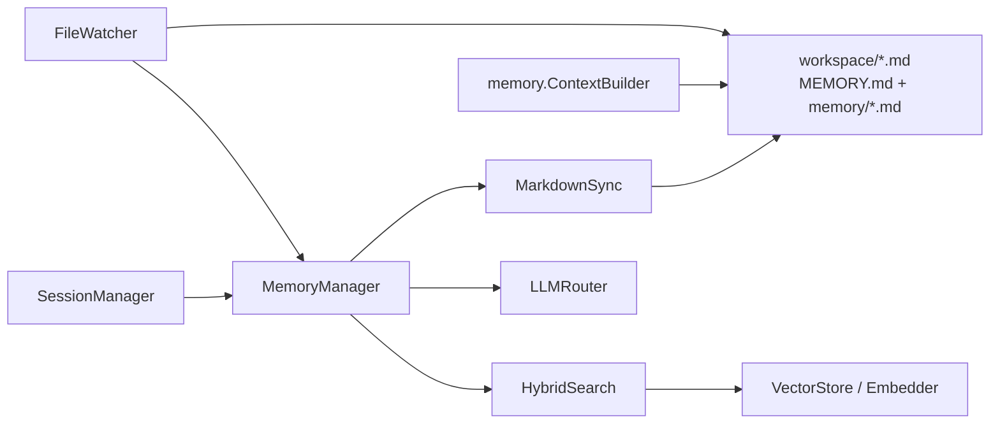
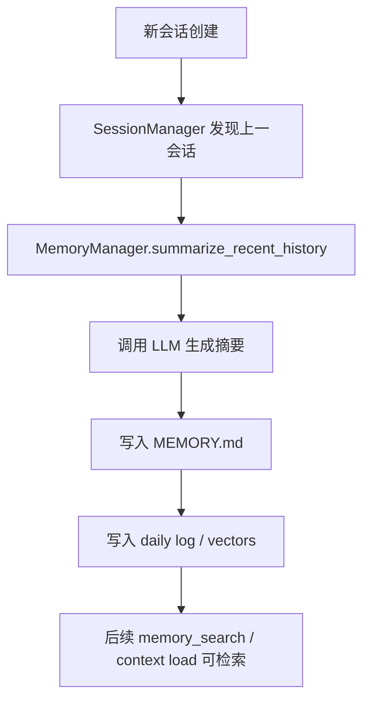
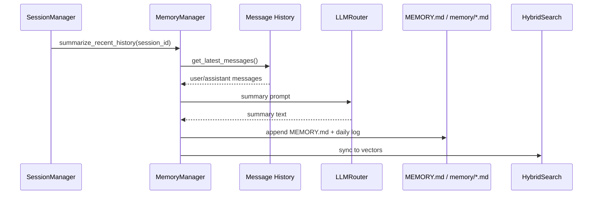
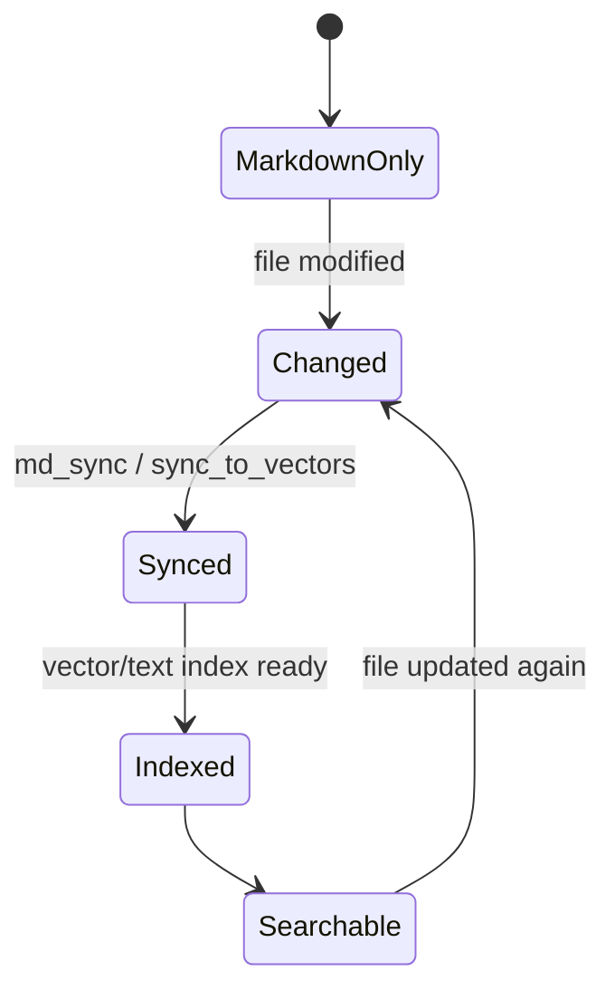

# 07. 记忆系统架构分析与 Review

## 1. 模块定位

记忆系统是 X-Agent 和普通聊天应用最大的差异点之一。当前实现同时覆盖：

- Markdown 文件型长期记忆
- 会话历史总结写入
- 重要信息抽取
- 向量/文本混合检索
- workspace 文件变更监听与同步

核心文件：

- `backend/src/memory/manager.py`
- `backend/src/memory/context_builder.py`
- `backend/src/memory/file_watcher.py`
- `backend/src/memory/hybrid_search.py`
- `backend/src/memory/vector_store.py`
- `backend/src/memory/md_sync.py`

## 2. 当前实现总架构图

## 3. 核心链路图

## 4. 关键时序图

## 5. 状态图

## 6. 现状拆解

### 6.1 `MemoryManager` 是强入口

`MemoryManager` 同时整合三类能力：

- Write：总结、归档、直接记录
- Search：hybrid search、向量同步
- Session：回查数据库消息历史

这让调用方很方便，但也让这个类天然偏大。

### 6.2 数据源是 Markdown，一致性通过同步链补齐

系统不是直接以向量库为唯一真相源，而是以 workspace 下的 Markdown 文件为长期可读存储：

- `MEMORY.md`
- `memory/YYYY-MM-DD.md`
- `SPIRIT.md`、`OWNER.md`、`TOOLS.md`

向量索引与检索是附加能力，而不是唯一主存储。

### 6.3 存在热更新与文件监听

`FileWatcher` 使用 watchdog 监听：

- `SPIRIT.md`
- `OWNER.md`
- `IDENTITY.md`
- `TOOLS.md`
- `AGENTS.md`
- `memory/*.md`

文件修改后触发 reload 或同步动作。

## 7. 关键代码锚点

| 入口 | 文件 | 说明 |
| --- | --- | --- |
| 统一入口 | `backend/src/memory/manager.py` | 总结、归档、搜索、同步 |
| 上下文构建 | `backend/src/memory/context_builder.py` | recent logs + long-term memory |
| 文件监听 | `backend/src/memory/file_watcher.py` | Markdown 变更监听 |
| 混合检索 | `backend/src/memory/hybrid_search.py` | 文本 + 向量相似度 |

## 8. 架构 Review

| 级别 | 发现 | 影响 | 建议 |
| --- | --- | --- | --- |
| M | `MemoryManager` 同时承担总结、抽取、搜索、session 查询职责 | 统一入口易用，但类职责明显膨胀 | 将 write/search/context/session-query 逐步拆为子服务 |
| M | 记忆系统采用 Markdown 真相源 + 向量索引副本，存在双写一致性风险 | 任一写入或同步失败都可能造成“文件已更新但索引未更新” | 引入显式 sync status / retry / repair 机制 |
| M | `conversation.ContextLoader` 与 `memory.ContextBuilder` 都在做上下文装配 | 上下文视图散落，理解成本高 | 统一“上下文来源”和“prompt 视图”的边界 |
| L | 以 Markdown 为真相源的设计可读性很强 | 对调试和人工维护友好 | 保持该优势，同时把索引状态可视化 |

## 9. 与目标态的差距

- 目标态 runtime 更强调 transcript、summary chain、artifact ref 等结构化上下文。
- 当前记忆系统更偏“人可读的长期记忆 + 会话总结 + 检索”。
- 两者不是冲突关系，但需要更清晰地定义：
  - runtime summary 是执行态压缩
  - memory summary 是长期记忆沉淀
