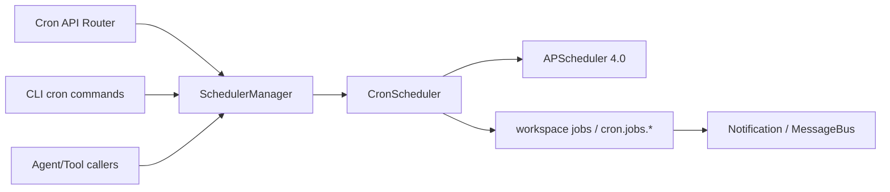
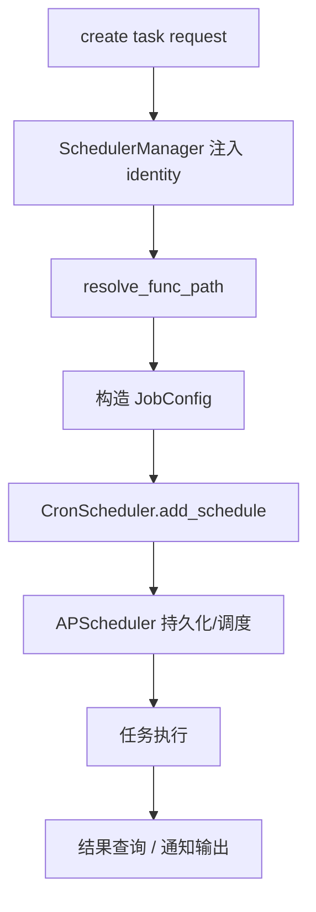
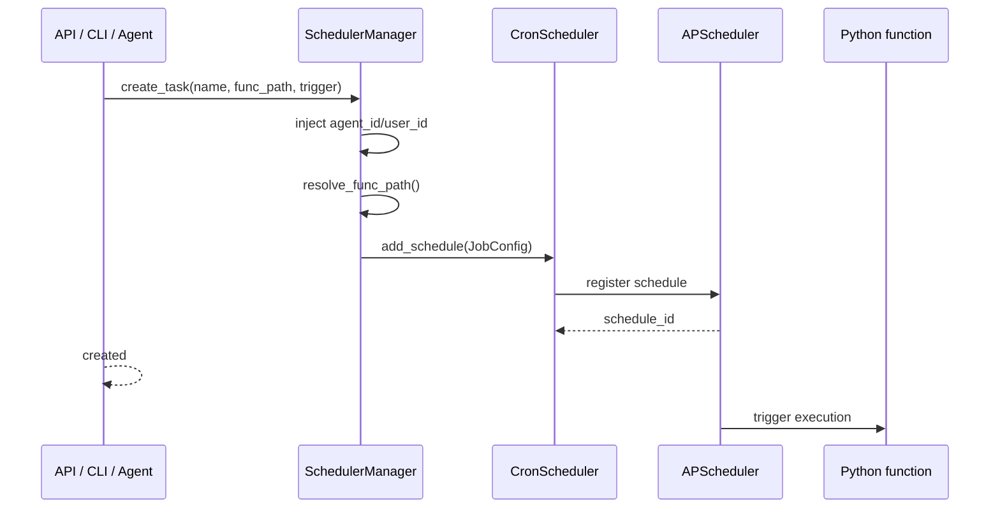
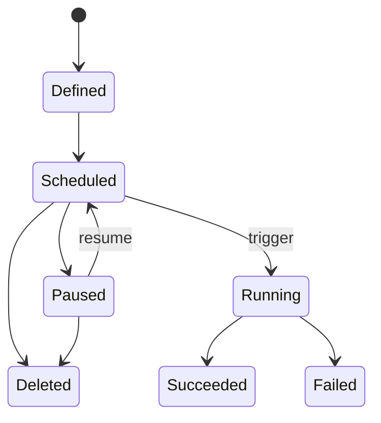

# 08. Cron 与自动化架构分析与 Review

## 1. 模块定位

Cron 子系统让 X-Agent 不只是“被动回答”，还可以：

- 管理定时任务
- 立即执行任务
- 通过 Agent/CLI/API 操作任务
- 在任务执行后与通知/会话系统联动

核心文件：

- `backend/src/cron/manager.py`
- `backend/src/cron/scheduler.py`
- `backend/src/cron/config.py`
- `backend/src/cron/api/router.py`
- `backend/src/cron/README.md`

## 2. 当前实现总架构图

## 3. 核心链路图

## 4. 关键时序图

## 5. 状态图

## 6. 现状拆解

### 6.1 Manager 是唯一公共入口

`backend/src/cron/README.md` 明确规定：

- 调用方必须依赖 `manager.py`
- 禁止直接依赖 `scheduler.py`

这条规约本身是该模块的架构亮点，因为它清晰地区分了：

- `SchedulerManager`：业务适配层
- `CronScheduler`：APScheduler 封装层

### 6.2 Manager 额外承担了多项横切职责

`SchedulerManager` 不只是简单代理，它还负责：

- 自动注入 `agent_id` / `user_id`
- `workspace:` 路径与裸文件名解析
- 统一错误处理
- 统一返回结构

### 6.3 API 表面存在新旧风格并存

`cron/api/router.py` 同时保留：

- `list_schedules`
- `schedules`
- `schedule/{id}`

说明该子系统在 API 层仍处于兼容演进态。

## 7. 关键代码锚点

| 入口 | 文件 | 说明 |
| --- | --- | --- |
| 统一管理入口 | `backend/src/cron/manager.py` | identity 注入、路径解析、统一接口 |
| API 入口 | `backend/src/cron/api/router.py` | REST 管理接口 |
| 分层约束文档 | `backend/src/cron/README.md` | 明确 manager/scheduler 边界 |

## 8. 架构 Review

| 级别 | 发现 | 影响 | 建议 |
| --- | --- | --- | --- |
| M | `SchedulerManager` 的分层定位清晰，是整个仓库中相对健康的中间层设计 | 有利于 API、CLI、工具调用统一走同一入口 | 保持这条边界，不要让调用方回退依赖 `scheduler.py` |
| M | Manager 同时承担 identity 注入、路径解析、错误适配、调度代理，职责在持续增大 | 后续再接更多任务类型时，manager 容易继续膨胀 | 拆出 path resolver、identity decorator、result mapper |
| M | API 存在兼容与 RESTful 双命名并存 | 前后端维护时容易混淆真实标准接口 | 逐步收敛到一套外部契约 |
| L | `workspace:` 与裸文件名解析提高了使用便利性 | 用户体验好 | 保留体验优势，同时增加更严格的校验与审计 |

## 9. 与目标态的差距

- Cron 子系统本身分层清晰，但和 runtime 的关系还比较松散。
- 未来若要深度融入 runtime，应考虑：
  - cron lane 与普通 main lane 的统一调度语义
  - cron 结果以 runtime artifact / announcement 形式返回
  - 定时任务与 session lifecycle 的统一治理
