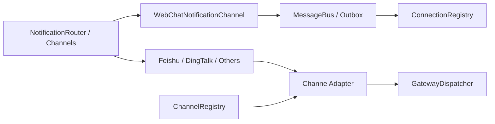
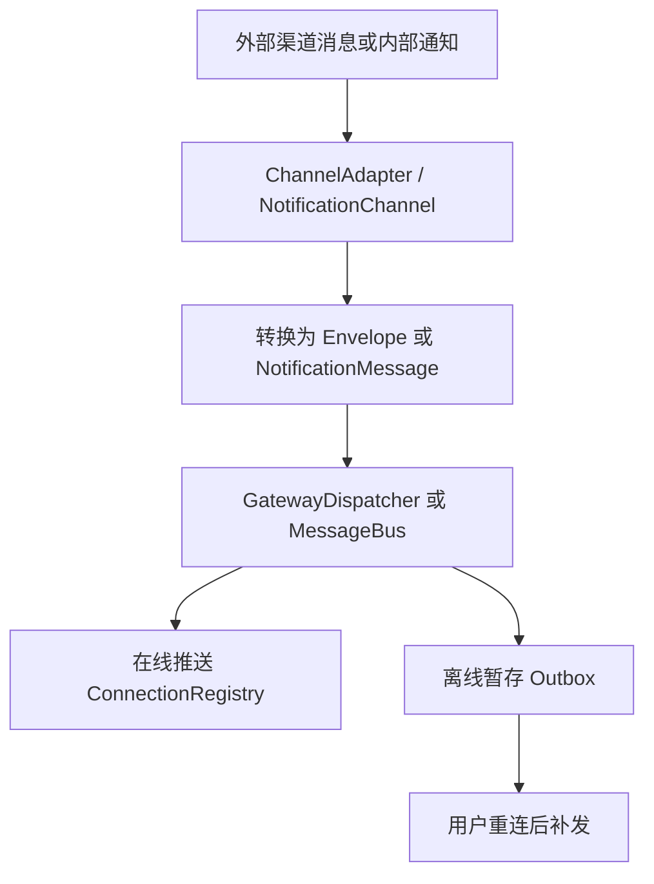
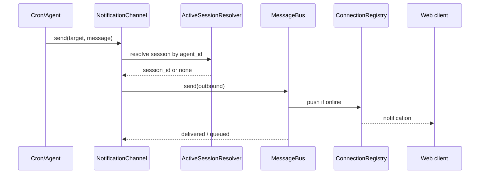
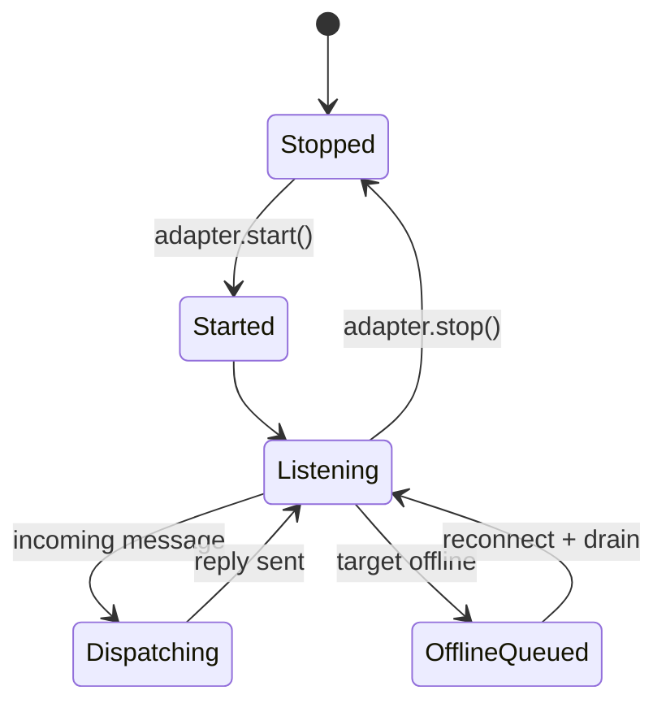

# 09. 外部渠道与通知架构分析与 Review

## 1. 模块定位

这一层负责两个方向：

- 外部 IM 平台接入：把平台消息转成 `Envelope`
- 系统内通知投递：把内部消息送到 WebChat、DingTalk、Telegram 等渠道

核心文件：

- `backend/src/channel/base.py`
- `backend/src/channel/registry.py`
- `backend/src/channel/feishu/adapter.py`
- `backend/src/channel/adapters/dingtalk.py`
- `backend/src/gateway/notification.py`
- `backend/src/gateway/message_bus.py`
- `backend/src/gateway/connection_registry.py`

## 2. 当前实现总架构图

## 3. 核心链路图

## 4. 关键时序图

## 5. 状态图

## 6. 现状拆解

### 6.1 渠道接入与通知投递是两条相邻但不同的子链路

- `channel/*` 偏“入口适配”
- `gateway/notification.py` 偏“出站投递”

两者都属于“渠道层”，但目前并未完全合并为单一模型。

### 6.2 WebChat 通知链路最成熟

`WebChatNotificationChannel` 已经具备：

- session 自动解析
- 在线推送
- 离线 outbox
- 重连补发

相比之下，外部渠道更多停留在 adapter/facade 层面。

### 6.3 Feishu 是当前较完整的外部渠道样板

`backend/src/channel/feishu/adapter.py` 已具备：

- WebSocket client 启动
- 事件解析
- 消息去重
- 转换为 `Envelope`
- 流式处理回复

说明外部渠道并非纯接口空壳，但成熟度仍不如 WebChat 主链。

## 7. 关键代码锚点

| 入口 | 文件 | 说明 |
| --- | --- | --- |
| 渠道抽象 | `backend/src/channel/base.py` | `ChannelAdapter` 接口 |
| 渠道注册表 | `backend/src/channel/registry.py` | 注册、启动、停止适配器 |
| 飞书适配器 | `backend/src/channel/feishu/adapter.py` | 当前较完整的外部渠道实现 |
| 通知系统 | `backend/src/gateway/notification.py` | 通知模型与投递 |
| 在线/离线投递 | `backend/src/gateway/message_bus.py` | push + outbox |

## 8. 架构 Review

| 级别 | 发现 | 影响 | 建议 |
| --- | --- | --- | --- |
| M | 渠道接入与通知投递分属两套模型，边界相邻但未统一 | 进入系统和离开系统的渠道语义不完全对称 | 统一 inbound/outbound channel model，减少重复概念 |
| M | WebChat 路径明显比外部渠道更成熟 | 多渠道承诺与真实成熟度存在落差 | 明确标注各渠道支持等级与能力矩阵 |
| M | `ChannelRegistry` 自动创建仅覆盖部分渠道类型 | 扩展新渠道仍需补较多样板代码 | 抽出更标准的 adapter bootstrap 流程 |
| L | MessageBus + Outbox 设计清晰，离线补发思路正确 | 对通知链路可靠性有正面作用 | 将 delivery metrics 纳入统一可观测 |

## 9. 与目标态的差距

- 目标态应让渠道不仅是“消息入口”，还成为统一 route/lane 的来源。
- 当前 channel 层已经把 `Envelope` 送进 Gateway，但 route/meta 的 runtime 级利用仍较浅。
- 未来可以继续增强：
  - 渠道级 session 映射治理
  - 跨渠道统一消息模板
  - runtime announcement 到外部渠道的标准渲染
