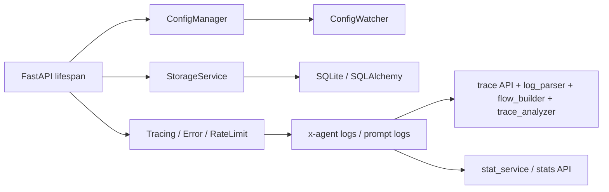
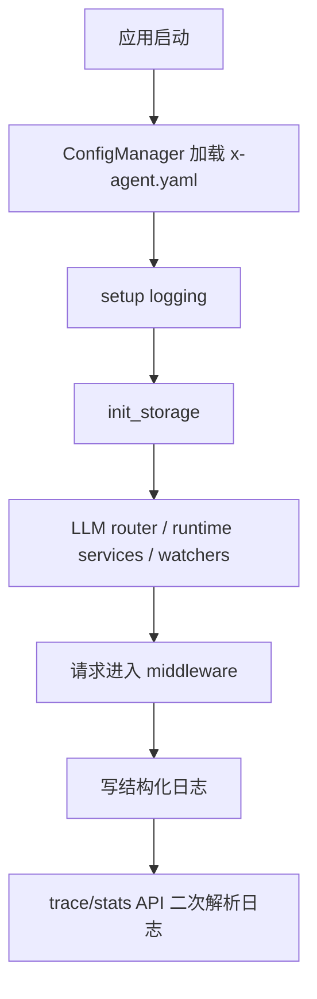
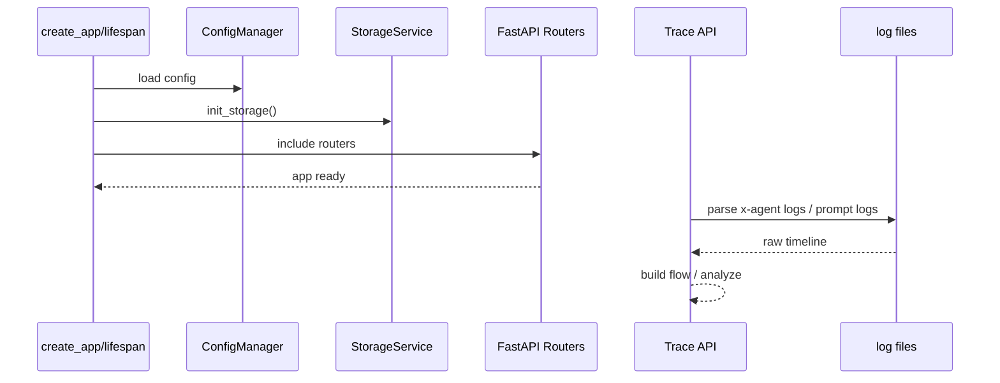
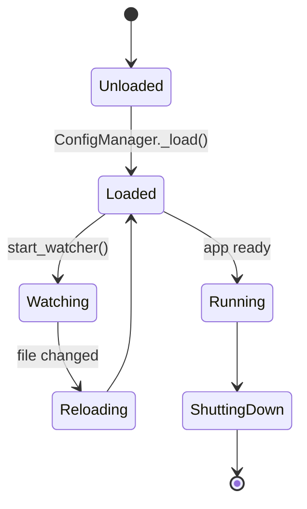

# 10. 配置、存储与可观测架构分析与 Review

## 1. 模块定位

这一层不是单独业务功能，但决定了整套系统能否稳定运行、被调试和被演进。它覆盖：

- 配置加载与热更新
- 存储初始化与数据库会话
- 应用启动/关闭
- tracing、stats、trace analysis、developer APIs

核心文件：

- `backend/src/config/manager.py`
- `backend/src/services/storage.py`
- `backend/src/main.py`
- `backend/src/api/middleware/*`
- `backend/src/api/v1/trace.py`
- `backend/src/api/v1/stats.py`
- `backend/src/services/log_parser.py`
- `backend/src/services/flow_builder.py`

## 2. 当前实现总架构图

## 3. 核心链路图

## 4. 关键时序图

## 5. 状态图

## 6. 现状拆解

### 6.1 Config 是单例式全局状态

`ConfigManager` 通过 singleton + callback + watcher 维护全局配置：

- 惰性加载
- reload
- 回调通知
- watcher 启停

优点是方便；代价是全局可变状态会穿透很多模块。

### 6.2 Storage 既有全局单例，也存在临时实例化

`services/storage.py` 提供：

- `get_storage_service()`
- `init_storage()`
- `close_storage()`

但并非所有调用方都严格复用它，例如 `api/v1/sessions.py` 中会直接 `SessionManager(StorageService())`。这导致：

- 数据库连接生命周期不统一
- 测试与运行时行为可能分裂

### 6.3 可观测能力很强，但结构偏“日志后二次分析”

Trace 相关 API 会：

- 读取日志文件
- 解析 timeline
- 构建 flow graph
- 再用 LLM 分析问题

这让开发体验很好，但说明 trace 的主要分析数据源仍是日志文件而不是独立事件存储。

## 7. 关键代码锚点

| 入口 | 文件 | 说明 |
| --- | --- | --- |
| 配置单例 | `backend/src/config/manager.py` | 配置加载与热更新 |
| 存储服务 | `backend/src/services/storage.py` | SQLAlchemy async session |
| 应用装配 | `backend/src/main.py` | lifespan、middleware、routers |
| Trace API | `backend/src/api/v1/trace.py` | 原始 trace、flow、LLM 分析 |
| Stats API | `backend/src/api/v1/stats.py` | 请求统计 |

## 8. 架构 Review

| 级别 | 发现 | 影响 | 建议 |
| --- | --- | --- | --- |
| H | 存储访问模式不一致：既有 `get_storage_service()` 单例，又有局部 `StorageService()` 新实例 | 数据库连接与事务边界不一致，增加调试难度 | 明确统一 storage acquisition 规则，禁止业务层随意 new `StorageService()` |
| M | `ConfigManager` 是可变全局单例，回调与 watcher 生命周期容易跨模块蔓延 | 热更新方便，但模块间耦合隐蔽 | 为 config reload 定义更明确的订阅边界与生命周期 |
| M | trace 分析主要依赖日志回放 | 分析能力强，但实时性与结构化程度受限 | 逐步把关键 runtime/gateway 事件沉淀为一等数据表或事件流 |
| L | `main.py` 的 lifespan 已经比较完整，启动顺序清晰 | 是当前主服务稳定性的基础 | 保持启动序列集中，不要把初始化逻辑继续下沉到端点层 |

## 9. 与目标态的差距

- 目标态 runtime 需要更强的一等可观测性：turn、budget、artifact、summary、child session 都应可直接追踪。
- 当前基础设施层已经有 tracing/logging/stats，但 runtime 级指标还没有完全成为统一一等数据。
- 这意味着基础设施不是缺失，而是“下一步要从日志导向事件导向”。
