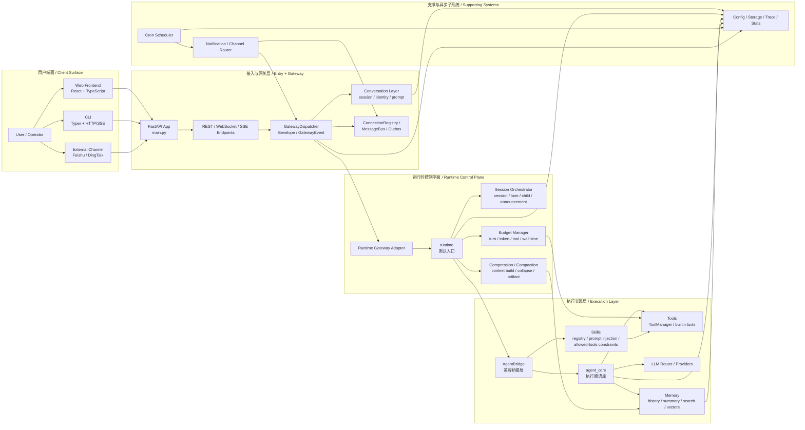
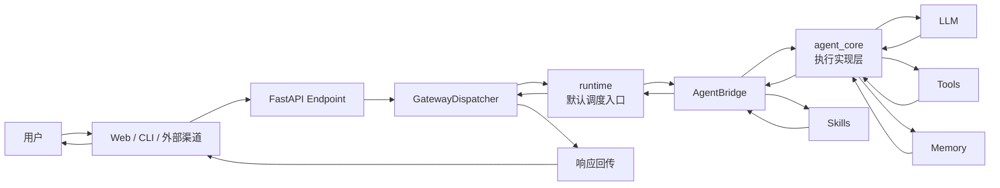
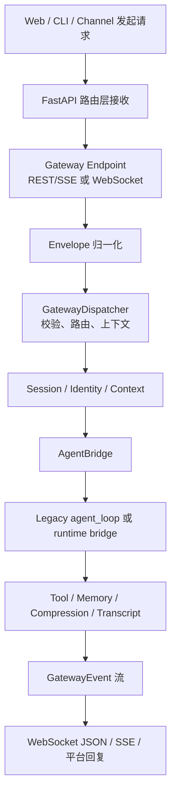
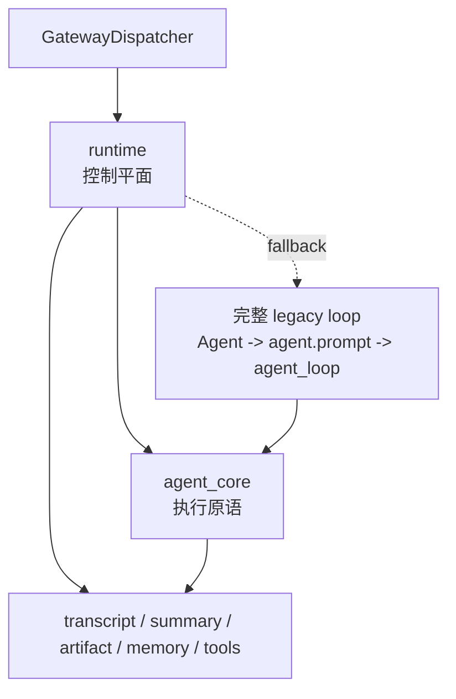
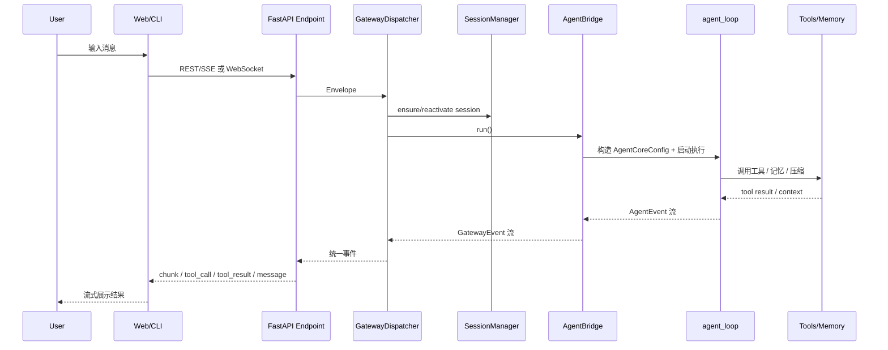
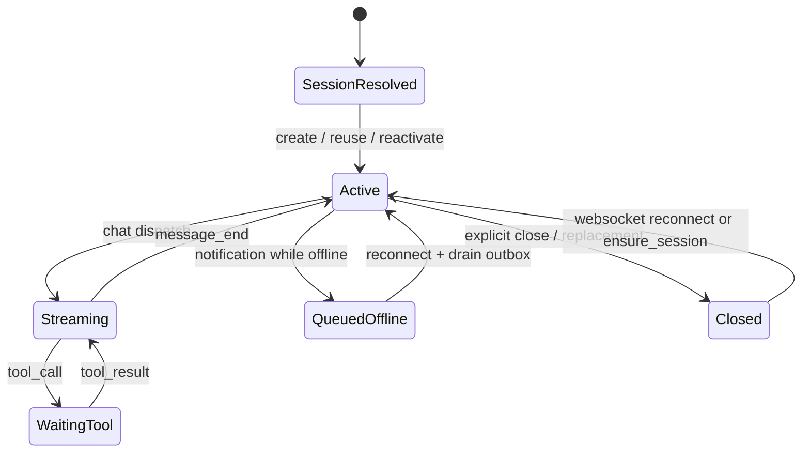

# X-Agent 架构分析与 Review

> 基线时间：2026-04-08  
> 评审口径：以当前代码真实实现为准，`docs/runtime/` 仅作为目标态对照，不替代现状判断。

## 1. 文档目标

这套文档面向需要快速理解 X-Agent 代码结构、调用链路和架构风险的研发人员。  
采用“总-分-总”组织方式：

1. 本文先给出整体系统视图、全局链路、总评结论。
2. 各模块文档分别展开前端、CLI、后端核心子系统。
3. 最后在本文收口总体 review 结论和建议演进顺序。

## 2. 代码现实中的系统组成

当前仓库不是单体聊天应用，而是一个由多交互端、多后端子系统和多种兼容层拼接而成的 AI Agent 平台：

- Web 前端：`frontend/src/`
- CLI：`cli/`
- FastAPI 主服务：`backend/src/main.py`
- REST/WebSocket/SSE Gateway：`backend/src/gateway/`
- 会话、身份、上下文装配：`backend/src/conversation/`
- Legacy Agent Core 执行实现层：`backend/src/agent_core/`
- 新 runtime 控制平面：`backend/src/runtime/`
- 记忆系统：`backend/src/memory/`
- 定时任务系统：`backend/src/cron/`
- 外部渠道与通知：`backend/src/channel/`、`backend/src/gateway/notification.py`
- 配置、存储、观测与开发者工具：`backend/src/config/`、`backend/src/services/`

## 3. 整体总架构图

## 3.1 极简调度总图（汇报版）

## 4. 全局主链路图

## 5. runtime 与 agent_core 的关系

这两层当前不是“新旧替代已经完成”的关系，而是“上下层协作、逐步迁移”的关系：

- `runtime` 负责新的控制平面：
  - session orchestration
  - turn request/result
  - budget / assessment / compaction
  - transcript / summary / artifact / snapshot 持久化
- `agent_core` 仍提供成熟的执行原语：
  - `AgentCoreConfig`
  - `Agent` / `agent_loop`
  - LLM 流式回复处理
  - tool executor
  - 既有消息类型与上下文转换工具
- 当前默认聊天入口已经先进入 runtime，但 runtime 仍复用多项 `agent_core` 实现，并保留完整 legacy bridge fallback。

## 6. 端到端关键时序图

## 7. 系统状态图

## 8. 模块章节导航

| 章节 | 主题 | 主要目录 |
| --- | --- | --- |
| 01 | Web 前端 | `frontend/src/` |
| 02 | CLI | `cli/` |
| 03 | API 与 Gateway | `backend/src/main.py`、`backend/src/api/`、`backend/src/gateway/` |
| 04 | 会话与上下文 | `backend/src/conversation/` |
| 05 | Agent Core 与工具系统 | `backend/src/agent_core/`、`backend/src/tools/` |
| 06 | Runtime 编排 | `backend/src/runtime/`、`backend/src/services/context/`、`backend/src/services/compression/` |
| 07 | 记忆系统 | `backend/src/memory/` |
| 08 | Cron 与自动化 | `backend/src/cron/` |
| 09 | 外部渠道与通知 | `backend/src/channel/`、`backend/src/gateway/notification.py` |
| 10 | 配置、存储与可观测 | `backend/src/config/`、`backend/src/services/storage.py`、`backend/src/api/v1/trace.py` 等 |

## 9. 总体架构判断

### 8.1 优势

- 已经形成“多入口统一归一化”的雏形：WebSocket、REST/SSE、CLI、外部渠道都收敛到 Gateway。
- Legacy Agent Core、记忆系统、Cron、通知系统都不是孤岛，而是通过会话与消息总线相互联通。
- 新 runtime 已经不是纸面设计，持久化仓储、会话编排、turn controller 和 gateway adapter 已接入主干代码。
- 但 runtime 与 agent_core 当前是“控制平面 + 执行实现层”的关系，不是已经完成切换的替代关系。
- 前端、CLI、Cron API 都较薄，主要业务被推回后端，有利于后续统一行为。

### 8.2 总体问题

- 当前系统最大的问题不是“没有分层”，而是“分层已存在，但 runtime 与 agent_core 的职责仍通过兼容桥深度缠绕”，导致边界仍然模糊。
- `AgentBridge`、`SessionManager`、`MemoryManager` 这类总入口承担了过多编排职责，成为事实上的架构中枢。
- runtime 与 legacy agent_core 并存，造成同一业务语义可能在多个层次被处理、持久化或裁剪。
- 会话语义、连接语义、通知语义分散在前端、Gateway、Conversation、MessageBus 多处实现，容易产生状态漂移。

## 10. 总体 Review 结论

### H 级

| 级别 | 发现 | 证据 | 影响 |
| --- | --- | --- | --- |
| H | `AgentBridge` 兼容职责过重，成为系统最大耦合热点 | `backend/src/gateway/agent_bridge.py` 同时处理 runtime、legacy agent loop、技能、工具、持久化、事件转换 | 使 Gateway、runtime、agent_core 的边界失真，后续演进成本高 |
| H | 会话生命周期语义分散且不完全一致 | `frontend/src/App.tsx`、`backend/src/conversation/session.py`、`backend/src/api/v1/sessions.py`、`backend/src/gateway/endpoints/websocket.py` | 易出现“前端以为新建、后端实际复用”“连接断开但会话仍活跃”等状态歧义 |
| H | runtime 与 agent_core 目前是“上下层复用 + 回退并存”，而不是清晰替代 | `backend/src/gateway/dispatcher.py`、`backend/src/gateway/agent_bridge.py`、`backend/src/agent_core/agent_loop.py`、`backend/src/runtime/turn/controller.py` | 容易误判真实执行边界，造成双重抽象、双重持久化和控制策略分裂 |

### M 级

| 级别 | 发现 | 证据 | 影响 |
| --- | --- | --- | --- |
| M | 存储访问方式不一致，存在全局单例与临时实例并用 | `backend/src/services/storage.py` 与 `backend/src/api/v1/sessions.py` 中 `SessionManager(StorageService())` | 连接管理、配置一致性和测试隔离都更难保证 |
| M | WebSocket 与 SSE 使用不同流协议，且都要维护自己的事件转换逻辑 | `backend/src/gateway/endpoints/websocket.py`、`backend/src/gateway/endpoints/rest.py`、`frontend/src/hooks/useAgent.ts`、`cli/adapters/gateway_client.py` | 协议演进容易漂移，增加客户端兼容成本 |
| M | 通知/渠道抽象存在，但能力成熟度不均衡 | `backend/src/channel/registry.py`、`backend/src/gateway/notification.py` | Web chat 较完整，外部渠道落地面不足，跨渠道一致性待加强 |

### L 级

| 级别 | 发现 | 证据 | 影响 |
| --- | --- | --- | --- |
| L | 可观测能力较强，但 trace 分析仍部分依赖日志回放而非一等事件存储 | `backend/src/api/v1/trace.py`、`backend/src/services/log_parser.py` | 可分析性强，但实时性和结构化程度仍有提升空间 |
| L | 目录层级与实现成熟度不完全对应 | `backend/src/runtime/`、`backend/src/channel/` 部分目录已成体系，部分仍偏 skeleton | 容易让新接手开发者高估模块完备度 |

## 11. 建议的演进顺序

1. 先统一会话语义：明确 create / reuse / close / reactivate / outbox 的唯一归属层。
2. 再拆 `AgentBridge`：把 runtime persistence、legacy bridge、skill injection、event conversion 分离。
3. 最后完成 runtime 去耦：让 bounded turn controller 成为真正主路径，同时把 `agent_core` 收敛为明确的执行库或彻底退出主链路。

## 12. 分章文档

- [01-web-frontend.md](./01-web-frontend.md)
- [02-cli.md](./02-cli.md)
- [03-api-and-gateway.md](./03-api-and-gateway.md)
- [04-conversation-and-session.md](./04-conversation-and-session.md)
- [05-agent-core-and-tooling.md](./05-agent-core-and-tooling.md)
- [06-runtime-orchestration.md](./06-runtime-orchestration.md)
- [07-memory-system.md](./07-memory-system.md)
- [08-cron-and-automation.md](./08-cron-and-automation.md)
- [09-channel-and-notification.md](./09-channel-and-notification.md)
- [10-config-storage-and-observability.md](./10-config-storage-and-observability.md)
