# Subagent 系统深度技术分析

## 一、系统概述

Claude Code 的 Subagent 系统是一个多层次、多模式智能体执行框架，支持在主会话中动态生成子智能体来完成专项任务。系统核心设计目标：

- **上下文隔离与共享的平衡**：子 agent 需要独立的执行环境，同时能继承父级的必要上下文
- **多种执行模式**：同步阻塞、异步后台、Fork 缓存共享
- **资源管理**：自动回收、内存控制、生命周期管理
- **可扩展性**：支持 MCP 服务器、Hooks、Skills 等插件机制

---

## 二、架构分层设计

### 2.1 整体架构图

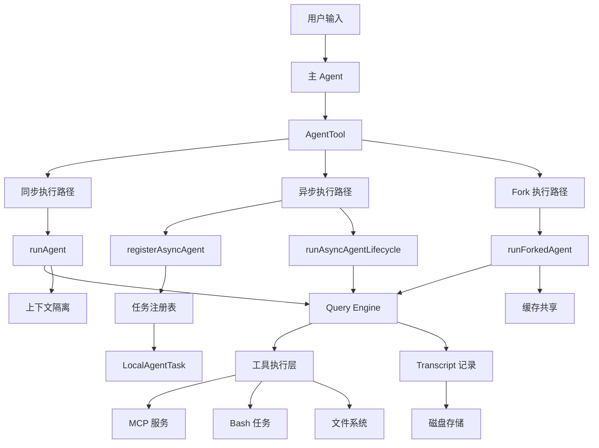

### 2.2 核心模块职责

| 模块 | 文件位置 | 职责 |
|------|---------|------|
| **AgentTool** | `src/tools/AgentTool/AgentTool.tsx` | 入口路由、参数验证、同步/异步分发 |
| **runAgent** | `src/tools/AgentTool/runAgent.ts` | Agent 执行核心、上下文构建、Query 循环 |
| **forkedAgent** | `src/utils/forkedAgent.ts` | Fork 模式、缓存安全参数、上下文克隆 |
| **LocalAgentTask** | `src/tasks/LocalAgentTask/LocalAgentTask.tsx` | 异步任务状态管理、生命周期控制 |
| **agentToolUtils** | `src/tools/AgentTool/agentToolUtils.ts` | 异步生命周期驱动、进度追踪 |
| **agentContext** | `src/utils/agentContext.ts` | AsyncLocalStorage 上下文传播 |

---

## 三、执行模式深度解析

### 3.1 模式决策树

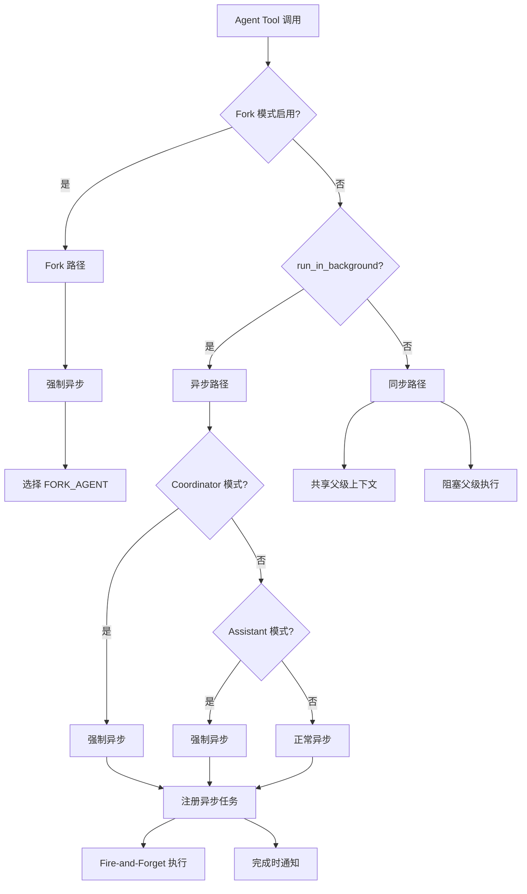

### 3.2 同步模式 (Synchronous)

**适用场景**：需要立即获取结果的子任务

**核心特征**：
```typescript
// 共享父级的关键回调
const agentToolUseContext = createSubagentContext(toolUseContext, {
  // 共享 setAppState，允许更新父级状态
  shareSetAppState: true,
  // 共享 abortController，父级取消时同步取消
  shareAbortController: true,
  // 共享响应长度统计
  shareSetResponseLength: true,
})
```

**执行流程时序图**：

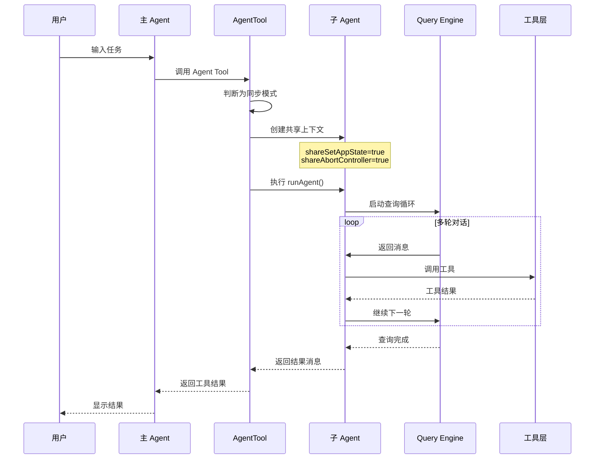

**阻塞影响**：
- 父级 Agent 的执行循环被挂起，直到子 Agent 完成
- 在 Assistant 模式下被强制改为异步，避免阻塞输入队列

### 3.3 异步模式 (Asynchronous)

**适用场景**：长时间运行的后台任务、并行执行的多个子任务

**核心特征**：
```typescript
// 完全隔离的上下文
const agentToolUseContext = createSubagentContext(toolUseContext, {
  // 不共享 setAppState (no-op)
  shareSetAppState: false,
  // 独立的新 AbortController
  abortController: new AbortController(),
  // 独立的拒绝追踪
  localDenialTracking: createDenialTrackingState(),
})

// 但任务注册必须到达根存储
setAppStateForTasks: parentContext.setAppStateForTasks
```

**生命周期管理时序图**：

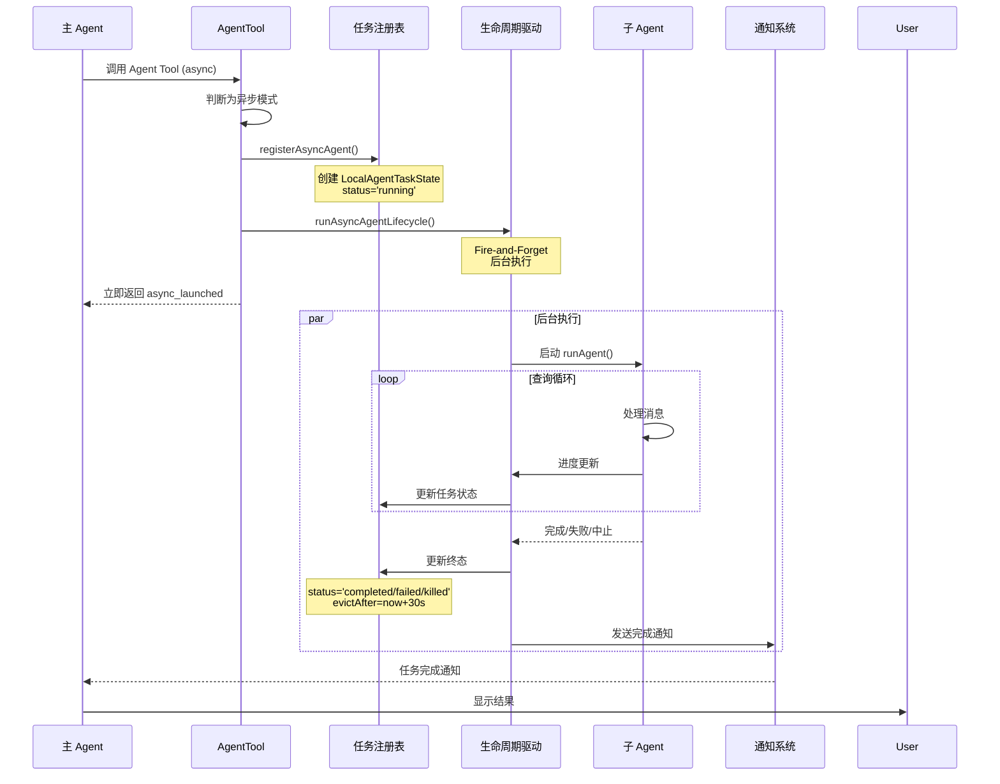

**关键设计点**：

1. **Fire-and-Forget 模式**：
   ```typescript
   // 不 await，后台执行
   void runWithAgentContext(asyncAgentContext, () =>
     wrapWithCwd(() =>
       runAsyncAgentLifecycle({...})
     )
   )
   ```

2. **任务状态机**：
   - `running` → `completed`：正常完成
   - `running` → `failed`：执行错误
   - `running` → `killed`：用户手动中止

3. **宽限期回收机制**：
   ```typescript
   const PANEL_GRACE_MS = 30_000  // 30秒
   evictAfter: task.retain ? undefined : Date.now() + PANEL_GRACE_MS
   ```

### 3.4 Fork 模式 (Context Forking)

**适用场景**：需要共享父级 prompt cache 以提升性能的场景

**核心创新**：CacheSafeParams 机制

```typescript
// 必须保持相同的参数（影响 API 缓存键）
export type CacheSafeParams = {
  systemPrompt: SystemPrompt        // 系统提示词
  userContext: { [k: string]: string }  // 用户上下文
  systemContext: { [k: string]: string }  // 系统上下文
  toolUseContext: ToolUseContext    // 工具上下文
  forkContextMessages: Message[]    // 消息前缀
}
```

**缓存共享原理**：

Anthropic API 的 prompt cache 键由以下部分组成：
1. System Prompt
2. Tools 列表
3. Model 名称
4. Messages 前缀
5. Thinking Config

Fork 模式通过保持这些参数完全一致，实现缓存命中：

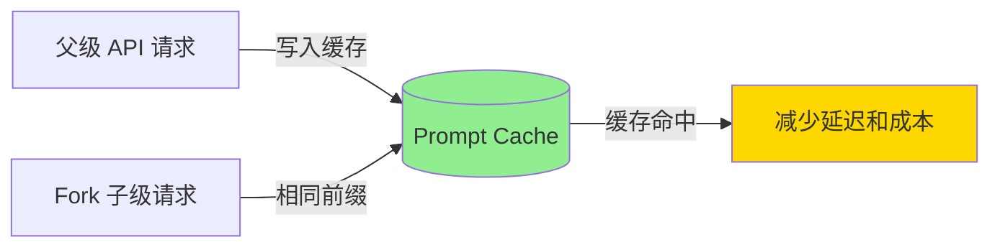

**递归 Fork 保护**：

```typescript
// 防止在 Fork 子级中再次 Fork
if (toolUseContext.options.querySource === `agent:builtin:${FORK_AGENT.agentType}` || 
    isInForkChild(toolUseContext.messages)) {
  throw new Error('Fork is not available inside a forked worker.')
}
```

**Fork 执行流程**：

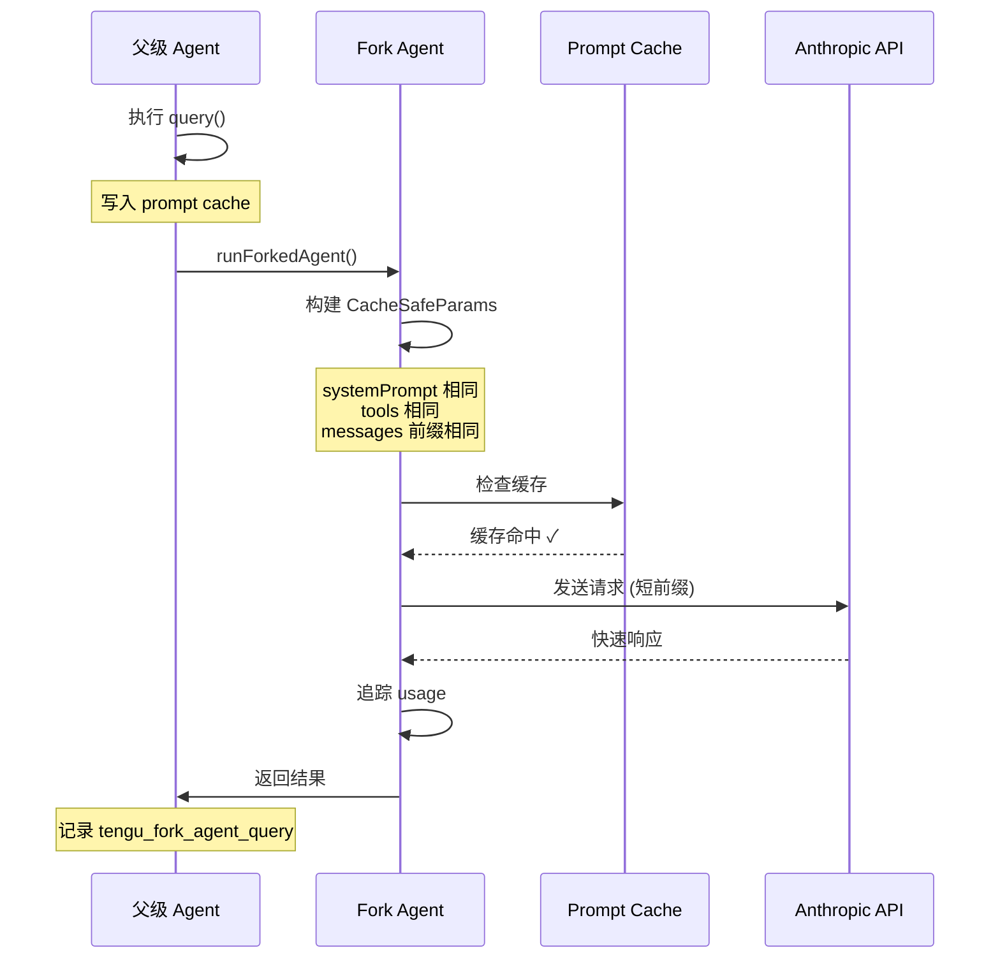

---

## 四、上下文隔离机制

### 4.1 隔离策略矩阵

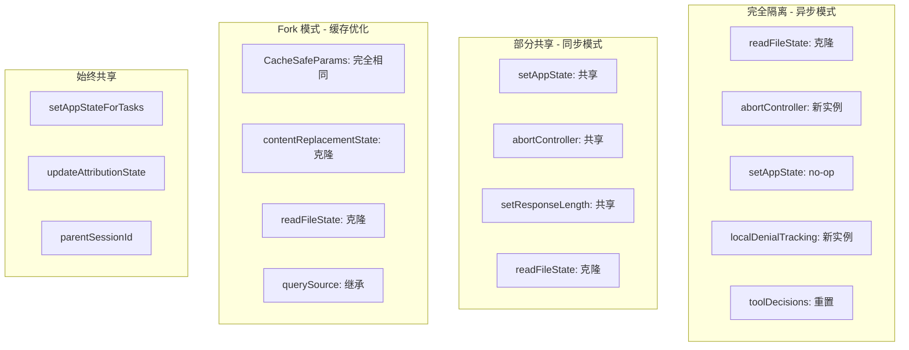

### 4.2 createSubagentContext 深度解析

这是整个隔离机制的核心函数：

```typescript
export function createSubagentContext(
  parentContext: ToolUseContext,
  overrides?: SubagentContextOverrides,
): ToolUseContext {
  // 1. AbortController 决策链
  const abortController =
    overrides?.abortController ??                    // 显式覆盖
    (overrides?.shareAbortController                 // 或显式共享
      ? parentContext.abortController
      : createChildAbortController(parentContext.abortController))  // 默认创建子级
  
  // 2. getAppState 包装
  const getAppState = overrides?.getAppState
    ? overrides.getAppState
    : overrides?.shareAbortController
      ? parentContext.getAppState                    // 交互式 agent 可以显示 UI
      : () => {
          const state = parentContext.getAppState()
          return {
            ...state,
            toolPermissionContext: {
              ...state.toolPermissionContext,
              shouldAvoidPermissionPrompts: true,    // 后台 agent 避免权限提示
            },
          }
        }
  
  return {
    // 3. 可变状态隔离
    readFileState: cloneFileStateCache(...),          // 克隆文件状态缓存
    nestedMemoryAttachmentTriggers: new Set(),        // 新集合
    toolDecisions: undefined,                         // 重置工具决策
    
    // 4. 内容替换状态（缓存稳定性）
    contentReplacementState: 
      overrides?.contentReplacementState ??
      cloneContentReplacementState(parentContext.contentReplacementState),
    
    // 5. 回调函数（默认 no-op）
    setAppState: overrides?.shareSetAppState 
      ? parentContext.setAppState 
      : () => {},                                     // 异步 agent 的 no-op
    
    // 关键：任务注册始终到达根存储
    setAppStateForTasks:
      parentContext.setAppStateForTasks ?? parentContext.setAppState,
    
    // 6. 查询追踪（深度递增）
    queryTracking: {
      chainId: randomUUID(),
      depth: (parentContext.queryTracking?.depth ?? -1) + 1,
    },
    
    // 7. UI 回调（子 agent 无法控制父级 UI）
    addNotification: undefined,
    setToolJSX: undefined,
    // ...
  }
}
```

### 4.3 AbortController 链式传播

```typescript
// src/utils/abortController.ts
function createChildAbortController(parent: AbortController): AbortController {
  const child = new AbortController()
  
  // 父级 abort 时自动传播到子级
  parent.signal.addEventListener('abort', () => {
    child.abort()
  })
  
  return child
}
```

**设计优势**：
- ✅ 父级取消时，所有子级级联取消
- ✅ 子级可以独立取消，不影响父级
- ✅ 支持多层嵌套（祖父 → 父 → 子）

**ESC 取消传播路径**：

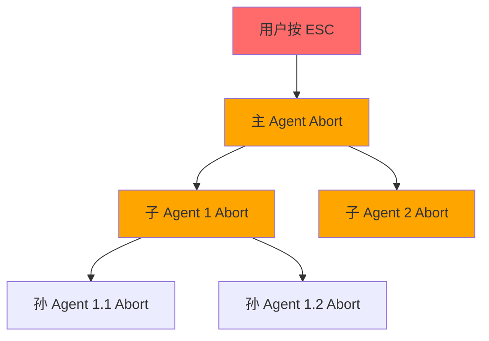

---

## 五、任务状态管理

### 5.1 LocalAgentTaskState 状态机

```typescript
type LocalAgentTaskState = {
  type: 'local_agent'
  
  // 生命周期状态
  status: 'running' | 'completed' | 'failed' | 'killed'
  
  // 核心标识
  agentId: string
  prompt: string
  agentType: string
  
  // 生命周期控制
  abortController?: AbortController
  unregisterCleanup?: () => void
  
  // 执行结果
  error?: string
  result?: AgentToolResult
  progress?: AgentProgress
  
  // 后台管理
  isBackgrounded: boolean          // 是否已后台化
  pendingMessages: string[]        // 中途排队的消息
  
  // UI 回收
  retain: boolean                  // UI 是否持有
  diskLoaded: boolean              // 是否已加载 transcript
  evictAfter?: number              // 回收截止时间戳
  
  startTime: number
  endTime?: number
}
```

**状态转换图**：

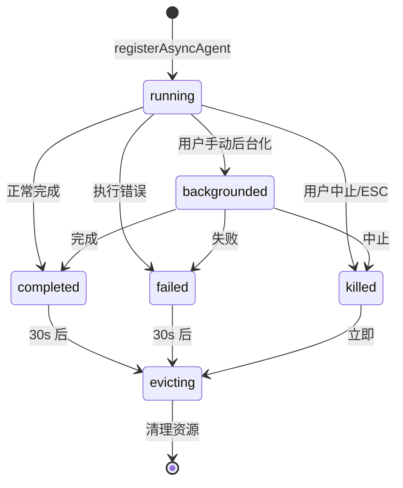

### 5.2 任务回收机制

**回收时机**：

```typescript
// 任务终止时设置回收时间
evictAfter: task.retain ? undefined : Date.now() + PANEL_GRACE_MS

// 30 秒宽限期后触发回收
if (evictAfter && Date.now() > evictAfter) {
  evictTaskOutput(taskId)        // 清理磁盘 transcript
  evictTerminalTask(taskId)      // 从 AppState.tasks 移除
}
```

**回收流程图**：

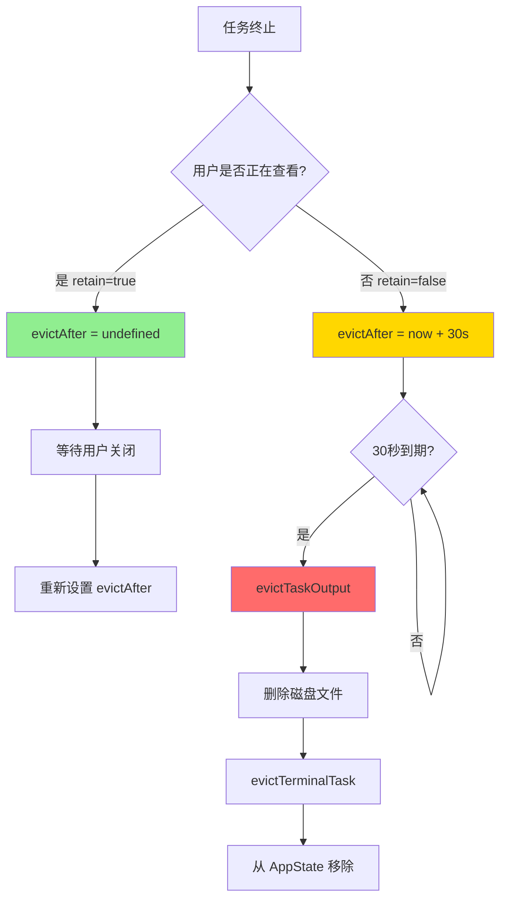

---

## 六、与外部系统的协作

### 6.1 MCP 服务器管理

子 Agent 可以定义自己的 MCP 服务器，独立于父级：

```typescript
// 初始化 Agent 专属 MCP 服务器
const {
  clients: mergedMcpClients,      // 父级 + 子级服务器
  tools: agentMcpTools,           // 子级 MCP 工具
  cleanup: mcpCleanup,            // 清理函数
} = await initializeAgentMcpServers(
  agentDefinition,
  toolUseContext.options.mcpClients,  // 继承父级客户端
)
```

**MCP 服务器生命周期**：

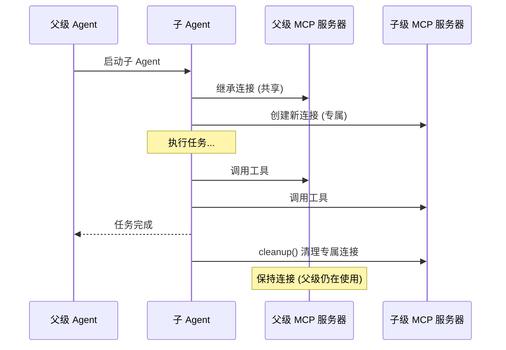

**设计要点**：
- ✅ 新增的 inline MCP 服务器在子 Agent 完成时清理
- ✅ 通过字符串引用继承的服务器不清理（父级仍在使用）
- ✅ 插件 Agent 的 MCP 不受 pluginOnly 策略限制

### 6.2 Hooks 系统集成

**SubagentStart Hooks**：

```typescript
// 执行子 Agent 启动钩子
for await (const hookResult of executeSubagentStartHooks(
  agentId,
  agentDefinition.agentType,
  agentAbortController.signal,
)) {
  if (hookResult.additionalContexts?.length > 0) {
    additionalContexts.push(...hookResult.additionalContexts)
  }
}

// 将钩子上下文添加为用户消息
if (additionalContexts.length > 0) {
  initialMessages.push(createAttachmentMessage({
    type: 'hook_additional_context',
    content: additionalContexts,
    hookName: 'SubagentStart',
  }))
}
```

**Frontmatter Hooks 注册**：

```typescript
// 注册 Agent 专属的 frontmatter hooks
if (agentDefinition.hooks && hooksAllowedForThisAgent) {
  registerFrontmatterHooks(
    rootSetAppState,
    agentId,
    agentDefinition.hooks,
    `agent '${agentDefinition.agentType}'`,
    true,  // isAgent - 将 Stop 转换为 SubagentStop
  )
}
```

**Hook 生命周期**：

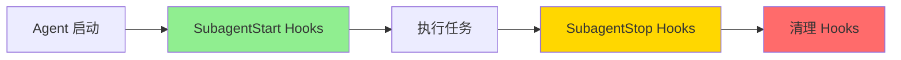

### 6.3 Skills 预加载机制

Agent 可以在 frontmatter 中声明需要预加载的 Skills：

```typescript
// 预加载 Skills
const skillsToPreload = agentDefinition.skills ?? []
if (skillsToPreload.length > 0) {
  const allSkills = await getSkillToolCommands(getProjectRoot())
  
  for (const skillName of skillsToPreload) {
    // 多策略解析技能名称
    const resolvedName = resolveSkillName(skillName, allSkills, agentDefinition)
    const skill = getCommand(resolvedName, allSkills)
    
    // 并发加载所有技能内容
    const content = await skill.getPromptForCommand('', toolUseContext)
    initialMessages.push(createUserMessage({
      content: [{ type: 'text', text: metadata }, ...content],
      isMeta: true,
    }))
  }
}
```

**技能解析策略**：
1. 精确匹配（name, userFacingName, aliases）
2. 插件前缀匹配（`my-skill` → `plugin:my-skill`）
3. 后缀匹配（查找以 `:skillName` 结尾的命令）

### 6.4 权限管理系统

**权限模式继承与覆盖**：

```typescript
const agentGetAppState = () => {
  let toolPermissionContext = state.toolPermissionContext

  // 1. Agent 可定义自己的权限模式（除非父级是 bypass/acceptEdits）
  if (agentPermissionMode && 
      state.toolPermissionContext.mode !== 'bypassPermissions' &&
      state.toolPermissionContext.mode !== 'acceptEdits') {
    toolPermissionContext = {
      ...toolPermissionContext,
      mode: agentPermissionMode,
    }
  }

  // 2. 异步 Agent 自动避免权限提示
  if (shouldAvoidPrompts) {
    toolPermissionContext = {
      ...toolPermissionContext,
      shouldAvoidPermissionPrompts: true,
    }
  }

  // 3. 工具权限隔离（allowedTools 替换所有 session 规则）
  if (allowedTools !== undefined) {
    toolPermissionContext = {
      ...toolPermissionContext,
      alwaysAllowRules: {
        cliArg: state.toolPermissionContext.alwaysAllowRules.cliArg,  // 保留 SDK 权限
        session: [...allowedTools],                                    // 替换 session 权限
      },
    }
  }

  return { ...state, toolPermissionContext, effortValue }
}
```

**权限决策流程**：

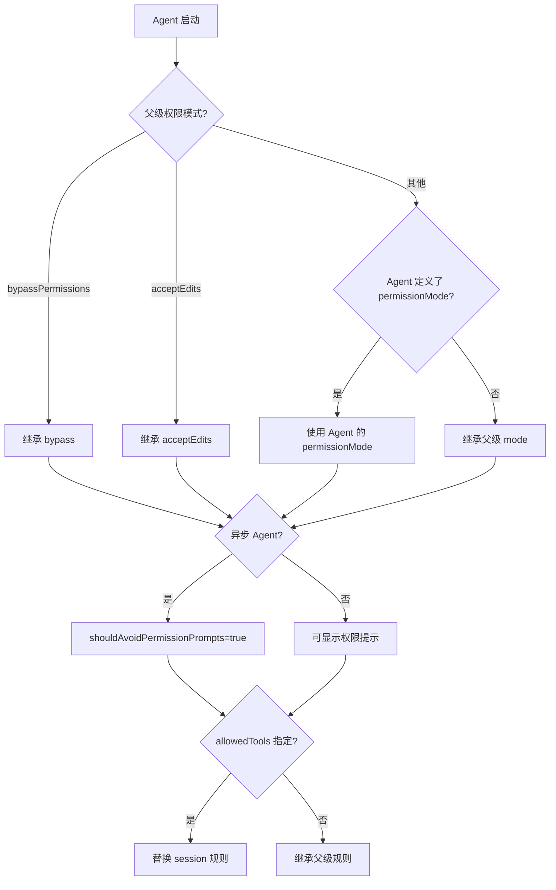

---

## 七、Transcript 持久化

### 7.1 侧链记录机制

每个子 Agent 的对话历史独立存储：

```typescript
// 记录初始消息
void recordSidechainTranscript(initialMessages, agentId)

// 记录每条新消息
for await (const message of query({...})) {
  if (isRecordableMessage(message)) {
    await recordSidechainTranscript([message], agentId, lastRecordedUuid)
    lastRecordedUuid = message.uuid
    yield message
  }
}
```

**存储路径**：
```
{sessionDir}/subagents/agent-{agentId}.jsonl
```

**元数据记录**：

```typescript
void writeAgentMetadata(agentId, {
  agentType: agentDefinition.agentType,
  worktreePath,      // 如果使用 worktree 隔离
  description,       // 原始任务描述
})
```

### 7.2 Transcript 分组

支持将相关 Agent 的 transcript 组织到子目录：

```typescript
if (transcriptSubdir) {
  setAgentTranscriptSubdir(agentId, transcriptSubdir)
}

// 例如：workflow 子 Agent 存储到 subagents/workflows/<runId>/
```

### 7.3 Transcript 加载

```typescript
// 按需加载子 Agent transcript
export async function loadSubagentTranscripts(
  agentIds: string[],
): Promise<{ [agentId: string]: Message[] }> {
  const results = await Promise.all(
    agentIds.map(async agentId => {
      const result = await getAgentTranscript(asAgentId(agentId))
      return result?.messages.length > 0 
        ? { agentId, transcript: result.messages }
        : null
    }),
  )
  // ...
}

// 从磁盘加载所有 transcript（即使任务已被回收）
export async function loadAllSubagentTranscriptsFromDisk() {
  const subagentsDir = join(sessionDir, 'subagents')
  const entries = await readdir(subagentsDir, { withFileTypes: true })
  const agentIds = entries
    .filter(d => d.isFile() && d.name.startsWith('agent-'))
    .map(d => d.name.slice('agent-'.length, -'.jsonl'.length))
  return loadSubagentTranscripts(agentIds)
}
```

---

## 八、性能优化策略

### 8.1 Prompt Cache 优化

**Fork 模式的缓存命中率**：

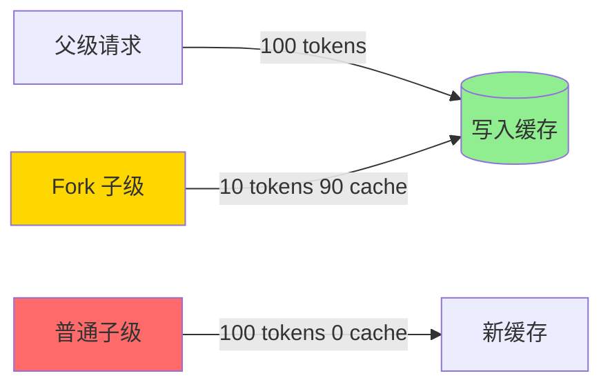

**缓存安全参数保护**：

```typescript
// 设置 maxOutputTokens 会改变 budget_tokens，破坏缓存！
// 仅在不需要缓存共享时使用（如 compact summaries）
maxOutputTokens?: number  // ⚠️ CAUTION
```

### 8.2 内存管理

**文件状态缓存克隆与释放**：

```typescript
// 克隆文件状态缓存（避免共享可变状态）
const agentReadFileState = forkContextMessages !== undefined
  ? cloneFileStateCache(toolUseContext.readFileState)
  : createFileStateCacheWithSizeLimit(READ_FILE_STATE_CACHE_SIZE)

// 执行完成后释放
try {
  // ... 执行查询
} finally {
  agentToolUseContext.readFileState.clear()  // 释放内存
  initialMessages.length = 0                 // 释放克隆的消息
}
```

**资源清理清单**：

```typescript
finally {
  await mcpCleanup()                              // 清理 MCP 服务器
  clearSessionHooks(rootSetAppState, agentId)     // 清理 Hooks
  cleanupAgentTracking(agentId)                   // 清理缓存追踪
  agentToolUseContext.readFileState.clear()       // 释放文件缓存
  initialMessages.length = 0                      // 释放消息
  unregisterPerfettoAgent(agentId)                // 清理性能追踪
  clearAgentTranscriptSubdir(agentId)             // 清理目录映射
  
  // 清理 todos（防止长期会话内存泄漏）
  rootSetAppState(prev => {
    if (!(agentId in prev.todos)) return prev
    const { [agentId]: _removed, ...todos } = prev.todos
    return { ...prev, todos }
  })
  
  // 清理后台 bash 任务（防止 PPID=1 僵尸进程）
  killShellTasksForAgent(agentId, ...)
}
```

### 8.3 探索/计划 Agent 优化

针对只读搜索 Agent 的特殊优化：

```typescript
// 探索/计划 Agent 省略 CLAUDE.md 上下文
const shouldOmitClaudeMd =
  agentDefinition.omitClaudeMd &&
  !override?.userContext &&
  getFeatureValue_CACHED_MAY_BE_STALE('tengu_slim_subagent_claudemd', true)

// 探索/计划 Agent 省略过时的 gitStatus（高达 40KB）
const resolvedSystemContext =
  agentDefinition.agentType === 'Explore' ||
  agentDefinition.agentType === 'Plan'
    ? systemContextNoGit
    : baseSystemContext
```

**节省效果**：
- 省略 CLAUDE.md：~5-15 Gtok/week（34M+ Explore 调用）
- 省略 gitStatus：~1-3 Gtok/week

---

## 九、优秀设计模式总结

### 9.1 上下文隔离与共享的平衡

| 设计点 | 实现方式 | 优势 |
|--------|---------|------|
| **默认隔离** | 所有可变状态默认克隆或重置 | 防止子 Agent 干扰父级 |
| **显式共享** | 通过 `shareXxx` 选项明确选择共享 | 避免隐式耦合 |
| **关键路径共享** | `setAppStateForTasks` 始终共享 | 保证任务可见性 |
| **级联取消** | Child AbortController 监听父级 | 支持优雅的资源清理 |

### 9.2 执行模式的统一抽象

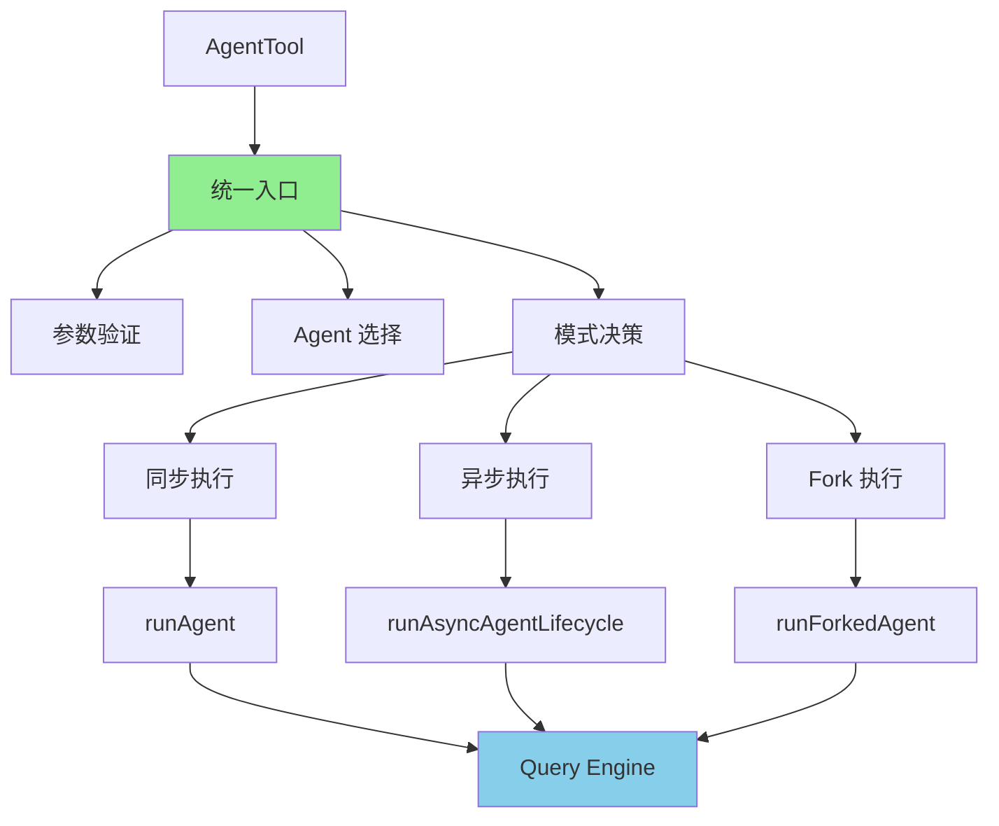

所有模式最终都归结为 `query()` 调用，保持了核心逻辑的一致性。

### 9.3 资源生命周期管理

**RAII 风格的资源管理**：

```typescript
// 获取资源
const { cleanup: mcpCleanup } = await initializeAgentMcpServers(...)

try {
  // 使用资源
  for await (const message of query({...})) {
    // ...
  }
} finally {
  // 总是清理（正常完成、错误、中止）
  await mcpCleanup()
}
```

### 9.4 防泄漏设计

| 泄漏类型 | 防护措施 | 代码位置 |
|---------|---------|---------|
| **内存泄漏** | 克隆的文件缓存在 finally 中释放 | `readFileState.clear()` |
| **进程泄漏** | Agent 完成时清理后台 bash 任务 | `killShellTasksForAgent()` |
| **状态泄漏** | Agent todos 在完成后删除 | `rootSetAppState(prev => {...})` |
| **权限泄漏** | 子 Agent 不继承父级的 session 权限 | `alwaysAllowRules.session = [...allowedTools]` |
| **上下文泄漏** | 队友 Agent 不继承父级 messages | `toolUseContext: { ...context, messages: [] }` |

### 9.5 可观测性设计

**多层次追踪**：

1. **Query Tracking**：
   ```typescript
   queryTracking: {
     chainId: randomUUID(),
     depth: (parentContext.queryTracking?.depth ?? -1) + 1,
   }
   ```

2. **Perfetto 性能追踪**：
   ```typescript
   if (isPerfettoTracingEnabled()) {
     registerPerfettoAgent(agentId, agentDefinition.agentType, parentId)
   }
   ```

3. **Analytics 事件**：
   ```typescript
   logEvent('tengu_agent_tool_selected', {
     agent_type, model, source, is_built_in_agent, is_async, is_fork
   })
   
   logEvent('tengu_fork_agent_query', {
     forkLabel, durationMs, messageCount, cacheHitRate, ...
   })
   ```

4. **Transcript 持久化**：所有对话历史可回溯

---

## 十、潜在改进点

### 10.1 性能优化

| 问题 | 现状 | 建议改进 |
|------|------|---------|
| **邮箱轮询开销** | 定期轮询文件邮箱 | 使用 inotify/FSEvents 监听文件变化 |
| **Transcript I/O** | 每条消息异步写入磁盘 | 批量写入 + 异步队列 |
| **文件状态克隆** | 每次创建子 Agent 都克隆 | 写时复制 (Copy-on-Write) 优化 |
| **缓存命中率** | Fork 模式外无缓存优化 | 探索 sibling agent 间的缓存共享 |

### 10.2 可靠性提升

| 问题 | 现状 | 建议改进 |
|------|------|---------|
| **消息丢失** | 文件邮箱无 ACK 机制 | 添加消息确认和重试 |
| **僵尸任务** | 极端情况下任务可能卡住 | 添加超时检测和自动清理 |
| **级联失败** | 父级崩溃可能导致子级孤儿 | 实现看门狗机制 |
| **磁盘空间** | Transcript 无限增长 | 添加自动清理策略 (TTL) |

### 10.3 开发者体验

| 问题 | 现状 | 建议改进 |
|------|------|---------|
| **调试困难** | 异步 Agent 难以调试 | 添加实时日志流和断点支持 |
| **类型安全** | 部分上下文传递使用 any | 强化类型约束和验证 |
| **错误处理** | 错误信息不够友好 | 提供结构化的错误诊断 |
| **性能分析** | 缺少可视化工具 | 构建 Agent 调用图和性能瀑布图 |

### 10.4 功能增强

| 需求 | 建议实现 |
|------|---------|
| **Agent 池** | 预初始化常用 Agent，减少冷启动 |
| **优先级调度** | 支持任务优先级，高优先级任务抢占资源 |
| **结果缓存** | 相同输入的幂等子 Agent 可缓存结果 |
| **跨会话协作** | 扩展 UDS/Bridge 支持更多通信模式 |
| **动态资源分配** | 根据任务复杂度动态调整模型和 token 预算 |

---

## 十一、关键设计决策记录

### 11.1 为什么 Fork 模式强制异步？

**原因**：
1. 统一的 `<task-notification>` 交互模型
2. 避免阻塞主循环的输入队列
3. Assistant 模式下多个子 Agent 并行执行

**代码证据**：
```typescript
// Fork subagent experiment: force ALL spawns async for a unified
// <task-notification> interaction model (not just fork spawns — all of them).
const forceAsync = isForkSubagentEnabled()
```

### 11.2 为什么异步 Agent 的 setAppState 是 no-op？

**原因**：
1. 防止后台 Agent 干扰前台 UI 状态
2. 避免并发写入导致的状态不一致
3. 但 `setAppStateForTasks` 例外，保证任务可见性

**代码证据**：
```typescript
setAppState: overrides?.shareSetAppState
  ? parentContext.setAppState
  : () => {},  // no-op for async agents

// 但任务注册必须到达根存储
setAppStateForTasks:
  parentContext.setAppStateForTasks ?? parentContext.setAppState
```

### 11.3 为什么 Fork 模式要克隆 contentReplacementState？

**原因**：
Fork 子级处理包含父级 `tool_use_id` 的消息，如果状态是全新的，会做出不同的替换决策，导致 wire prefix 不同，缓存失效。克隆状态确保一致的决策。

**代码证据**：
```typescript
// Clone by default (not fresh): cache-sharing forks process parent
// messages containing parent tool_use_ids. A fresh state would see
// them as unseen and make divergent replacement decisions → wire
// prefix differs → cache miss. A clone makes identical decisions →
// cache hit.
contentReplacementState: cloneContentReplacementState(parentContext.contentReplacementState)
```

### 11.4 为什么 Explore/Plan Agent 要省略 CLAUDE.md 和 gitStatus？

**原因**：
1. 它们是只读搜索 Agent，不需要提交/PR 规则上下文
2. gitStatus 明确标记为过时，对这些 Agent 无用（它们可以自己运行 `git status`）
3. 节省大量 token 成本（每周 ~6-18 Gtok）

**代码证据**：
```typescript
// Read-only agents don't act on commit/PR/lint rules from CLAUDE.md
// Dropping claudeMd here saves ~5-15 Gtok/week across 34M+ Explore spawns.
const shouldOmitClaudeMd = agentDefinition.omitClaudeMd && ...

// Explore/Plan are read-only search agents — gitStatus is dead weight
// Saves ~1-3 Gtok/week fleet-wide.
```

---

## 十二、总结

Claude Code 的 Subagent 系统展现了以下优秀工程实践：

### 12.1 架构层面
- ✅ **清晰的分层设计**：AgentTool → runAgent → Query Engine
- ✅ **统一的抽象**：三种执行模式共享核心查询循环
- ✅ **扩展性**：支持 MCP、Hooks、Skills 等插件机制

### 12.2 安全性
- ✅ **默认隔离**：所有可变状态默认隔离
- ✅ **显式共享**：通过选项明确选择共享
- ✅ **资源清理**：finally 块保证总是清理

### 12.3 性能
- ✅ **Prompt Cache 优化**：Fork 模式实现缓存共享
- ✅ **内存管理**：及时释放克隆的资源
- ✅ **按需加载**：Transcript 按需加载，支持回收

### 12.4 可维护性
- ✅ **详细的注释**：每个设计决策都有代码注释说明原因
- ✅ **类型安全**：TypeScript 类型系统保证正确性
- ✅ **可观测性**：多层次追踪和日志

### 12.5 未来展望

随着系统的发展，以下方向值得关注：

1. **性能优化**：减少 I/O 开销，提高缓存命中率
2. **可靠性提升**：添加消息确认、超时检测、看门狗机制
3. **开发者体验**：改进调试工具、错误诊断、性能分析
4. **功能增强**：Agent 池、优先级调度、结果缓存

这套系统为 Claude Code 提供了强大的多智能体协作能力，是工程设计和 AI 能力的完美结合。
