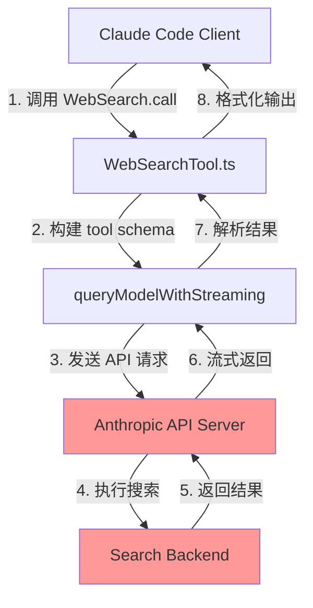
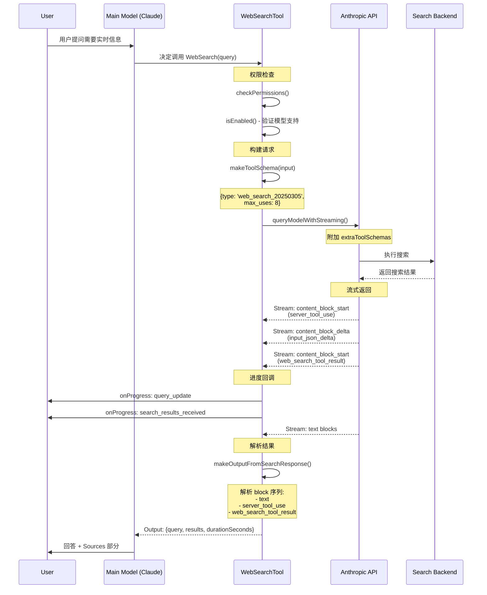
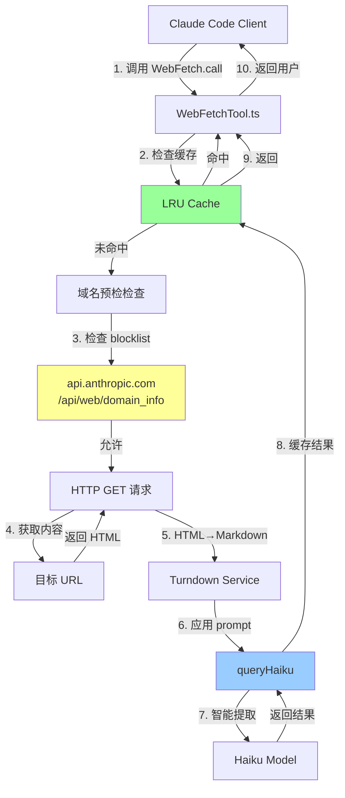
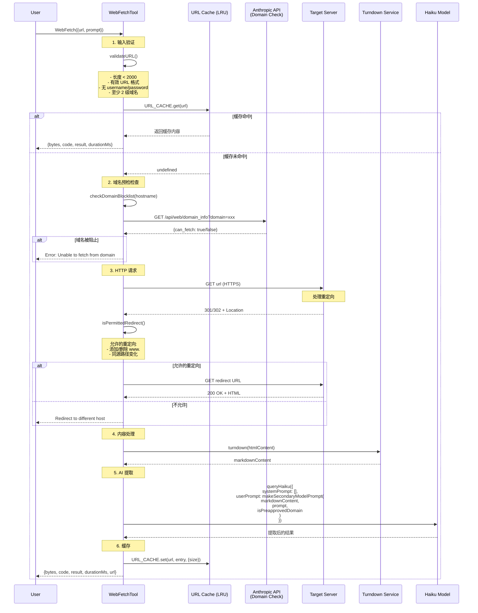

# Web Search 与 Web Fetch 工具深度技术分析

## 目录

- [1. 概述](#1-概述)
- [2. Web Search 工具实现](#2-web-search-工具实现)
  - [2.1 架构设计](#21-架构设计)
  - [2.2 调用链路](#22-调用链路)
  - [2.3 核心实现细节](#23-核心实现细节)
  - [2.4 预算控制机制](#24-预算控制机制)
- [3. Web Fetch 工具实现](#3-web-fetch-工具实现)
  - [3.1 架构设计](#31-架构设计)
  - [3.2 调用链路](#32-调用链路)
  - [3.3 核心实现细节](#33-核心实现细节)
  - [3.4 预算控制机制](#34-预算控制机制)
- [4. 技术挑战点](#4-技术挑战点)
- [5. 设计亮点](#5-设计亮点)
- [6. 可改进之处](#6-可改进之处)

---

## 1. 概述

Claude Code 中的 `WebSearch` 和 `WebFetch` 是两个核心的网络访问工具，它们使得 AI 能够获取实时信息。两者在设计上有本质区别：

- **WebSearch**: 通过 Anthropic API 的服务端工具（Server-Side Tool）实现，搜索逻辑在云端执行
- **WebFetch**: 在客户端本地执行 HTTP 请求，获取网页内容后使用 Haiku 模型进行智能提取

两个工具都受到多层预算控制机制的约束，包括 token 预算、结果大小限制和缓存策略。

---

## 2. Web Search 工具实现

### 2.1 架构设计

WebSearch 采用 **服务端代理架构**，实际的搜索操作由 Anthropic API 在云端完成：



**关键特征**：
- 搜索操作完全在服务端执行，客户端只负责发起请求和接收结果
- 使用 `BetaWebSearchTool20250305` API 类型
- 支持 `allowed_domains` 和 `blocked_domains` 过滤
- 最大搜索次数硬编码为 8 次 (`max_uses: 8`)

### 2.2 调用链路

#### 完整时序图



#### 代码调用路径

```typescript
// 1. 用户触发搜索
WebSearchTool.call(input, context, _canUseTool, _parentMessage, onProgress)
  ↓
// 2. 构建 tool schema
makeToolSchema(input): BetaWebSearchTool20250305
  {
    type: 'web_search_20250305',
    name: 'web_search',
    allowed_domains: input.allowed_domains,
    blocked_domains: input.blocked_domains,
    max_uses: 8
  }
  ↓
// 3. 调用 API
queryModelWithStreaming({
  messages: [createUserMessage('Perform a web search...')],
  systemPrompt: 'You are an assistant for performing a web search...',
  options: {
    extraToolSchemas: [toolSchema],
    querySource: 'web_search_tool',
    toolChoice: useHaiku ? { type: 'tool', name: 'web_search' } : undefined
  }
})
  ↓
// 4. 流式处理结果
for await (const event of queryStream) {
  - event.type === 'assistant': 收集 content blocks
  - event.type === 'stream_event': 
    - content_block_start (server_tool_use): 记录 toolUseId
    - content_block_delta (input_json_delta): 累积 JSON，提取 query 用于进度显示
    - content_block_start (web_search_tool_result): 触发进度回调
}
  ↓
// 5. 格式化输出
makeOutputFromSearchResponse(allContentBlocks, query, durationSeconds)
  ↓
// 6. 映射为 tool result block
mapToolResultToToolResultBlockParam(output, toolUseID)
  → 格式化为文本: "Web search results for query: ..." + Links + REMINDER
```

### 2.3 核心实现细节

#### 2.3.1 模型选择策略

```typescript
// src/tools/WebSearchTool/WebSearchTool.ts:262-265
const useHaiku = getFeatureValue_CACHED_MAY_BE_STALE('tengu_plum_vx3', false)

// 使用 Haiku 作为快速轻量模型进行搜索
const model = useHaiku ? getSmallFastModel() : context.options.mainLoopModel
```

**设计意图**：
- 通过 GrowthBook 特性开关控制是否使用 Haiku
- Haiku 更便宜、更快，适合简单的搜索代理任务
- 支持 A/B 测试和渐进式 rollout

#### 2.3.2 流式进度追踪

```typescript
// 追踪每个 tool_use_id 对应的 query
const toolUseQueries = new Map()

// 从 partial JSON 中提取 query
const queryMatch = currentToolUseJson.match(/"query"\s*:\s*"((?:[^"\\]|\\.)*)"/)
if (queryMatch && queryMatch[1]) {
  const query = jsonParse('"' + queryMatch[1] + '"')
  progressCounter++
  onProgress({
    toolUseID: `search-progress-${progressCounter}`,
    data: {
      type: 'query_update',
      query
    }
  })
}
```

**技术亮点**：
- 使用正则表达式从**不完整的 JSON** 中提取 query
- 安全处理转义字符：`(?:[^"\\]|\\.)*`
- 通过 `Map` 追踪多个并发搜索的 query

#### 2.3.3 结果解析器

```typescript
function makeOutputFromSearchResponse(
  result: BetaContentBlock[],
  query: string,
  durationSeconds: number
): Output {
  // 解析复杂的 block 序列：
  // [
  //   text,                    // 模型的文本评论
  //   server_tool_use,         // 工具调用标记
  //   web_search_tool_result,  // 搜索结果
  //   text,                    // 更多评论
  //   ...  (可重复多次)
  // ]
  
  const results: (SearchResult | string)[] = []
  let textAcc = ''
  let inText = true
  
  for (const block of result) {
    if (block.type === 'server_tool_use') {
      // 切换到非文本模式
      inText = false
      if (textAcc.trim().length > 0) {
        results.push(textAcc.trim())
      }
      textAcc = ''
      continue
    }
    
    if (block.type === 'web_search_tool_result') {
      // 提取搜索结果
      const hits = block.content.map(r => ({ title: r.title, url: r.url }))
      results.push({
        tool_use_id: block.tool_use_id,
        content: hits
      })
    }
    
    if (block.type === 'text') {
      // 累积文本文本
      textAcc += block.text
    }
  }
}
```

### 2.4 预算控制机制

WebSearch 受以下预算控制：

#### 2.4.1 工具结果大小限制

```typescript
// src/tools/WebSearchTool/WebSearchTool.ts:155
maxResultSizeChars: 100_000  // 100K 字符
```

**执行逻辑**：
```typescript
// src/constants/toolLimits.ts
export const DEFAULT_MAX_RESULT_SIZE_CHARS = 50_000  // 系统级上限

// src/utils/toolResultStorage.ts
export function getPersistenceThreshold(
  toolName: string,
  declaredMaxResultSizeChars: number
): number {
  // GrowthBook 可以覆盖特定工具的阈值
  const overrides = getFeatureValue_CACHED_MAY_BE_STALE('tengu_satin_quoll', {})
  const override = overrides?.[toolName]
  if (typeof override === 'number' && Number.isFinite(override) && override > 0) {
    return override
  }
  // 取工具声明值和系统默认值的较小者
  return Math.min(declaredMaxResultSizeChars, DEFAULT_MAX_RESULT_SIZE_CHARS)
}
```

#### 2.4.2 每消息聚合预算

```typescript
// src/constants/toolLimits.ts:49
export const MAX_TOOL_RESULTS_PER_MESSAGE_CHARS = 200_000  // 200K

// 可通过 GrowthBook 动态调整
export function getPerMessageBudgetLimit(): number {
  const override = getFeatureValue_CACHED_MAY_BE_STALE('tengu_hawthorn_window', null)
  if (typeof override === 'number' && Number.isFinite(override) && override > 0) {
    return override
  }
  return MAX_TOOL_RESULTS_PER_MESSAGE_CHARS
}
```

**工作原理**：
- 当**同一用户消息**中的多个 tool_result 总大小超过 200K 时
- 系统会持久化最大的 block 到磁盘
- 替换为预览消息：`Output too large (X KB). Full output saved to: file_path`

#### 2.4.3 API 级搜索次数限制

```typescript
// src/tools/WebSearchTool/WebSearchTool.ts:82
max_uses: 8  // 硬编码最多 8 次搜索
```

这是 Anthropic API 服务端的硬性限制，防止过度使用搜索资源。

---

## 3. Web Fetch 工具实现

### 3.1 架构设计

WebFetch 采用 **客户端执行 + AI 提取架构**：



**关键特征**：
- 在客户端直接发起 HTTP 请求
- 使用 Turndown 将 HTML 转换为 Markdown
- 使用 Haiku 模型智能提取内容
- 双层缓存：URL 内容缓存 (15min) + 域名检查缓存 (5min)

### 3.2 调用链路

#### 完整时序图



#### 代码调用路径

```typescript
// 1. 权限检查
WebFetchTool.checkPermissions(input, context)
  ↓
// 检查预批准主机列表
isPreapprovedHost(parsedUrl.hostname, parsedUrl.pathname)
  → 预批准域名: docs.python.org, developer.mozilla.org, etc.
  ↓
// 检查用户权限规则
getRuleByContentsForTool(permissionContext, WebFetchTool, 'deny')
getRuleByContentsForTool(permissionContext, WebFetchTool, 'ask')
getRuleByContentsForTool(permissionContext, WebFetchTool, 'allow')
  ↓
// 2. 调用工具
WebFetchTool.call({url, prompt}, {abortController, options})
  ↓
// 3. 获取内容
getURLMarkdownContent(url, abortController)
  ↓
  // 3.1 检查缓存
  URL_CACHE.get(url)
  ↓
  // 3.2 域名预检
  checkDomainBlocklist(hostname)
    → GET https://api.anthropic.com/api/web/domain_info?domain=xxx
  ↓
  // 3.3 HTTP 请求
  getWithPermittedRedirects(url, signal, isPermittedRedirect)
    → axios.get(url, {
        maxRedirects: 0,  // 禁用自动重定向
        responseType: 'arraybuffer',
        maxContentLength: 10MB,
        timeout: 60s
      })
  ↓
  // 3.4 HTML 转 Markdown
  turndownService.turndown(htmlContent)
  ↓
  // 3.5 缓存结果
  URL_CACHE.set(url, entry, {size: contentBytes})
  ↓
// 4. 应用 prompt 提取
if (isPreapproved && contentType === 'text/markdown' && content < 100K) {
  result = content  // 直接使用
} else {
  result = applyPromptToMarkdown(prompt, content, signal, ...)
}
  ↓
// 5. 返回结果
{bytes, code, codeText, result, durationMs, url}
```

### 3.3 核心实现细节

#### 3.3.1 双层缓存策略

```typescript
// src/tools/WebFetchTool/utils.ts

// 缓存 1: URL 内容缓存
const CACHE_TTL_MS = 15 * 60 * 1000  // 15 分钟
const MAX_CACHE_SIZE_BYTES = 50 * 1024 * 1024  // 50MB

const URL_CACHE = new LRUCache<string, CacheEntry>({
  maxSize: MAX_CACHE_SIZE_BYTES,
  ttl: CACHE_TTL_MS,
})

// 缓存 2: 域名预检检查缓存
const DOMAIN_CHECK_CACHE = new LRUCache<string, true>({
  max: 128,
  ttl: 5 * 60 * 1000,  // 5 分钟 - 比 URL_CACHE 短
})
```

**为什么需要两个缓存？**
- URL_CACHE 是按 URL 键的，同域名不同路径会重复检查域名
- DOMAIN_CHECK_CACHE 按域名键缓存，避免重复的预检 HTTP 请求

**案例**：
```
访问 https://docs.python.org/3/library/os.html
访问 https://docs.python.org/3/library/sys.html

没有 DOMAIN_CHECK_CACHE:
  - 2 次 /api/web/domain_info?domain=docs.python.org 请求

有 DOMAIN_CHECK_CACHE:
  - 1 次 /api/web/domain_info?domain=docs.python.org 请求 (缓存 5 分钟)
```

#### 3.3.2 安全的重定向处理

```typescript
export function isPermittedRedirect(
  originalUrl: string,
  redirectUrl: string
): boolean {
  try {
    const parsedOriginal = new URL(originalUrl)
    const parsedRedirect = new URL(redirectUrl)
    
    // 1. 协议必须相同
    if (parsedRedirect.protocol !== parsedOriginal.protocol) {
      return false
    }
    
    // 2. 端口必须相同
    if (parsedRedirect.port !== parsedOriginal.port) {
      return false
    }
    
    // 3. 不允许带认证信息
    if (parsedRedirect.username || parsedRedirect.password) {
      return false
    }
    
    // 4. 允许添加/删除 www.
    const stripWww = (hostname: string) => hostname.replace(/^www\./, '')
    const originalHostWithoutWww = stripWww(parsedOriginal.hostname)
    const redirectHostWithoutWww = stripWww(parsedRedirect.hostname)
    
    return originalHostWithoutWww === redirectHostWithoutWww
  } catch {
    return false
  }
}
```

**安全考虑**：
- 防止开放重定向漏洞：恶意服务器将用户重定向到钓鱼网站
- 只允许同源重定向（www. 变化或路径变化）

#### 3.3.3 内容处理管道

```typescript
// 1. 接收原始字节
const rawBuffer = Buffer.from(response.data)
;(response as { data: unknown }).data = null  // 立即释放 ArrayBuffer

// 2. 检测二进制内容
if (isBinaryContentType(contentType)) {
  // PDF、图片等 - 保存到磁盘
  const result = await persistBinaryContent(rawBuffer, contentType, persistId)
  persistedPath = result.filepath
}

// 3. HTML 转 Markdown
let markdownContent: string
if (contentType.includes('text/html')) {
  markdownContent = (await getTurndownService()).turndown(htmlContent)
  contentBytes = Buffer.byteLength(markdownContent)
} else {
  markdownContent = htmlContent  // 直接使用
  contentBytes = bytes
}

// 4. 懒加载 Turndown（减少启动内存）
function getTurndownService(): Promise<InstanceType<TurndownCtor>> {
  return (turndownServicePromise ??= import('turndown').then(m => {
    const Turndown = (m as unknown as { default: TurndownCtor }).default
    return new Turndown()
  }))
}
```

**内存优化**：
- Turndown 延迟加载 (~1.4MB 保留堆内存)
- 立即释放 `response.data` (ArrayBuffer 可达 10MB)
- 重用单个 Turndown 实例（`.turndown()` 是无状态的）

#### 3.3.4 Haiku 内容提取

```typescript
export async function applyPromptToMarkdown(
  prompt: string,
  markdownContent: string,
  signal: AbortSignal,
  isNonInteractiveSession: boolean,
  isPreapprovedDomain: boolean
): Promise<string> {
  // 1. 截断内容防止 "Prompt is too long"
  const truncatedContent = markdownContent.length > MAX_MARKDOWN_LENGTH
    ? markdownContent.slice(0, MAX_MARKDOWN_LENGTH) + '\n\n[Content truncated...]'
    : markdownContent
  
  // 2. 构建 Haiku 的 prompt
  const modelPrompt = makeSecondaryModelPrompt(
    truncatedContent,
    prompt,
    isPreapprovedDomain
  )
  
  // 3. 调用 Haiku
  const assistantMessage = await queryHaiku({
    systemPrompt: asSystemPrompt([]),
    userPrompt: modelPrompt,
    signal,
    options: {
      querySource: 'web_fetch_apply',
      agents: [],
      isNonInteractiveSession,
      hasAppendSystemPrompt: false,
      mcpTools: []
    }
  })
  
  // 4. 提取结果
  const { content } = assistantMessage.message
  if (content.length > 0) {
    const contentBlock = content[0]
    if ('text' in contentBlock) {
      return contentBlock.text
    }
  }
  return 'No response from model'
}
```

**为什么使用 Haiku？**
- 快速且便宜（相比 Claude Sonnet/Opus）
- 适合简单的内容提取任务
- 减少用户等待时间

### 3.4 预算控制机制

#### 3.4.1 内容大小限制

```typescript
// URL 长度限制
const MAX_URL_LENGTH = 2000

// HTTP 内容大小限制
const MAX_HTTP_CONTENT_LENGTH = 10 * 1024 * 1024  // 10MB

// Markdown 截断长度
export const MAX_MARKDOWN_LENGTH = 100_000  // 100K 字符

// 超时控制
const FETCH_TIMEOUT_MS = 60_000  // 60 秒
const DOMAIN_CHECK_TIMEOUT_MS = 10_000  // 10 秒
```

#### 3.4.2 重定向次数限制

```typescript
const MAX_REDIRECTS = 10

export async function getWithPermittedRedirects(
  url: string,
  signal: AbortSignal,
  redirectChecker: (originalUrl: string, redirectUrl: string) => boolean,
  depth = 0
): Promise<AxiosResponse<ArrayBuffer> | RedirectInfo> {
  if (depth > MAX_REDIRECTS) {
    throw new Error(`Too many redirects (exceeded ${MAX_REDIRECTS})`)
  }
  // ...
}
```

**防止重定向循环攻击**：
```
恶意服务器: /a → /b → /a → /b → ...
没有限制: 每次重定向重置 FETCH_TIMEOUT_MS，导致无限挂起
有限制: 最多 10 次后抛出异常
```

#### 3.4.3 工具结果预算

与 WebSearch 相同，受以下控制：
- `maxResultSizeChars: 100_000` (工具声明)
- `DEFAULT_MAX_RESULT_SIZE_CHARS: 50_000` (系统上限)
- `MAX_TOOL_RESULTS_PER_MESSAGE_CHARS: 200_000` (每消息聚合)

---

## 4. 技术挑战点

### 4.1 WebSearch 的技术挑战

#### 4.1.1 流式结果解析复杂性

**问题**：Anthropic API 返回的搜索结果是一个复杂的 block 序列，包含文本文本、工具调用和搜索结果的交错混合。

**挑战**：
```typescript
// 实际返回的数据结构示例
[
  { type: 'text', text: 'Let me search for that...' },
  { type: 'server_tool_use', id: 'tool_1', name: 'web_search', input_json: '{"query": "..."}' },
  { type: 'web_search_tool_result', tool_use_id: 'tool_1', content: [...] },
  { type: 'text', text: 'Now searching for another term...' },
  { type: 'server_tool_use', id: 'tool_2', name: 'web_search', input_json: '{"query": "..."}' },
  { type: 'web_search_tool_result', tool_use_id: 'tool_2', content: [...] },
  { type: 'text', text: 'Here are the results...' }
]
```

**解决方案**：状态机解析器，通过 `inText` 标志跟踪当前是在文本模式还是搜索结果模式。

#### 4.1.2 不完整 JSON 的安全解析

**问题**：在流式传输过程中，`input_json_delta` 事件会逐步发送 JSON 片段，需要在 JSON 不完整时提取 query。

**挑战**：
```
partial JSON: {"query": "React documentatio
partial JSON: {"query": "React documentation"}  ← 完整了！
partial JSON: {"query": "React documentation", "allowed_domains": [...
```

**解决方案**：
```typescript
// 使用正则表达式提取字符串值，处理转义
const queryMatch = currentToolUseJson.match(/"query"\s*:\s*"((?:[^"\\]|\\.)*)"/)
if (queryMatch && queryMatch[1]) {
  // 只解析引号内的部分（已完成的字符串）
  const query = jsonParse('"' + queryMatch[1] + '"')
}
```

#### 4.1.3 多模型兼容性

**问题**：WebSearch 在不同 API 提供商和模型上的支持程度不同。

**解决方案**：
```typescript
isEnabled() {
  const provider = getAPIProvider()
  const model = getMainLoopModel()
  
  // FirstParty: 始终支持
  if (provider === 'firstParty') return true
  
  // Vertex AI: 仅 Claude 4.0+ 支持
  if (provider === 'vertex') {
    return model.includes('claude-opus-4') ||
           model.includes('claude-sonnet-4') ||
           model.includes('claude-haiku-4')
  }
  
  // Foundry: 只发布支持 WebSearch 的模型
  if (provider === 'foundry') return true
  
  return false
}
```

### 4.2 WebFetch 的技术挑战

#### 4.2.1 安全防护与数据防泄漏

**问题**：允许 AI 发起 HTTP 请求存在严重的安全风险：
1. 访问内部网络资源
2. 数据外泄（通过 URL 参数）
3. SSRF 攻击（服务端请求伪造）

**多层防护**：

```typescript
// 第 1 层: URL 验证
function validateURL(url: string): boolean {
  // - 长度限制 2000
  // - 有效 URL 格式
  // - 禁止 username/password（防止凭据泄露）
  // - 至少 2 级域名（阻止 localhost、internal 等）
}

// 第 2 层: 域名预检检查
async function checkDomainBlocklist(domain: string) {
  // 查询 Anthropic 的域名白名单 API
  GET https://api.anthropic.com/api/web/domain_info?domain=xxx
}

// 第 3 层: 预批准主机列表
const PREAPPROVED_HOSTS = new Set([
  'docs.python.org',
  'developer.mozilla.org',
  'github.com',
  // ... 仅代码相关的公开文档站点
])

// 第 4 层: 受限的重定向
function isPermittedRedirect(originalUrl, redirectUrl) {
  // 只允许同源重定向（www. 变化或路径变化）
}

// 第 5 层: 出口代理检测
if (error.response.headers['x-proxy-error'] === 'blocked-by-allowlist') {
  throw new EgressBlockedError(hostname)
}
```

#### 4.2.2 内存管理

**问题**：处理大型 HTML 页面可能导致内存峰值：
- HTTP 响应体可达 10MB
- Turndown 构建 DOM 树时可达 3-5 倍膨胀（30-50MB）

**解决方案**：

```typescript
// 1. 立即释放 Axios 持有的 ArrayBuffer
const rawBuffer = Buffer.from(response.data)
;(response as { data: unknown }).data = null  // 让 GC 回收 10MB

// 2. 延迟加载 Turndown
function getTurndownService() {
  return (turndownServicePromise ??= import('turndown').then(...))
}

// 3. 重用 Turndown 实例（.turndown() 是无状态的）
```

#### 4.2.3 缓存一致性

**问题**：双层缓存可能导致不一致：
- URL 缓存 (15min TTL) 和域名检查缓存 (5min TTL)
- 域名从黑名单变为白名单时的缓存失效

**解决方案**：
```typescript
// DOMAIN_CHECK_CACHE 只缓存 'allowed' 状态
// blocked/failed 的结果不缓存，下次重试
if (response.data.can_fetch === true) {
  DOMAIN_CHECK_CACHE.set(domain, true)  // 只缓存允许
  return { status: 'allowed' }
}
return { status: 'blocked' }  // 不缓存，下次重新检查
```

#### 4.2.4 二进制内容处理

**问题**：WebFetch 可能获取 PDF、图片等二进制内容，但 AI 无法直接理解。

**解决方案**：
```typescript
// 1. 保存二进制文件到磁盘
if (isBinaryContentType(contentType)) {
  const result = await persistBinaryContent(rawBuffer, contentType, persistId)
  persistedPath = result.filepath
}

// 2. 仍将解码后的文本传给 Haiku（PDF 包含足够的 ASCII 结构）
// Haiku 可以从 /Title、文本流等结构中提取摘要

// 3. 在结果中附加文件路径
result += `\n\n[Binary content (${contentType}, ${formatFileSize(persistedSize)}) also saved to ${persistedPath}]`
```

---

## 5. 设计亮点

### 5.1 WebSearch 的设计亮点

#### 5.1.1 服务端代理架构

**优势**：
- ✅ 客户端无需实现搜索逻辑
- ✅ Anthropic 可以优化搜索后端而不更新客户端
- ✅ 天然支持搜索结果的排名和相关性
- ✅ 避免了客户端搜索的复杂性（爬虫、索引等）

**对比 WebFetch**：
| 维度 | WebSearch | WebFetch |
|------|-----------|----------|
| 执行位置 | 服务端 | 客户端 |
| 延迟 | 中等 (需要网络往返) | 较低 (直接 HTTP) |
| 成本 | 较高 (API 调用) | 较低 (Haiku) |
| 灵活性 | 受限于搜索 API | 任意 URL |

#### 5.1.2 流式进度反馈

**亮点**：即使搜索结果尚未完整返回，用户也能看到实时进度。

```typescript
// 用户看到的实时反馈
onProgress({
  toolUseID: `search-progress-${progressCounter}`,
  data: {
    type: 'query_update',          // "正在搜索: React documentation"
    type: 'search_results_received' // "收到 8 条搜索结果"
  }
})
```

#### 5.1.3 强制来源引用

```typescript
// src/tools/WebSearchTool/prompt.ts
CRITICAL REQUIREMENT - You MUST follow this:
  - After answering the user's question, you MUST include a "Sources:" section
  - In the Sources section, list all relevant URLs as markdown hyperlinks
  - This is MANDATORY - never skip including sources
```

**效果**：提高结果的可信度和可追溯性。

### 5.2 WebFetch 的设计亮点

#### 5.2.1 智能内容提取

**亮点**：使用 Haiku 进行上下文感知的内容提取，而非简单的文本截断。

**案例对比**：

```
用户 prompt: "提取所有 API 端点和它们的参数"

方案 1: 简单截断
  → 只返回页面开头，可能完全不包含 API 端点

方案 2: Haiku 提取 (实际方案)
  → Haiku 理解整个页面，精准提取所有 API 端点
  → 即使用户内容在页面末尾也能正确提取
```

#### 5.2.2 预批准域名免权限

```typescript
const PREAPPROVED_HOSTS = new Set([
  'docs.python.org',
  'developer.mozilla.org',
  'github.com',
  // ... 100+ 代码相关域名
])

// 访问预批准域名时自动通过，无需用户确认
if (isPreapprovedHost(parsedUrl.hostname, parsedUrl.pathname)) {
  return { behavior: 'allow', decisionReason: { type: 'other', reason: 'Preapproved host' } }
}
```

**优势**：提升用户体验，减少对常见开发文档站点的频繁权限确认。

#### 5.2.3 双层缓存优化

**性能提升案例**：

```
场景: 用户让 AI 分析 Python 标准库的 5 个模块

没有双层缓存:
  - 5 次域名预检检查 (5 × 100ms = 500ms)
  - 5 次 URL 内容获取 (5 × 2s = 10s)
  总计: ~10.5s

有双层缓存:
  - 1 次域名预检检查 (1 × 100ms = 100ms) [DOMAIN_CHECK_CACHE]
  - 5 次 URL 内容获取 (5 × 2s = 10s)
  总计: ~10.1s
  如果再次访问相同 URL: 0ms (URL_CACHE 命中)
```

#### 5.2.4 防御性编程

**案例 1: GrowthBook 类型安全**

```typescript
// 防御 GrowthBook 返回 null/string/NaN
const override = getFeatureValue_CACHED_MAY_BE_STALE<Record<string, number> | null>(
  'tengu_satin_quoll',
  {}
)
if (typeof override === 'number' && Number.isFinite(override) && override > 0) {
  return override
}
```

**案例 2: 缓存大小保护**

```typescript
// lru-cache 需要正整数，空响应会报错
URL_CACHE.set(url, entry, { size: Math.max(1, contentBytes) })
```

---

## 6. 可改进之处

### 6.1 WebSearch 的改进空间

#### 6.1.1 搜索结果去重

**问题**：多次搜索可能返回重复的 URL。

**当前行为**：
```typescript
// 搜索 "React docs" 和 "React documentation" 可能返回相同结果
results: [
  { tool_use_id: '1', content: [{title: 'React Docs', url: 'https://react.dev'}] },
  { tool_use_id: '2', content: [{title: 'React Documentation', url: 'https://react.dev'}] }
]
```

**改进建议**：
```typescript
// 在 makeOutputFromSearchResponse 中去重
const seenUrls = new Set<string>()
const dedupedResults = results.filter(hit => {
  if (seenUrls.has(hit.url)) return false
  seenUrls.add(hit.url)
  return true
})
```

#### 6.1.2 搜索结果质量评估

**问题**：无法判断搜索结果的相关性。

**改进建议**：
```typescript
// 添加相关性评分
type SearchResult = {
  title: string
  url: string
  relevanceScore?: number  // 0-1，基于 snippet 与 query 的匹配度
}

// 使用 Haiku 快速评估
const relevanceScore = await queryHaiku({
  userPrompt: `Rate the relevance of this search result to the query (0-1):
    Query: ${query}
    Result: ${title} - ${snippet}`
})
```

#### 6.1.3 错误处理细化

**问题**：当前错误处理过于粗糙。

```typescript
// 当前: 所有错误都变成字符串
if (!Array.isArray(block.content)) {
  const errorMessage = `Web search error: ${block.content.error_code}`
  results.push(errorMessage)
}
```

**改进建议**：
```typescript
// 区分不同类型的错误
type WebSearchError =
  | { type: 'rate_limit'; retryAfter: number }
  | { type: 'invalid_query'; message: string }
  | { type: 'service_unavailable'; estimatedDowntime: string }
  | { type: 'unknown'; errorCode: string }

// 根据错误类型采取不同策略
if (error.type === 'rate_limit') {
  // 等待后重试
} else if (error.type === 'invalid_query') {
  // 修改 query 后重试
}
```

### 6.2 WebFetch 的改进空间

#### 6.2.1 增量内容更新

**问题**：即使页面只有小部分变化，也需要重新获取整个页面。

**改进建议**：
```typescript
// 使用 ETag/Last-Modified 支持条件请求
const cachedEntry = URL_CACHE.get(url)
if (cachedEntry) {
  headers['If-None-Match'] = cachedEntry.etag
  headers['If-Modified-Since'] = cachedEntry.lastModified
}

const response = await axios.get(url, { headers })
if (response.status === 304) {
  // 内容未变化，直接使用缓存
  return cachedEntry
}

// 内容更新，缓存新 ETag
URL_CACHE.set(url, {
  ...newEntry,
  etag: response.headers['etag'],
  lastModified: response.headers['last-modified']
})
```

#### 6.2.2 并发请求优化

**问题**：多个 URL 的请求是串行的。

**当前行为**：
```typescript
// 获取 3 个页面的内容
await getURLMarkdownContent(url1)  // 2s
await getURLMarkdownContent(url2)  // 2s
await getURLMarkdownContent(url3)  // 2s
// 总计: 6s
```

**改进建议**：
```typescript
// 并发获取
const [content1, content2, content3] = await Promise.all([
  getURLMarkdownContent(url1),
  getURLMarkdownContent(url2),
  getURLMarkdownContent(url3)
])
// 总计: ~2s (受限于最慢的请求)
```

**注意**：需要控制并发数防止过载：
```typescript
import pLimit from 'p-limit'
const limit = pLimit(3)  // 最多 3 个并发

const contents = await Promise.all(
  urls.map(url => limit(() => getURLMarkdownContent(url)))
)
```

#### 6.2.3 智能内容分块

**问题**：超大页面被截断到 100K 字符，可能丢失关键信息。

**当前行为**：
```typescript
const truncatedContent = markdownContent.length > MAX_MARKDOWN_LENGTH
  ? markdownContent.slice(0, MAX_MARKDOWN_LENGTH) + '\n\n[Content truncated...]'
  : markdownContent
```

**改进建议**：
```typescript
// 方案 1: 基于语义分块
import { RecursiveCharacterTextSplitter } from 'langchain/text_splitter'

const splitter = new RecursiveCharacterTextSplitter({
  chunkSize: MAX_MARKDOWN_LENGTH,
  chunkOverlap: 1000  // 重叠部分避免切断上下文
})
const chunks = await splitter.splitText(markdownContent)

// 对每个块应用 prompt，然后合并
const results = await Promise.all(
  chunks.map(chunk => applyPromptToMarkdown(prompt, chunk, signal, ...))
)
return results.join('\n\n---\n\n')
```

```typescript
// 方案 2: 基于用户 prompt 的相关性过滤
// 先用 Haiku 评估每个段落的相关性
const relevantSections = await queryHaiku({
  userPrompt: `Given this user prompt: "${prompt}"
    Identify which sections of this page are most relevant:
    [Table of Contents / Section Headers]
    
    Return only the section numbers that should be included.`
})

// 只提取相关部分
const filteredContent = extractSections(markdownContent, relevantSections)
```

#### 6.2.4 更细粒度的权限控制

**问题**：当前权限控制是基于整个域名的。

**当前行为**：
```
WebFetch(domain:github.com) 允许访问 github.com 的任何路径
  → github.com/user/repo  ✓
  → github.com/admin/settings  ✗ (应该是受限的)
```

**改进建议**：
```typescript
// 支持路径前缀匹配
type WebFetchPermissionRule = {
  toolName: 'WebFetch',
  ruleContent: 'domain:github.com/user/*'  // 通配符支持
}

// 检查时验证路径
function matchesPermissionRule(url: URL, rule: string): boolean {
  const [domainPattern, pathPattern] = rule.split(':')
  const urlPattern = `${url.hostname}${url.pathname}`
  return minimatch(urlPattern, `${domainPattern}${pathPattern}`)
}
```

#### 6.2.5 缓存失效策略

**问题**：固定 15 分钟 TTL 不适合所有内容类型。

**改进建议**：
```typescript
// 基于内容类型动态调整 TTL
function getCacheTTL(contentType: string, url: string): number {
  // 新闻/实时内容: 短 TTL
  if (url.includes('/news/') || url.includes('/latest')) {
    return 5 * 60 * 1000  // 5 分钟
  }
  
  // API 文档: 中等 TTL
  if (url.includes('/docs/') || url.includes('/api/')) {
    return 30 * 60 * 1000  // 30 分钟
  }
  
  // 规范/标准: 长 TTL
  if (url.includes('/spec/') || url.includes('/rfc/')) {
    return 24 * 60 * 60 * 1000  // 24 小时
  }
  
  // 默认: 15 分钟
  return 15 * 60 * 1000
}
```

#### 6.2.6 可访问性和反爬虫对抗

**问题**：某些网站可能阻止自动化请求。

**当前行为**：
```typescript
headers: {
  Accept: 'text/markdown, text/html, */*',
  'User-Agent': getWebFetchUserAgent()  // 可能标识为自动化工具
}
```

**改进建议**：
```typescript
// 1. 更真实的 User-Agent
headers: {
  'User-Agent': 'Mozilla/5.0 (compatible; ClaudeCode/1.0; +https://claude.ai/code)',
  'Accept': 'text/html,application/xhtml+xml,application/xml;q=0.9,*/*;q=0.8',
  'Accept-Language': 'en-US,en;q=0.5',
  'Accept-Encoding': 'gzip, deflate, br',
  'Connection': 'keep-alive',
  'Upgrade-Insecure-Requests': '1'
}

// 2. 处理 JavaScript 渲染的页面（可选）
// 对于检测到的 SPA，使用无头浏览器
if (isJavaScriptRendered(response)) {
  return await fetchWithHeadlessBrowser(url, options)
}
```

### 6.3 共同的改进空间

#### 6.3.1 统一的预算监控系统

**问题**：当前预算控制分散在多处。

```
WebSearch:
  - max_uses: 8 (API 层)
  - maxResultSizeChars: 100,000 (工具层)
  - MAX_TOOL_RESULTS_PER_MESSAGE_CHARS: 200,000 (消息层)

WebFetch:
  - MAX_HTTP_CONTENT_LENGTH: 10MB (HTTP 层)
  - MAX_MARKDOWN_LENGTH: 100,000 (内容层)
  - maxResultSizeChars: 100,000 (工具层)
  - MAX_TOOL_RESULTS_PER_MESSAGE_CHARS: 200,000 (消息层)
```

**改进建议**：
```typescript
// 统一的预算监控上下文
class ToolBudgetContext {
  private tokenUsage: Map<string, number> = new Map()
  private resultSizes: Map<string, number> = new Map()
  private apiCalls: Map<string, number> = new Map()
  
  canUseTool(toolName: string): { allowed: boolean; reason?: string } {
    // 综合检查所有预算
  }
  
  recordUsage(toolName: string, tokens: number, resultSize: number) {
    // 记录使用情况
  }
  
  getBudgetStatus(): BudgetReport {
    // 返回当前预算状态
  }
}
```

#### 6.3.2 可观测性增强

**问题**：难以追踪工具调用的完整链路。

**改进建议**：
```typescript
// 添加 OpenTelemetry spans
const span = tracer.startSpan('web_fetch', {
  attributes: {
    'url': url,
    'prompt.length': prompt.length,
    'cache.hit': cachedEntry !== undefined
  }
})

try {
  const result = await fetchAndProcess(url, prompt)
  span.setAttributes({
    'result.bytes': result.bytes,
    'result.duration_ms': result.durationMs,
    'http.status_code': result.code
  })
  span.setStatus({ code: SpanStatusCode.OK })
} catch (error) {
  span.setStatus({ code: SpanStatusCode.ERROR, message: error.message })
  throw error
} finally {
  span.end()
}
```

#### 6.3.3 测试结果预算可视化

**问题**：用户不知道当前预算使用情况。

**改进建议**：
```typescript
// 在 UI 中显示预算使用
const budgetStatus = getBudgetStatus()

UI 显示:
┌─────────────────────────────────────┐
│ WebSearch Budget                    │
│ API Calls: 3/8 (37%) ██████░░░░    │
│ Result Size: 45K/100K (45%) ██████░│
│ Message Budget: 120K/200K (60%) ████│
└─────────────────────────────────────┘
```

---

## 7. 总结

### 7.1 架构对比

| 维度 | WebSearch | WebFetch |
|------|-----------|----------|
| **执行位置** | 服务端 (Anthropic) | 客户端 (Claude Code) |
| **实现复杂度** | 低 (代理调用) | 高 (完整 HTTP 管道) |
| **安全挑战** | 中 (服务端控制) | 高 (需多层防护) |
| **延迟** | 中 (2-5s) | 低-中 (1-3s) |
| **成本** | 高 (API 调用) | 低 (Haiku) |
| **灵活性** | 低 (仅搜索) | 高 (任意 URL) |
| **缓存策略** | 无 (依赖 API) | 双层 LRU 缓存 |

### 7.2 核心技术决策

1. **WebSearch 采用服务端架构**：避免客户端实现搜索的复杂性，利用 Anthropic 的搜索基础设施
2. **WebFetch 采用客户端架构**：提供更大的灵活性，支持任意 URL 的内容提取
3. **使用 Haiku 进行智能提取**：在成本和质量之间取得平衡
4. **多层安全防护**：URL 验证、域名预检、预批准列表、重定向限制、出口代理
5. **GrowthBook 特性开关**：支持 A/B 测试和渐进式 rollout

### 7.3 设计哲学

- **防御性编程**：对 GrowthBook 返回值、缓存大小、JSON 解析等都有防御性检查
- **内存优化**：延迟加载、立即释放、重用实例
- **用户体验优先**：预批准域名免权限、流式进度反馈、强制来源引用
- **可配置性**：通过 GrowthBook 动态调整阈值，无需发布新版本

这些设计使得 WebSearch 和 WebFetch 既能安全地运行，又能提供高质量的结果，同时保持系统的可维护性和可扩展性。
