# WebSearch 与 WebFetch 协作机制深度解析

## 目录

- [1. 协作架构总览](#1-协作架构总览)
- [2. 模型如何决定使用哪个工具](#2-模型如何决定使用哪个工具)
  - [2.1 工具描述引导](#21-工具描述引导)
  - [2.2 决策流程图](#22-决策流程图)
  - [2.3 典型场景分析](#23-典型场景分析)
- [3. 串联协作模式](#3-串联协作模式)
  - [3.1 WebSearch → WebFetch 工作流](#31-websearch--webfetch-工作流)
  - [3.2 真实案例分析](#32-真实案例分析)
- [4. 并行协作模式](#4-并行协作模式)
  - [4.1 多工具并发调用](#41-多工具并发调用)
  - [4.2 结果聚合策略](#42-结果聚合策略)
- [5. ToolSearch 的协调作用](#5-toolsearch-的协调作用)
- [6. 自动模式分类器](#6-自动模式分类器)
- [7. 预算控制的联动](#7-预算控制的联动)
- [8. 协作优化策略](#8-协作优化策略)

---

## 1. 协作架构总览

WebSearch 和 WebFetch 并非孤立工作，而是通过 **Claude 模型的自主决策** 形成灵活的协作网络。

### 1.1 协作关系图

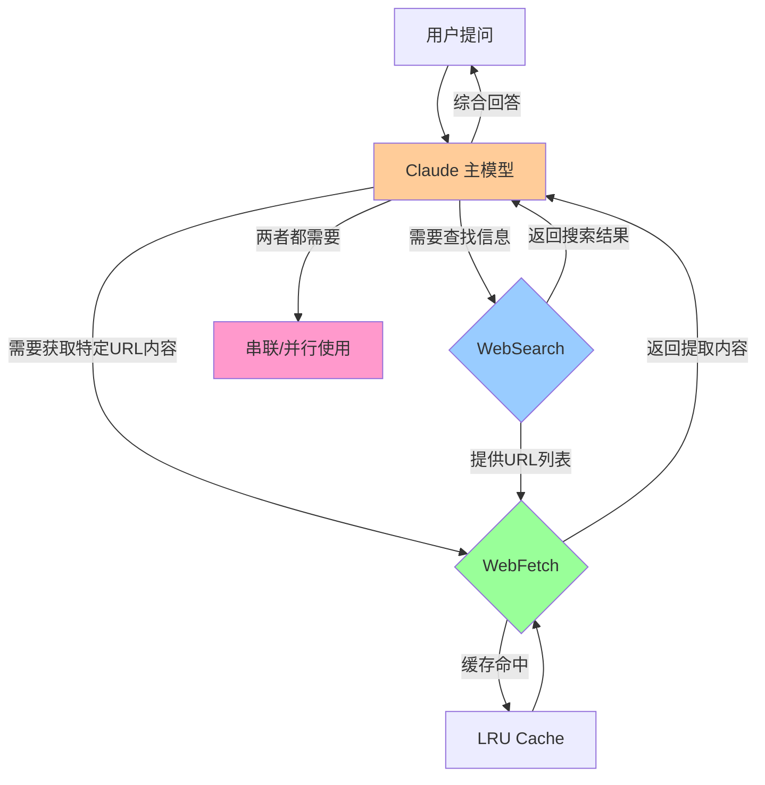

### 1.2 核心协作机制

两个工具的协作依赖于以下机制：

1. **工具描述引导** (Tool Description Guidance): 通过 system prompt 告诉模型何时使用哪个工具
2. **模型自主决策** (Model Autonomy): Claude 根据任务需求自主选择工具
3. **多轮迭代** (Multi-turn Iteration): 搜索结果可以触发后续的 Fetch 请求
4. **结果聚合** (Result Aggregation): 模型综合两个工具的结果生成最终答案

---

## 2. 模型如何决定使用哪个工具

### 2.1 工具描述引导

Claude Code 通过 **工具描述 (tool descriptions)** 指导模型的选择。这些描述作为 system prompt 的一部分发送给模型。

#### WebSearch 的描述

```typescript
// src/tools/WebSearchTool/prompt.ts
- Allows Claude to search the web and use the results to inform responses
- Provides up-to-date information for current events and recent data
- Returns search result information formatted as search result blocks
- Use this tool for accessing information beyond Claude's knowledge cutoff
- Searches are performed automatically within a single API call

Usage notes:
  - Domain filtering is supported to include or block specific websites
  - Web search is only available in the US
```

**关键词**：`search the web`, `up-to-date`, `current events`, `beyond knowledge cutoff`

#### WebFetch 的描述

```typescript
// src/tools/WebFetchTool/prompt.ts
- Fetches content from a specified URL and processes it using an AI model
- Takes a URL and a prompt as input
- Fetches the URL content, converts HTML to markdown
- Processes the content with the prompt using a small, fast model
- Returns the model's response about the content
- Use this tool when you need to retrieve and analyze web content

Usage notes:
  - IMPORTANT: If an MCP-provided web fetch tool is available, prefer using that tool
  - For GitHub URLs, prefer using the gh CLI via Bash instead
```

**关键词**：`specified URL`, `retrieve and analyze web content`, `extract information`

### 2.2 决策流程图

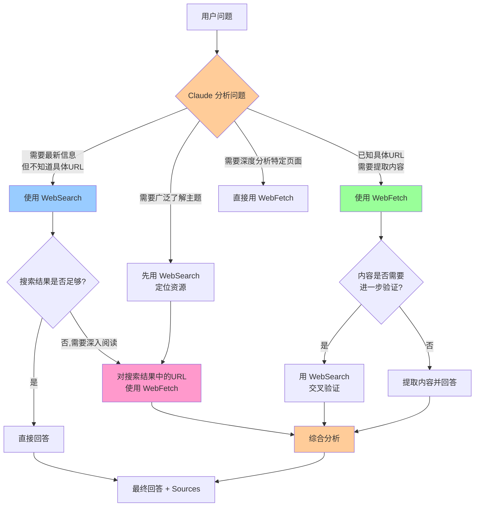

### 2.3 典型场景分析

#### 场景 1: 查询最新技术趋势

**用户问题**: "React 19 有哪些新特性？"

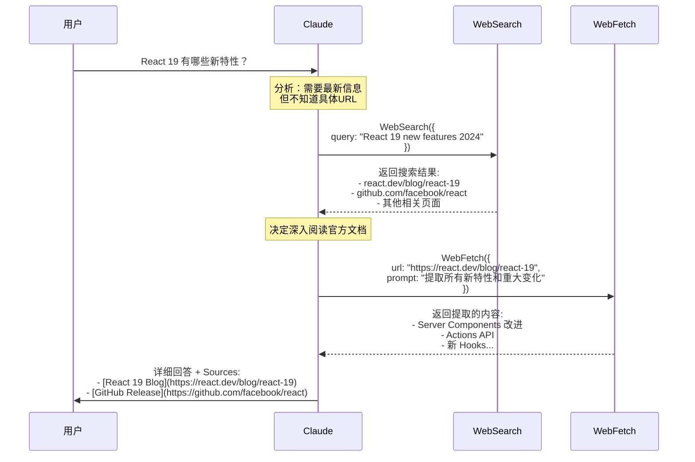

**决策逻辑**：
```
1. 用户问题需要 2024 年的最新信息 (超出训练数据)
2. 不知道具体哪个 URL 有完整信息
3. → 先用 WebSearch 定位资源
4. 搜索结果返回多个 URL
5. 官方文档 (react.dev) 最权威
6. → 用 WebFetch 深度提取
7. 综合搜索结果和提取内容生成回答
```

#### 场景 2: 分析特定文档页面

**用户问题**: "帮我理解这个 API 文档：https://docs.python.org/3/library/asyncio-task.html"

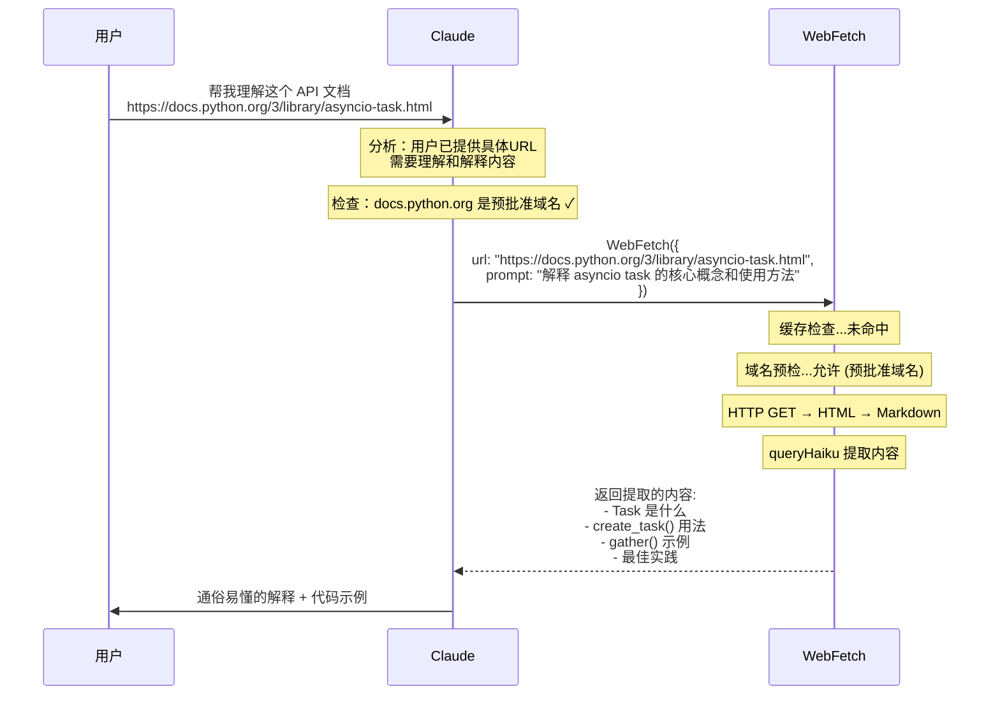

**决策逻辑**：
```
1. 用户已提供具体 URL
2. 需要理解和解释内容 (不是搜索)
3. docs.python.org 是预批准域名 (免权限)
4. → 直接使用 WebFetch
5. 无需搜索 (用户明确指定了目标)
```

#### 场景 3: 综合调研任务

**用户问题**: "对比 Next.js 14 和 Remix 的路由系统差异"

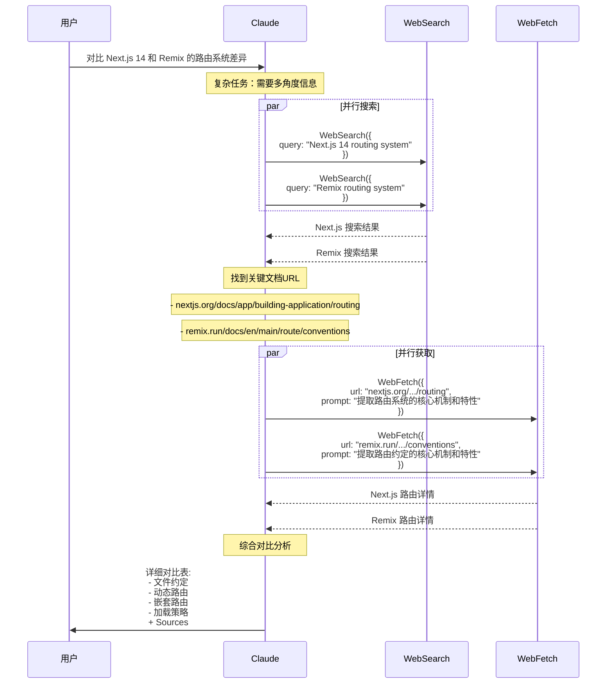

**决策逻辑**：
```
1. 需要对比两个框架 (多角度信息)
2. → 先用 WebSearch 了解概况
3. 搜索结果指向官方文档
4. → 用 WebFetch 深入提取
5. 两个框架并行处理 (提高效率)
6. 模型综合所有信息生成对比表
```

---

## 3. 串联协作模式

### 3.1 WebSearch → WebFetch 工作流

这是最常见的协作模式，模型先用搜索定位资源，再用 Fetch 深度提取。

#### 完整时序图

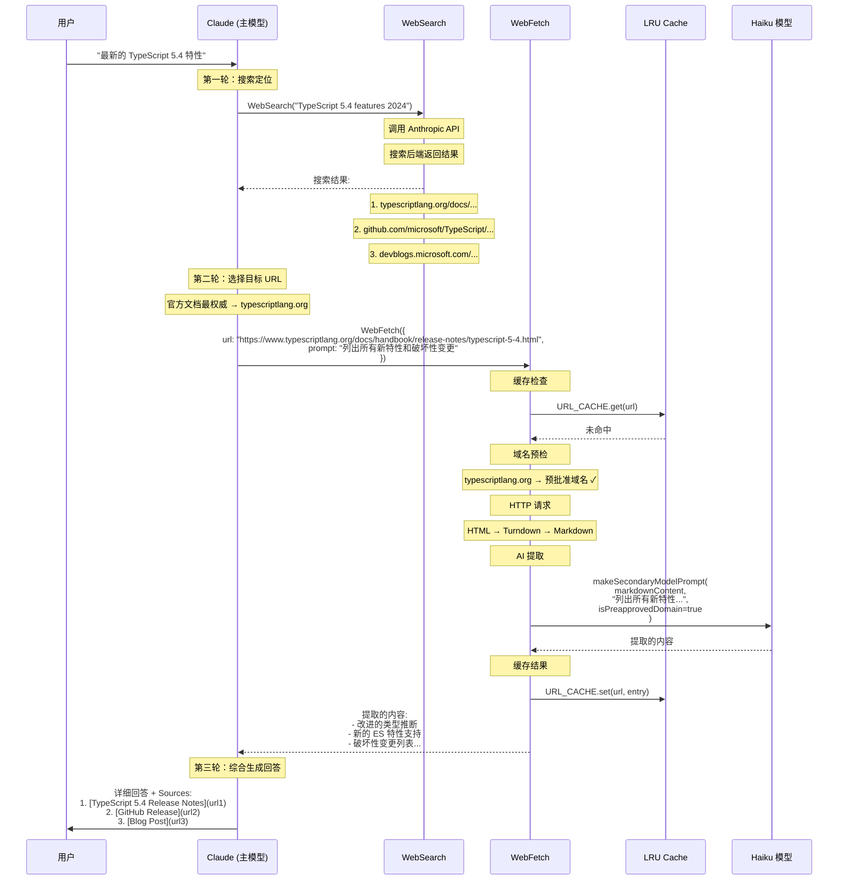

#### 代码实现路径

```typescript
// 1. 主模型决定搜索
// src/query.ts → queryLoop()
for await (const message of deps.callModel({...})) {
  // 模型输出: <tool_use> WebSearch
}

// 2. WebSearch 执行
// src/tools/WebSearchTool/WebSearchTool.ts
WebSearchTool.call({query: "TypeScript 5.4 features"})
  ↓
// 构建独立的 API 调用
queryModelWithStreaming({
  messages: [createUserMessage("Perform a web search for: TypeScript 5.4 features")],
  systemPrompt: "You are an assistant for performing a web search tool use",
  options: {
    extraToolSchemas: [toolSchema],  // web_search_20250305
    querySource: 'web_search_tool'
  }
})
  ↓
// 解析搜索结果
makeOutputFromSearchResponse(allContentBlocks, query, durationSeconds)
  → {
    query: "TypeScript 5.4 features 2024",
    results: [
      "Let me search for TypeScript 5.4 features",
      {tool_use_id: "1", content: [{title: "TS 5.4 Release", url: "https://typescriptlang.org/..."}]},
      {tool_use_id: "2", content: [{title: "GitHub Release", url: "https://github.com/..."}]}
    ],
    durationSeconds: 3.2
  }

// 3. 主模型接收搜索结果，决定 Fetch
// src/query.ts → queryLoop() (下一轮迭代)
for await (const message of deps.callModel({...})) {
  // 模型看到搜索结果，选择 Fetch 官方文档
}

// 4. WebFetch 执行
// src/tools/WebFetchTool/WebFetchTool.ts
WebFetchTool.call({
  url: "https://www.typescriptlang.org/docs/handbook/release-notes/typescript-5-4.html",
  prompt: "列出所有新特性和破坏性变更"
})
  ↓
// 获取内容
getURLMarkdownContent(url, abortController)
  ↓
// 应用 prompt 提取
applyPromptToMarkdown(prompt, markdownContent, signal, ...)
  ↓
// 调用 Haiku
queryHaiku({
  systemPrompt: asSystemPrompt([]),
  userPrompt: makeSecondaryModelPrompt(
    truncatedContent,
    prompt,
    isPreapprovedDomain
  ),
  options: {querySource: 'web_fetch_apply'}
})
  ↓
// 返回提取结果
{bytes: 45000, code: 200, result: "TypeScript 5.4 新特性:\n1. ...", durationMs: 2800, url: "..."}

// 5. 主模型综合生成最终回答
// 模型结合搜索结果 (URL 列表) 和提取内容 (详细信息)
// 生成带 Sources 的完整回答
```

### 3.2 真实案例分析

#### 案例 1: 调试错误信息

**场景**: 用户遇到一个罕见的 TypeScript 错误

```
用户: "TypeScript 报错: Type 'X' is not assignable to type 'Y' with index signatures"
```

**Claude 的决策过程**:

```typescript
// 第 1 步: 搜索错误信息
WebSearch({
  query: "TypeScript 'not assignable to type' index signatures error"
})

// 搜索结果返回:
// - stackoverflow.com/questions/...
// - github.com/microsoft/TypeScript/issues/...
// - typescriptlang.org/docs/...

// 第 2 步: Fetch Stack Overflow 获取具体解决方案
WebFetch({
  url: "https://stackoverflow.com/questions/12345/...",
  prompt: "提取关于 index signatures 错误的所有解决方案和代码示例"
})

// 第 3 步: Fetch GitHub Issue 获取官方解释
WebFetch({
  url: "https://github.com/microsoft/TypeScript/issues/67890",
  prompt: "提取 TypeScript 团队对这个问题的官方解释和修复计划"
})

// 第 4 步: 综合回答
模型生成:
"""
这个错误是因为...

解决方案:
1. 使用类型断言 (来自 Stack Overflow)
   ```typescript
   const x = obj as TargetType
   ```

2. 修改接口定义 (来自 GitHub Issue)
   ```typescript
   interface MyType {
     [key: string]: unknown
   }
   ```

官方状态:
- TypeScript 团队已知此问题
- 计划在 5.5 中修复

Sources:
- [Stack Overflow: Index Signature Issue](https://stackoverflow.com/...)
- [GitHub Issue #67890](https://github.com/...)
"""
```

**为什么需要两个工具？**
- WebSearch: 定位问题相关的讨论和资源
- WebFetch: 深度提取具体的解决方案和代码示例
- 单独用 Search: 只能看到标题和摘要，没有完整代码
- 单独用 Fetch: 不知道应该 fetch 哪个 URL

---

## 4. 并行协作模式

### 4.1 多工具并发调用

在某些场景下，模型会**同时**调用多个工具（包括多次 WebSearch 和 WebFetch），以提高效率。

#### 并发架构图

```mermaid
graph TB
    U[用户问题] --> M[Claude 主模型]
    
    M -->|决定需要多角度信息| PARALLEL{并行执行}
    
    PARALLEL -->|搜索不同角度| WS1[WebSearch 1<br/>"Next.js routing"]
    PARALLEL -->|搜索不同角度| WS2[WebSearch 2<br/>"Remix routing"]
    PARALLEL -->|获取已知URL| WF1[WebFetch 1<br/>官方文档A]
    PARALLEL -->|获取已知URL| WF2[WebFetch 2<br/>官方文档B]
    
    WS1 --> AGG[结果聚合]
    WS2 --> AGG
    WF1 --> AGG
    WF2 --> AGG
    
    AGG --> M
    M --> FINAL[综合回答]
    
    style PARALLEL fill:#ffcc99
    style AGG fill:#99ff99
```

#### 时序图：并行调用

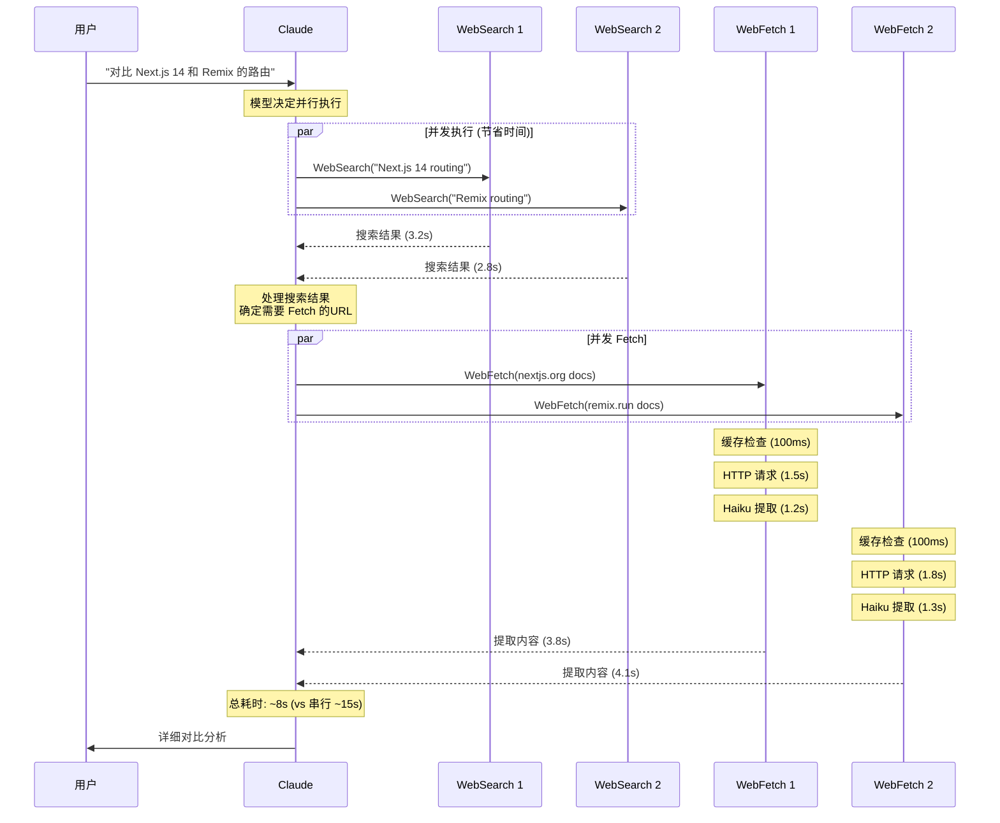

### 4.2 结果聚合策略

当多个工具并行执行时，模型需要聚合所有结果。

#### 聚合流程

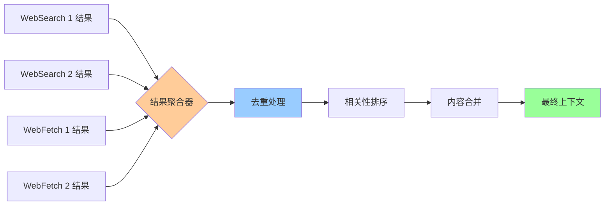

#### 聚合示例

```typescript
// 模型接收到的工具结果
const toolResults = {
  webSearch_1: {
    query: "Next.js 14 routing",
    results: [
      "Next.js 14 introduced App Router...",
      {content: [{title: "Next.js Docs", url: "https://nextjs.org/docs/..."}]}
    ]
  },
  webSearch_2: {
    query: "Remix routing",
    results: [
      "Remix uses file-based routing...",
      {content: [{title: "Remix Docs", url: "https://remix.run/docs/..."}]}
    ]
  },
  webFetch_1: {
    url: "https://nextjs.org/docs/...",
    result: "Next.js 14 路由特性:\n- App Router\n- Server Components\n- Layout nesting..."
  },
  webFetch_2: {
    url: "https://remix.run/docs/...",
    result: "Remix 路由特性:\n- File-based routing\n- Nested routes\n- Dynamic segments..."
  }
}

// 模型内部聚合逻辑 (伪代码)
function aggregateResults(toolResults) {
  // 1. 去重 (两个搜索可能返回相同 URL)
  const uniqueUrls = new Set()
  
  // 2. 提取关键信息
  const nextjsFeatures = toolResults.webFetch_1.result
  const remixFeatures = toolResults.webFetch_2.result
  
  // 3. 构建对比表
  return {
    comparison: {
      nextjs: parseFeatures(nextjsFeatures),
      remix: parseFeatures(remixFeatures)
    },
    sources: [
      ...toolResults.webSearch_1.results[1].content,
      ...toolResults.webSearch_2.results[1].content
    ]
  }
}
```

---

## 5. ToolSearch 的协调作用

### 5.1 ToolSearch 是什么

`ToolSearch` 是一个**元工具** (meta-tool)，用于在大量可用工具中搜索和发现合适的工具。当工具数量超过阈值时自动启用。

```typescript
// src/utils/toolSearch.ts
// 当延迟加载的工具描述超过上下文窗口的百分比时启用
const DEFAULT_AUTO_TOOL_SEARCH_PERCENTAGE = 0.15  // 15%

// 阈值计算
function getAutoToolSearchTokenThreshold(model: string): number {
  const contextWindow = getContextWindowForModel(model, betas)
  return Math.floor(contextWindow * 0.15)
}
```

### 5.2 ToolSearch 与 WebSearch/WebFetch 的关系

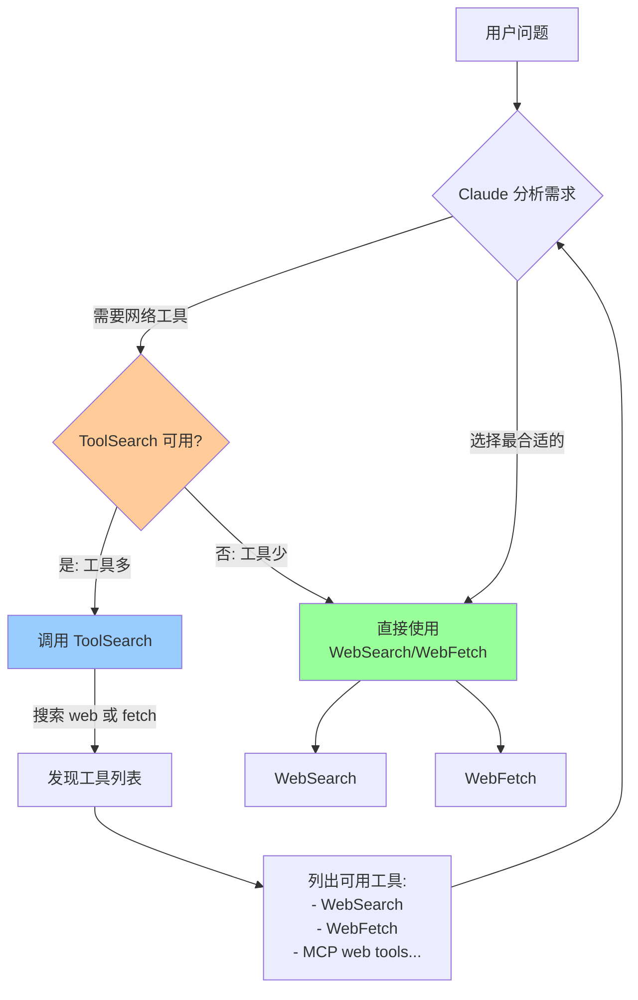

### 5.3 ToolSearch 工作流程

#### 场景：MCP 服务器添加了自定义 WebFetch 工具

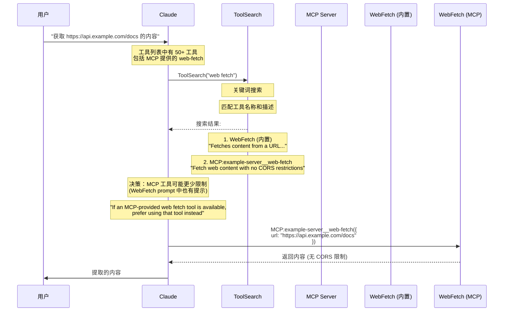

**关键点**：
- WebFetch 的 prompt 中明确提示优先使用 MCP 版本
- ToolSearch 帮助模型发现和选择合适的工具
- 模型根据工具描述做出最优选择

---

## 6. 自动模式分类器

### 6.1 Auto Mode 概述

Claude Code 支持 **自动模式 (auto mode)**，在这种模式下，分类器会自动判断工具调用是否安全，无需用户确认。

```typescript
// src/utils/permissions/classifierDecision.ts
const SAFE_YOLO_ALLOWLISTED_TOOLS = new Set([
  FILE_READ_TOOL_NAME,
  GREP_TOOL_NAME,
  GLOB_TOOL_NAME,
  // ... 其他安全工具
  // 注意: WebSearch 和 WebFetch 不在允许列表中!
])

export function isAutoModeAllowlistedTool(toolName: string): boolean {
  return SAFE_YOLO_ALLOWLISTED_TOOLS.has(toolName)
}
```

### 6.2 WebSearch/WebFetch 在 Auto Mode 中的处理

由于网络访问的敏感性，这两个工具**不在**安全允许列表中，需要经过分类器检查。

#### 分类器工作流程

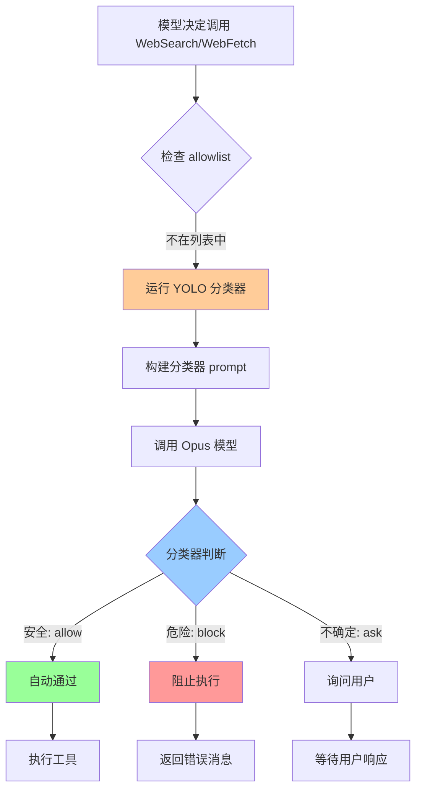

#### 分类器示例

```typescript
// src/utils/permissions/yoloClassifier.ts
export async function classifyYoloAction(
  messages: Message[],
  action: TranscriptEntry,
  tools: Tools,
  context: ToolPermissionContext,
  signal: AbortSignal,
): Promise<YoloClassifierResult> {
  // 1. 构建分类器上下文 (JSONL 格式)
  const actionCompact = toCompact(action, lookup)
  // 示例: {"WebSearch":"TypeScript 5.4 features"}
  // 示例: {"WebFetch":"https://example.com: extract API docs"}
  
  // 2. 构建 prompt
  const prompt = `
    You are evaluating whether an agent action should be allowed.
    
    Conversation history:
    ${formatTranscript(messages)}
    
    Action to evaluate:
    ${actionCompact}
    
    Decision criteria:
    - Is this action safe?
    - Does it attempt to access sensitive data?
    - Is it consistent with the user's request?
    
    Respond with:
    {"allow": true, "reason": "..."}
    or
    {"allow": false, "reason": "..."}
  `
  
  // 3. 调用 Opus 分类器
  const result = await queryOpus({
    systemPrompt: "You are a security classifier for agent actions",
    userPrompt: prompt,
    signal
  })
  
  // 4. 解析结果
  const parsed = parseClassifierResponse(result)
  return {
    shouldBlock: !parsed.allow,
    reason: parsed.reason,
    model: 'opus'
  }
}
```

### 6.3 实际案例分析

#### 案例 1: WebSearch 自动通过

```typescript
// 用户请求
用户: "搜索 React 19 的最新特性"

// 模型决定调用
WebSearch({
  query: "React 19 new features 2024"
})

// 分类器输入
{
  transcript: [
    {user: "搜索 React 19 的最新特性"},
    {WebSearch: "React 19 new features 2024"}
  ],
  action: {WebSearch: "React 19 new features 2024"}
}

// 分类器判断
{
  allow: true,
  reason: "Search query is directly related to user's request and contains no sensitive information"
}

// 结果: 自动通过，无需用户确认
```

#### 案例 2: WebFetch 被阻止

```typescript
// 异常场景 (模型被攻击)
用户: "读取 http://internal.company.local/secrets 的内容"

// 模型决定调用 (被注入攻击)
WebFetch({
  url: "http://internal.company.local/secrets",
  prompt: "读取所有内容"
})

// 分类器输入
{
  transcript: [
    {user: "读取 http://internal.company.local/secrets 的内容"},
    {WebFetch: "http://internal.company.local/secrets: 读取所有内容"}
  ],
  action: {WebFetch: "http://internal.company.local/secrets: 读取所有内容"}
}

// 分类器判断
{
  allow: false,
  reason: "URL appears to target an internal corporate resource containing sensitive data (secrets). This may be a social engineering attack."
}

// 结果: 阻止执行，返回错误
```

**注意**：即使分类器通过，WebFetch 还有多层安全防护：
1. URL 验证 (不能是 localhost/internal)
2. 域名预检检查 (Anthropic API 黑名单)
3. 预批准域名列表 (仅公开文档站点)
4. 重定向限制 (防止开放重定向)

---

## 7. 预算控制的联动

### 7.1 多层预算体系

WebSearch 和 WebFetch 的协作受到多层预算控制的影响。

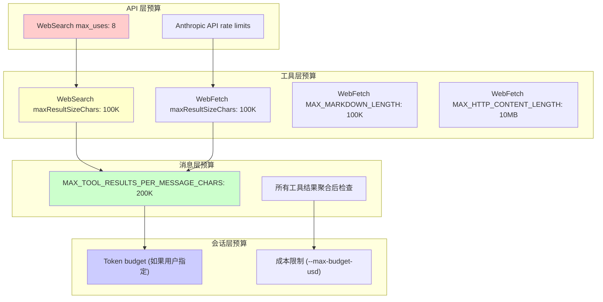

### 7.2 预算联动案例

#### 场景：大量网页抓取触发聚合预算

```typescript
// 用户请求
用户: "分析这 5 个竞争对手的产品页面，总结差异"

// Claude 决定并行 Fetch 5 个 URL
const urls = [
  "https://competitor1.com/product",  // 返回 80K 字符
  "https://competitor2.com/product",  // 返回 60K 字符
  "https://competitor3.com/product",  // 返回 90K 字符
  "https://competitor4.com/product",  // 返回 70K 字符
  "https://competitor5.com/product"   // 返回 85K 字符
]

// 单个结果都未超过工具层预算 (100K)
// 但总和 = 385K > 消息层预算 (200K)

// 触发聚合预算执行
// src/utils/toolResultStorage.ts
async function enforceToolResultBudget(
  messages: Message[],
  state: ContentReplacementState
) {
  const limit = getPerMessageBudgetLimit()  // 200K
  
  // 计算当前消息的总大小
  const totalSize = sum(contentSizes)  // 385K
  
  if (totalSize > limit) {
    // 持久化最大的 tool_result 到磁盘
    // 按大小降序排序
    const sortedBlocks = candidates.sort((a, b) => b.size - a.size)
    
    // 逐个持久化直到低于预算
    let currentSize = totalSize
    for (const block of sortedBlocks) {
      if (currentSize <= limit) break
      
      const result = await persistToolResult(block.content, block.tool_use_id)
      replaceWithPreview(block, result)
      currentSize -= block.size - preview.size
    }
  }
}

// 结果:
// - Competitor 3 (90K) → 持久化到文件，替换为预览
// - Competitor 5 (85K) → 持久化到文件，替换为预览
// - Competitor 1 (80K) → 持久化到文件，替换为预览
// - 剩余: 60K + 70K = 130K < 200K ✓

// 模型收到的消息:
"""
WebFetch 结果:
- Competitor 2: [完整内容 60K 字符]
- Competitor 4: [完整内容 70K 字符]
- Competitor 3: Output too large (90K). Full output saved to: 
  /path/to/session/tool-results/uuid3.txt
  Preview: "Competitor 3 offers..."
- Competitor 5: Output too large (85K). Full output saved to:
  /path/to/session/tool-results/uuid5.txt
  Preview: "Competitor 5 specializes in..."
- Competitor 1: Output too large (80K). Full output saved to:
  /path/to/session/tool-results/uuid1.txt
  Preview: "Competitor 1 provides..."
"""

// 模型可以:
// 1. 基于预览生成初步分析
// 2. 如需完整内容，使用 FileReadTool 读取文件
```

### 7.3 Token Budget 的影响

如果用户指定了 token 预算，两个工具的协作会受到更严格的控制。

```typescript
// 用户启动时指定预算
claude --task-budget 500000  // 500K tokens

// 预算追踪
// src/query/tokenBudget.ts
function checkTokenBudget(
  tracker: BudgetTracker,
  budget: number,
  globalTurnTokens: number
): TokenBudgetDecision {
  const pct = Math.round((globalTurnTokens / budget) * 100)
  
  // 达到 90% 阈值时继续
  if (globalTurnTokens < budget * 0.9) {
    return {
      action: 'continue',
      nudgeMessage: `You've used ${pct}% of your ${budget.toLocaleString()} token budget. Keep working.`,
      continuationCount: tracker.continuationCount + 1,
      pct,
      turnTokens: globalTurnTokens,
      budget
    }
  }
  
  // 达到预算上限，停止
  return {
    action: 'stop',
    completionEvent: {
      continuationCount: tracker.continuationCount,
      pct,
      turnTokens: globalTurnTokens,
      budget,
      diminishingReturns: false,
      durationMs: Date.now() - tracker.startedAt
    }
  }
}

// 对 WebSearch/WebFetch 协作的影响:
// 1. 预算 < 50%: 正常使用两个工具
// 2. 预算 50-90%: 减少不必要的搜索，优先 Fetch 已知 URL
// 3. 预算 > 90%: 收到系统提示，加快完成速度
// 4. 预算 100%: 停止执行，生成总结
```

---

## 8. 协作优化策略

### 8.1 智能缓存减少重复调用

#### 缓存协同效应

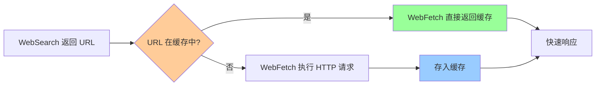

**优化效果**：

```typescript
// 场景：用户多次询问相关主题

// 第 1 次询问
用户: "React Server Components 是什么？"
→ WebSearch("React Server Components 2024")
→ WebFetch("https://react.dev/reference/rsc/server-components")
→ 耗时: 5.2s (搜索 2.8s + Fetch 2.4s)
→ 缓存: URL 存入 URL_CACHE (TTL 15min)

// 5 分钟后第 2 次询问
用户: "Server Components 能访问 localStorage 吗？"
→ WebSearch("React Server Components localStorage access")
→ WebFetch("https://react.dev/reference/rsc/server-components")  // 相同 URL
→ 耗时: 3.5s (搜索 3.5s + Fetch 0s [缓存命中])
→ 缓存命中节省: 2.4s

// 10 分钟后第 3 次询问
用户: "再解释一下 Server Components 的数据获取"
→ WebSearch(...)
→ WebFetch(...)  // 仍命中缓存 (15min TTL)
→ 耗时: 3.2s (搜索 3.2s + Fetch 0s)
```

### 8.2 上下文感知的工具选择

Claude 会基于以下因素智能选择工具：

```typescript
// 决策矩阵 (模型内部推理)

const decisionMatrix = {
  // 场景 1: 探索性查询
  "什么是最新的技术趋势": {
    knowledge: "超出训练数据",
    known_url: false,
    action: "WebSearch"
  },
  
  // 场景 2: 精确 URL 查询
  "解释这个页面: https://example.com/docs": {
    knowledge: "需要提取内容",
    known_url: true,
    action: "WebFetch"
  },
  
  // 场景 3: 深度调研
  "对比框架 A 和框架 B 的性能": {
    knowledge: "需要多角度信息",
    known_url: false,
    action: "WebSearch (多个) → WebFetch (官方文档)"
  },
  
  // 场景 4: 验证信息
  "确认这个 API 是否已弃用": {
    knowledge: "需要最新官方信息",
    known_url: true,
    action: "WebFetch (官方文档) + WebSearch (社区讨论)"
  },
  
  // 场景 5: 代码示例
  "给我 React 19 的 use() Hook 示例": {
    knowledge: "需要具体代码",
    known_url: true,  // 从搜索结果已知
    action: "WebFetch (官方文档提取代码)"
  }
}
```

### 8.3 错误恢复和降级策略

当一个工具失败时，模型会智能降级。

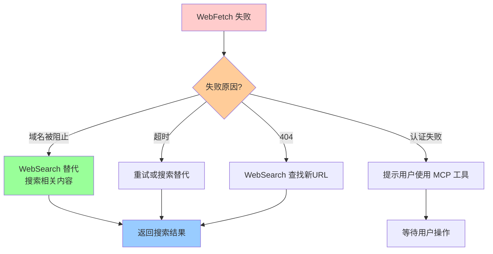

#### 降级案例

```typescript
// 场景 1: 域名被阻止
WebFetch({
  url: "https://blocked-domain.com/docs",
  prompt: "提取内容"
})
→ 错误: "Claude Code is unable to fetch from blocked-domain.com"

// 降级策略
模型自动切换:
WebSearch({
  query: "blocked-domain.com documentation mirror"
})
→ 找到镜像站点或缓存版本

// 场景 2: 404 错误
WebFetch({
  url: "https://example.com/old-docs-page",
  prompt: "提取内容"
})
→ 错误: HTTP 404

// 降级策略
WebSearch({
  query: "example.com documentation current page"
})
→ 找到新的正确 URL
→ WebFetch({url: "https://example.com/new-docs-page", ...})

// 场景 3: 需要认证
WebFetch({
  url: "https://docs.google.com/document/...",
  prompt: "提取内容"
})
→ 失败: 需要 Google 认证

// 降级策略 (WebFetch prompt 中有提示)
模型尝试:
1. 查找 MCP 工具: "google-docs" MCP server
2. 或使用 Bash: `curl` with auth token
3. 或询问用户提供内容
```

### 8.4 性能优化建议

基于协作机制的分析，以下是优化建议：

#### 1. 预测性缓存

```typescript
// 当前: WebSearch 无缓存
// 建议: 缓存搜索结果，避免重复搜索相同 query

const SEARCH_CACHE = new LRUCache<string, SearchResult>({
  maxSize: 100 * 1024 * 1024,  // 100MB
  ttl: 30 * 60 * 1000  // 30 分钟
})

async function cachedWebSearch(query: string) {
  const cached = SEARCH_CACHE.get(query)
  if (cached) return cached
  
  const result = await WebSearchTool.call({query})
  SEARCH_CACHE.set(query, result)
  return result
}
```

#### 2. 批量 URL 获取

```typescript
// 当前: 串行 Fetch
for (const url of urls) {
  await WebFetch({url, prompt})  // 每个 2-4s
}

// 建议: 并发控制
import pLimit from 'p-limit'
const limit = pLimit(3)  // 最多 3 个并发

const results = await Promise.all(
  urls.map(url => limit(() => WebFetch({url, prompt})))
)
// 总耗时从 15s 降到 ~5s
```

#### 3. 智能 URL 优先级

```typescript
// 当前: 模型手动选择 URL
// 建议: 基于权威性评分自动排序

function scoreUrlAuthority(url: string, searchResult: SearchResult): number {
  let score = 0
  
  // 官方域名 +10
  if (url.includes('react.dev') || url.includes('docs.')) {
    score += 10
  }
  
  // GitHub 官方仓库 +8
  if (url.includes('github.com/facebook/react')) {
    score += 8
  }
  
  // 博客文章 +5
  if (url.includes('blog.')) {
    score += 5
  }
  
  // Stack Overflow +3
  if (url.includes('stackoverflow.com')) {
    score += 3
  }
  
  return score
}

// 模型优先 Fetch 高分 URL
const sortedUrls = searchResults.sort((a, b) => 
  scoreUrlAuthority(b) - scoreUrlAuthority(a)
)
```

---

## 9. 总结

### 9.1 协作模式对比

| 协作模式 | 适用场景 | 优势 | 劣势 |
|---------|---------|------|------|
| **Search → Fetch** | 探索性查询后深度分析 | 精准定位，信息完整 | 延迟较高 (2 轮) |
| **并行执行** | 多源信息对比 | 速度快 (并发) | 资源消耗大 |
| **独立使用** | 明确需求 | 简单高效 | 信息可能不完整 |
| **迭代循环** | 复杂调研 | 深度广度兼具 | 成本和延迟最高 |

### 9.2 核心设计原则

1. **模型自主决策**: 通过工具描述引导，而非硬编码规则
2. **多层安全保障**: 权限控制、域名预检、自动模式分类器
3. **智能缓存**: 减少重复请求，提高响应速度
4. **预算联动**: 多层预算控制防止资源滥用
5. **优雅降级**: 工具失败时自动切换替代方案

### 9.3 最佳实践

对于 Claude Code 用户：

```markdown
✅ 推荐做法:
- 已知 URL 时直接提供，跳过搜索步骤
- 复杂问题拆分为多个子查询
- 利用缓存：相关查询会更快

❌ 避免做法:
- 不要要求访问内部/认证资源 (WebFetch 会失败)
- 避免过于宽泛的搜索 ("互联网上的一切")
- 不要在预算耗尽时要求大量网络访问
```

对于 Claude Code 开发者：

```markdown
✅ 优化方向:
- 实现 WebSearch 结果缓存
- 支持批量并发 URL 获取
- 增强 ToolSearch 与 Web 工具的集成
- 提供预算使用情况的可视化反馈

⚠️ 注意事项:
- 保持工具描述的清晰和准确
- 确保安全分类器的准确性
- 监控缓存命中率并调整 TTL
- 防止重定向和 SSRF 攻击
```

---

**文档版本**: 1.0  
**创建日期**: 2026-04-09  
**相关文档**: 
- [Web Search 与 Web Fetch 深度技术分析](./14-web-search-fetch-analysis.md)
- [Task State Machine](./01-task-state-machine.md)
- [Context Sharing](./08-context-sharing.md)
