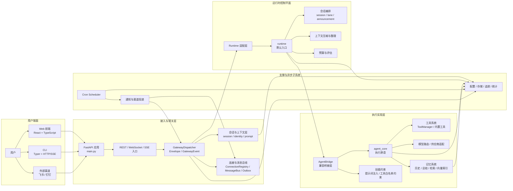

# X-Agent 架构与设计原则总纲

> 基线时间：2026-04-08  
> 依据文档：`docs/architecture-review/*.md`  
> 口径说明：以当前代码真实实现为准，`docs/runtime/` 仅作为演进补充，不替代现状判断。

## 1. 文档目的

本文是 X-Agent 的系统级总纲，目标不是重复各专题评审文档，而是把当前仓库中已经成形的架构骨架、模块边界和设计原则收拢到一份可快速阅读的中文说明里。

它主要回答四个问题：

- 当前系统到底由哪些子系统组成
- 这些子系统在代码中的职责边界是什么
- 关键请求链路是如何从入口流转到执行层的
- 现在这套架构遵循哪些明确的设计原则

## 2. 当前系统组成

按照 `docs/architecture-review/README.md` 的评审口径，当前仓库不是单体聊天应用，而是一个由多交互端、多后端子系统和多种兼容层组成的 AI Agent 平台。

系统主要由以下部分构成：

- Web 前端：`frontend/src/`
- CLI：`cli/`
- FastAPI 主服务：`backend/src/main.py`
- REST / WebSocket / SSE 网关：`backend/src/gateway/`
- 会话、身份与上下文装配：`backend/src/conversation/`
- 执行实现层：`backend/src/agent_core/`
- 运行时控制平面：`backend/src/runtime/`
- 记忆系统：`backend/src/memory/`
- 定时任务系统：`backend/src/cron/`
- 外部渠道与通知：`backend/src/channel/`、`backend/src/gateway/notification.py`
- 配置、存储、可观测及通用服务：`backend/src/config/`、`backend/src/services/`、`backend/src/utils/`

## 3. 总体架构

当前系统的总体形态可以概括为“多入口接入 + 网关协议收敛 + 运行时控制平面 + 执行实现层 + 记忆 / 定时任务 / 渠道等支撑子系统”。

## 4. 主链路说明

### 4.1 Web 请求链路

Web 前端负责会话恢复、消息发送和流式展示：

- `frontend/src/App.tsx` 负责页面级视图切换与本地会话恢复
- `frontend/src/hooks/useAgent.ts` 负责聊天状态机与消息归并
- `frontend/src/hooks/useWebSocket.ts` 负责连接、重连和流式事件接收

主链路如下：

1. 前端读取本地 `agent_id` / `session_id`
2. 通过 REST 查询或创建会话
3. 建立 `/ws/agent/{session_id}` 连接
4. 发送用户消息并接收 `chunk`、`tool_call`、`tool_result`、`message` 等事件
5. 在前端重组为统一的消息模型并渲染

### 4.2 CLI 请求链路

CLI 是后端能力的命令行入口，不是独立运行时。

主链路如下：

1. `cli/main.py` 注册命令
2. `cli/commands/*.py` 解析参数与用户输入
3. `cli/adapters/gateway_client.py` 通过 HTTP + SSE 调用 `/api/v1/gateway/chat`
4. 后端返回 `GatewayEvent` 流
5. CLI 将事件流渲染为终端输出

Web 与 CLI 当前使用两套流协议消费端：

- Web 主要走 WebSocket
- CLI 主要走 REST + SSE

这是现状事实，不应在总纲里被误写成“已经统一为单一流协议”。

### 4.3 后端主处理链路

后端的统一处理主线是：

1. Endpoint 把请求转换为 `Envelope`
2. `GatewayDispatcher` 校验请求并解析目标 Agent
3. `conversation/` 负责 identity、session、prompt 与上下文装配
4. `AgentBridge` 作为 Gateway 与执行层之间的桥接入口
5. `runtime/` 承担控制平面职责
6. `agent_core/` 承担模型调用、工具执行和消息流处理
7. 结果以 `GatewayEvent` 的形式回传到 WebSocket 或 SSE

## 5. 核心子系统与职责边界

### 5.1 Web 前端

主要职责：

- 页面与视图切换
- Agent / Session 选择、恢复与切换
- 聊天事件流消费与消息重建
- 追踪、设置、技能等管理界面展示

边界判断：

- 前端是用户面与状态拼装层，不承载后端业务规则
- 当前 `App.tsx` 仍承担了一部分会话编排职责，属于现状中的偏重入口

### 5.2 CLI

主要职责：

- 暴露聊天、会话、Agent、Cron、状态检查等命令
- 作为后端远程控制台消费 API 与 SSE 能力
- 输出适合终端阅读的流式结果

边界判断：

- CLI 本质上是后端能力的薄适配层
- 它的稳定性高度依赖网关接口的稳定性

### 5.3 API 与网关

主要职责：

- 统一装配 FastAPI 应用、middleware 与 router
- 对外暴露 REST、WebSocket、SSE 入口
- 通过 `Envelope` 与 `GatewayEvent` 统一系统内外协议
- 通过 `GatewayDispatcher` 把请求收敛到执行入口

边界判断：

- 网关层是系统的协议收敛层，不应直接承载底层执行细节
- `ConnectionRegistry`、`MessageBus`、`Outbox` 负责连接和消息分发，不应与业务逻辑强耦合

### 5.4 会话、身份与上下文

主要职责：

- 建立和复用 session
- 根据 channel / session / user 构造 identity
- 读取 workspace 中的启动文件
- 构造 system prompt 与上下文装配结果

关键文件：

- `backend/src/conversation/session.py`
- `backend/src/conversation/identity.py`
- `backend/src/conversation/context_loader.py`
- `backend/src/conversation/system_prompt_builder.py`

边界判断：

- `SessionManager` 不只是数据访问层，它还带有会话复用、重新激活、总结触发等业务副作用
- `ContextLoader` 与 `SystemPromptBuilder` 都会读取 workspace 文件，但职责并不相同
- 当前启动文件装配链会涉及 `AGENTS.md`、`SPIRIT.md`、`OWNER.md`、`TOOLS.md`、`MEMORY.md`

### 5.5 运行时控制平面与执行实现层

这是当前系统最容易被误解的一组边界。

当前关系不是“`runtime` 已完全替代 `agent_core`”，而是：

- `runtime/` 负责控制平面
- `agent_core/` 负责执行实现
- `AgentBridge` 负责两者之间的桥接与兼容

`runtime/` 主要负责：

- 有界回合控制
- 会话编排
- `transcript`、`summary`、`artifact`、`snapshot` 等运行时对象持久化
- `budget`、`assessment`、`compaction` 相关治理

`agent_core/` 主要负责：

- Agent 消息状态与流式处理
- `agent_loop` 执行
- 工具调用解析与执行
- 复用已有消息模型与上下文转换能力

这一点必须在总纲中明确，因为它决定了后续重构的基本判断口径。

### 5.6 记忆系统

记忆系统是 X-Agent 与普通聊天应用最核心的差异之一。

主要职责：

- 维护 Markdown 文件型长期记忆
- 执行会话总结写入
- 进行重要信息抽取
- 提供向量 / 文本混合检索
- 监听 workspace 文件变更并同步索引

关键文件：

- `backend/src/memory/manager.py`
- `backend/src/memory/context_builder.py`
- `backend/src/memory/file_watcher.py`
- `backend/src/memory/hybrid_search.py`
- `backend/src/memory/vector_store.py`
- `backend/src/memory/md_sync.py`

关键边界：

- Markdown 文件是长期可读存储
- 向量索引是检索增强能力，不是唯一真相源
- `MemoryManager` 是强入口，聚合了写入、搜索和历史回查多种职责

### 5.7 Cron 与自动化

主要职责：

- 创建、暂停、恢复、删除、执行定时任务
- 解析 `workspace:` 路径和函数入口
- 管理任务配置、调度和执行历史
- 与通知链路和 Agent 链路协同

关键边界：

- `SchedulerManager` 是唯一公共入口
- `CronScheduler` 是 APScheduler 封装层
- 调用方应依赖 `manager.py`，不应绕过管理层直接操作调度器

### 5.8 外部渠道与通知

这一层同时包含两条相邻但不同的链路：

- `channel/*`：入口适配，把外部平台消息转成系统内部 `Envelope`
- `gateway/notification.py`：出站投递，把内部通知发送到 WebChat 或外部渠道

边界判断：

- 渠道接入和通知投递属于同一领域，但当前尚未完全收敛为单一模型
- WebChat 通知链路成熟度更高，外部渠道适配能力仍在扩展

### 5.9 配置、存储与可观测

主要职责：

- 配置加载、校验、热更新
- 存储初始化与数据库生命周期管理
- 结构化日志、trace、stats 与开发者排障接口

关键边界：

- `ConfigManager` 是全局配置状态中心
- 存储服务既存在全局单例式使用，也存在局部实例化，当前生命周期管理并未完全统一
- 可观测能力不是附属功能，而是系统级基础设施

## 6. 设计原则

以下原则不是理想化口号，而是从当前代码结构和架构评审结论中提炼出的设计共识。

### 6.1 以真实代码为准

架构说明必须以当前仓库真实实现为准，不能把目标态设计直接写成已落地事实。

这意味着：

- `docs/runtime/` 不能替代 `docs/architecture-review/` 的现状描述
- 未完全统一的协议、边界和生命周期必须如实写明
- 总纲优先描述“已经存在什么”，再描述“正在往哪里收敛”

### 6.2 接入协议与内部协议分离

系统允许 WebSocket、SSE、REST、外部 IM 等多种入口并存，但内部必须通过统一协议收敛。

当前的核心收敛抽象是：

- 上行：`Envelope`
- 下行：`GatewayEvent`

这保证了入口多样化不会直接污染执行层。

### 6.3 控制平面与执行实现分离

`runtime` 与 `agent_core` 的职责边界必须保持清晰：

- `runtime` 决定回合如何被控制、评估、压缩和持久化
- `agent_core` 负责模型调用、消息流与工具执行

这条原则比“某个目录是否更新”更重要，因为它决定了系统后续演进是否可持续。

### 6.4 会话、身份、上下文显式建模

系统不是无状态聊天接口，而是带 session、identity、workspace 和历史记忆的 Agent 平台。

因此必须显式建模：

- 谁在发起请求
- 这条请求属于哪个会话
- 当前上下文由哪些 workspace 文件和历史记录构成
- system prompt 与运行时上下文如何分别装配

### 6.5 Markdown 是长期记忆主存储

记忆系统的长期真相源是 workspace 中可读的 Markdown 文件，而不是向量库。

这条原则带来的结果是：

- 用户可以直接查看和维护长期记忆
- 向量检索服务于召回，不取代主存储
- 文件监听、索引同步和记忆召回必须围绕 Markdown 一致性展开

### 6.6 管理层优先于底层实现直连

多个子系统都体现了“管理层作为唯一公共入口”的设计方式，例如：

- Cron 调用方依赖 `SchedulerManager`
- Gateway 调用方依赖 `GatewayDispatcher`
- 外部请求通过 `AgentBridge` 进入执行链

这条原则的意义是：

- 统一横切逻辑
- 统一错误处理和返回结构
- 降低调用方对底层实现细节的耦合

### 6.7 渐进收敛，而不是一次性重写

当前系统已经形成运行中的多模块结构，正确的演进方式是逐步收敛，而不是推翻重来。

因此总纲需要明确承认：

- legacy 执行链仍在被复用
- runtime 正在成为新的控制平面
- 新旧能力之间通过 bridge 和 adapter 协同，而不是硬切换

### 6.8 可观测性是架构要求

追踪、日志、统计与开发者调试接口不是附属工具，而是主架构的一部分。

这意味着：

- 关键链路必须可追踪
- 错误必须可定位
- 请求处理过程必须能被回放和分析
- 新模块设计不能绕开结构化日志和 tracing

## 7. 工程约束

除上面的架构原则外，项目还遵循一组明确的工程约束，这些约束来源于现有项目规范与宪章：

- 代码质量优先：类型、静态检查、复杂度控制
- 测试优先：功能实现必须伴随测试与回归验证
- 关注点分离：表达层、网关层、执行层、数据层解耦
- 一致性优先：不同端的行为与错误风格尽量统一
- 性能有边界：流式响应、压缩和检索都有明确性能预期
- 组合优于继承：优先使用插件、适配器和组合结构
- 稳定抽象优先：让易变模块依赖稳定接口
- 避免过度设计：只为真实需求保留复杂度

## 8. 当前不应误写的事项

以下内容在系统总纲中应避免被写错：

- 不应写成“runtime 已完全替代 agent_core”
- 不应写成“Web 与 CLI 已统一为同一流协议”
- 不应把 `SessionManager` 写成纯数据访问层
- 不应把向量库写成记忆系统唯一存储
- 不应把 `docs/runtime/` 写成当前代码的现状说明

## 9. 推荐阅读顺序

建议按以下顺序继续阅读：

1. `docs/system-outline.md`
2. `docs/architecture-review/README.md`
3. `docs/architecture-review/03-api-and-gateway.md`
4. `docs/architecture-review/04-conversation-and-session.md`
5. `docs/architecture-review/05-agent-core-and-tooling.md`
6. `docs/architecture-review/06-runtime-orchestration.md`
7. `docs/architecture-review/07-memory-system.md`
8. `docs/architecture-review/08-cron-and-automation.md`
9. `docs/architecture-review/09-channel-and-notification.md`
10. `docs/architecture-review/10-config-storage-and-observability.md`
