[澎湃号·湃客 >](https://m.thepaper.cn/channel_36079)

# 2026年Agentic AI十大关键趋势，技术、应用与治理三位一体

[王吉伟频道王吉伟频道官方澎湃号](https://m.thepaper.cn/user_interaction_6056059)

2026-01-06 07:14

山东

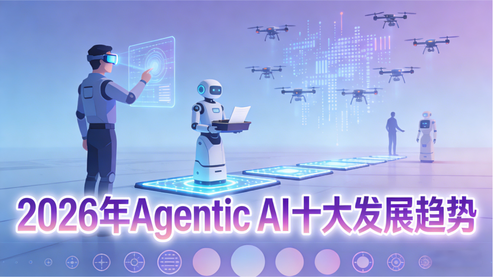

2026年Agentic AI十大关键趋势：技术、应用与治理三位一体

30倍市场扩容！2026 Agentic AI十大趋势，重构13万亿劳动力市场

2026必看：Agentic AI十大爆发趋势，70%企业已布局的赚钱赛道

从实验到规模化：2026 Agentic AI十大趋势，企业落地的关键拐点

2026 Agentic AI十大发展趋势：技术突破与商业落地全景

全文约7300字，阅读时间10分钟

文/王吉伟

2025年被业内公认为AI Agent商业元年，标志着AI从被动响应工具向主动决策执行者的根本性跨越。

这一年，AI Agent技术层面实现多维度关键突破。

自主操作能力实现质性进展，突破传统接口调用模式，GUI Agent路线走向成熟。多模态融合与记忆机制持续优化，主流AI Agent已实现文本+图像的多模态交互覆盖，在语音识别、视觉理解等基础能力上显著提升。自主决策与规划能力提升，AI Agent已具备明确的“感知-决策-执行”闭环能力，可应用于采购策略制定、贷款审批、工业设备操控等复杂场景。

这一年，AI Agent的企业部署速度显著加快。

普华永道于2025年5月发布的一份涵盖1000名美国商业领袖的调查显示，79%的组织表示他们在某种程度上已经采用了AI Agent。Salesforce报告试数据显示，2025上半年AI agent创建与部署增长119%，完成的行动量环比增长约80%月增率。

麦肯锡于11月发布的2025 AI应用现状调研显示，全球78%的组织已在日常运营中使用某种AI工具，其中85%的组织已将AI Agent集成至至少一项工作流程，标志着其从实验性工具进入企业级实用阶段。

同时数据显示，23%的企业已在企业内部至少一个业务职能中规模化部署Agentic AI系统，另有39%的企业处于实验阶段，多数规模化部署仅覆盖1-2个职能，跨职能全面落地仍较少

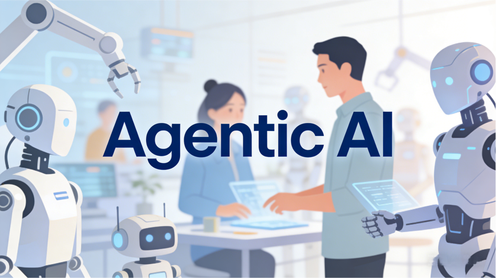

AI Agent应用渗透率也在快速提升。在金融、电商领域渗透率超30%，在落地速度相对较慢的制造业也快达到20%。在医疗领域，聚焦影像识别、报告生成等辅助诊断场景，用户复购率超过40%。

在消费级场景，以AI原生应用与智能硬件为核心的超级入口之争是全年焦点。截至2025年12月，字节系豆包APP表现累计下载量超1亿次，超过腾讯元宝、阿里夸克之和，长期占据苹果商店免费APP排行榜前十；阿里也推出千问APP、灵光AI等多款产品，其中千问公测23天月活用户突破3000万。腾讯生态已经全面介入元宝，能够轻松触达数亿用户。

AI Agent的市场规模正在快速增长。中商产业研究院数据显示（不同机构的计算方法与数据不同），2025年全球AI智能体市场规模约113亿美元，2024年约为51亿美元。2025年中国AI智能体市场规模约69亿元，2024年约为28.73亿元。这个市场规模与增长速度，比预想的还要高一些。

这一年，随着AI Agent在企业的大量应用以及企业级智能体的频繁讨论，人们对智能体的关注焦点，也从单纯的AI Agent转移到了整合AI Agent与Agentic Workflow的顶层系统及战略范式的Agentic AI系统。

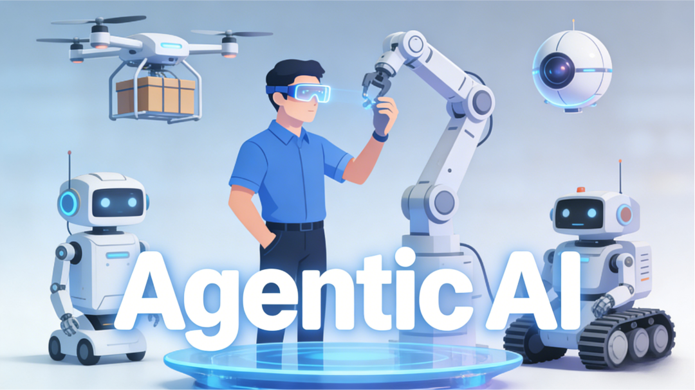

2025年，AI Agent的应用发展给了我们很多惊喜，也用实际数据展现了它的落地速度、发展潜力与应用前景。2026年，AI Agent又会有哪些应用与发展趋势呢？

本文，王吉伟频道整理总结了2026年Agentic AI应用发展的十大趋势，帮助大家进一步理解Agentic AI的未来发展。

PS：本文已打包整理成PDF，需要的朋友，可以在公众号主页发消息：250105，获取资源。

【赠书福利见文末】

趋势1：长期自主性与记忆机制突破

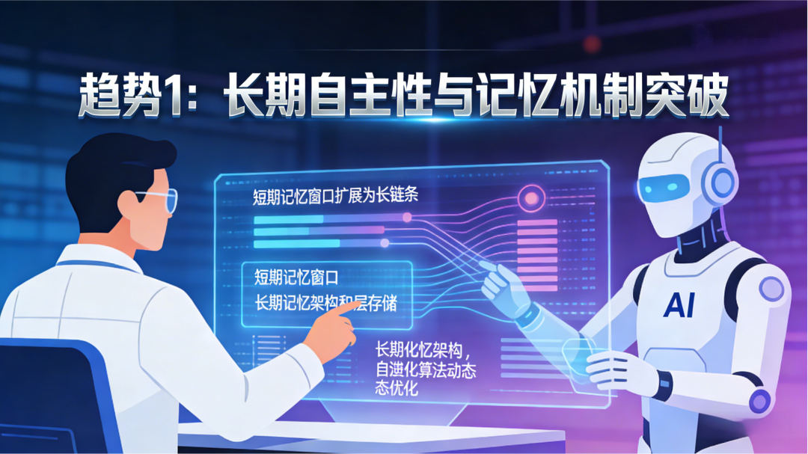

2026年AI Agent在长期自主性方面将实现关键突破，核心体现在记忆机制的根本性改进。Anthropic等公司通过优化记忆机制与Context压缩算法，推动Agent实现数周级持续工作，保持任务目标不偏离、关键信息不遗忘。模型上下文处理能力提升10倍以上，支持处理完整软件项目开发、跨部门业务流程等超大规模任务。

记忆机制的突破主要体现在三个层面：

短期记忆增强：Context窗口扩展技术使得Agent能够处理更长的任务序列，从传统的几千个token扩展到数万个token，支持复杂业务流程的端到端执行。OpenAI正积极推进相关研发，预计个人助理级记忆能力可能在2026年初步实现。

长期记忆架构：Memory Bear等系统构建了类人记忆架构，整合多模态信息感知、动态记忆维护和自适应认知服务，实现LLM记忆机制的全链重构。这种架构包含短期记忆（用于当前任务上下文）和长期记忆（用于存储过往的成功经验与失败教训），使AI Agent能够从历史交互中学习，持续优化其决策路径。

自进化能力：自进化Agent通过强化学习和用户反馈自动优化决策模型，无需人工调参，早期试验版本已实现月均性能提升15%。这种持续学习能力使Agent能够在实际应用中不断改进，适应业务需求的动态变化。

智能体记忆技术的突破，带来了智能体的长期自主性与上下文工程革命。Gartner数据显示，2026年AI Agent将实现数周级任务连贯性，通过记忆机制优化与Context压缩算法解决长时记忆问题。模型处理negligible提升10倍以上，将能够支持完整软件项目开发、跨部门业务流程等超大规模任务。

趋势2：Computer Use能力升级

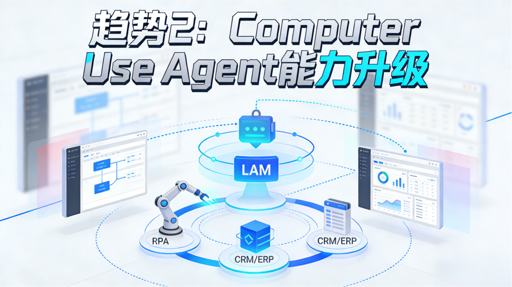

Computer Use Agent（CUA）概念诞生于2024年，经过了2025年的持续演变与进化，2026年Computer Use能力将成为AI Agent的标配，标志着智能体从问答到办事的根本性转变。Agent可像人类一样操作浏览器、桌面软件和企业系统，完成数据录入、系统配置、报表生成等复杂操作。CUA在生产级环境中可用性的提高，将会让Agent实现以下进化：

跨系统操作能力：Agent能够打破系统壁垒，实现跨系统闭环执行。通过模拟人类操作行为，Agent可以在不同的企业系统间自由切换，执行跨系统的业务流程，如从CRM系统提取客户信息，在ERP系统中创建订单，在财务系统中生成发票等。

与RPA深度融合：LAM（大语言模型自动化）与RPA深度融合，形成AI处理不可预测部分RPA负责可靠核心流程的混合自动化方案。这种融合模式充分发挥了AI的智能决策能力和RPA的精确执行能力，大幅提升了自动化的可靠性和效率。

趋势3：多模态交互与感知能力显著提升

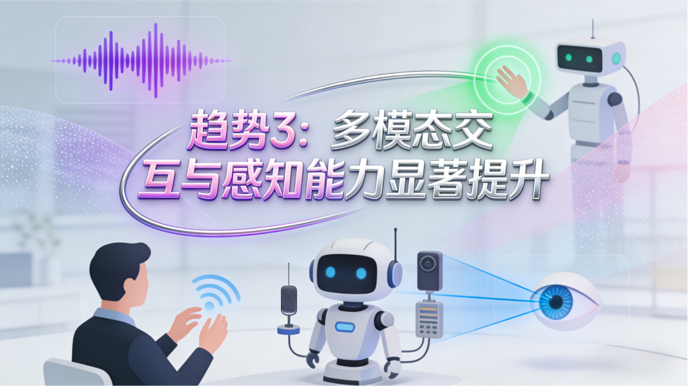

多模态大模型的快速迭代，带来了多模态Agent，也让人机交互全面升级。

多模态Agent增加了多模态感知，强化了推理与行动执行能力融入真实世界任务中，情境识别、自主反应与计划能力显著提升。

多模态智能体能够理解语音、图像、视频、手势等多输入类型，这将大幅提升自动化理解能力，能够进行更自然的人机交互和复杂环境理解，将在客服、医疗诊断、现场识别等场景中实现更佳的效果。

多模态智能体的应用，意味着Agentic AI不仅理解语言，还能感知和操作世界，这将极大提升其在自动驾驶、机器人和IoT等场景的实用性。也让Agent适用于更多业务场景与复杂流程，为超级Agent的诞生奠定了基础。

2026年开始，越来越多企业开始探索使agent能够处理语音、图像、传感数据等多模态输入，提升实际业务场景的感知与执行能力。多模态Agent的典型应用语音Agent，在2026年将迎来爆发式增长，a16z预测输入框将消亡，Agent通过观察用户行为主动介入并提供待审核的行动方案。

趋势4：多Agent协作架构将成主流

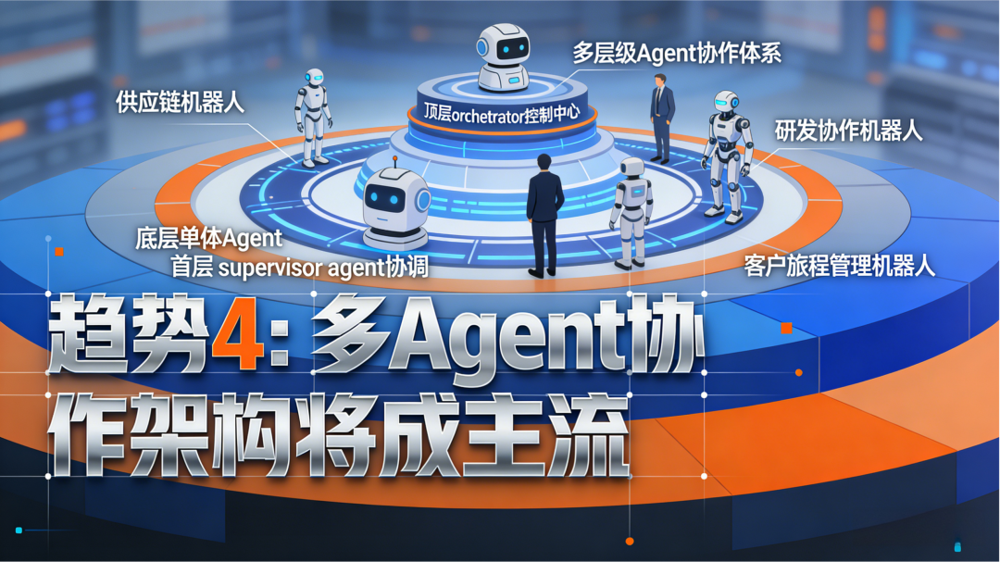

Gartner、Forbes等多机构预测2026年将加速从单一AI Agent向多Agent协作编排（multi-agent orchestration）转型，多智能体能够分工协作、自主决策、实时调整复杂任务（如供应链、R&D pipelines、客户旅程等），以协调复杂流程如供应链优化、研发自动执行等。

在多Agent的基础上，一些机构从业务角度提出了相应的概念。IBM提出了super agent（超级agent）概念，认为企业软件将不仅嵌入agents，还会围绕agent构建交互和控制平面，届时智能体将能够跨场景、跨渠道执行复杂任务，并有统一控制平面和协调仪表盘。Gartner提出未来几年Agent系统将形成跨应用的agentic ecosystem（代理生态系统），推动业务流程重塑。

在技术上，单体Agent将向多级Agent协同系统的演变，技术演进路径为单体模型→协作体系→跨域智能网络。

这同时也是企业业务架构转变，将会形成agent→supervisor agent→orchestrator→agent ecosystem的层级体系。

这种技术与业务的双重演变，也让多智能体编排成为技术核心。

多Agent成为主流架构，标志着AI Agent从Level 1（工具使用）和Level 2（基础任务链）向Level 3（团队协作）的进化，市场真正价值将来自专业化Agent协同作战。

麦肯锡预测，2026年将迎来协作式智能体工作流的广泛应用，多Agent协作团队将成为主流架构，可实现自主分工、跨Agent任务交接与协同优化，核心衡量指标为团队效率与任务交接成功率（无返工比例）。

典型多Agent架构设计是，一个主Agent负责拆解复杂目标，调用多个子Agent（数据Agent、内容Agent、分析Agent、创意Agent、报告Agent等）协同完成任务。这种架构类似于人类组织中的分工协作，每个Agent都有特定的专业技能，通过高效协作完成复杂目标。

自主协作机制将会决定Agent执行效率。多Agent系统实现自主分工、互相检查、自动修复故障，无需等待人工干预，效率提升300%以上。Agent间通过标准化协议进行通信，能够动态分配任务、协调资源、处理冲突，形成高效的协作网络。

业界预测，2026年将是多Agent协作的起点，不同agent之间协同、分工、并自动解决复杂业务目标。多Agent系统也将成为2026 Agentic AI的默认形态之一，从任务处理工具变为业务流程自治引擎。

趋势5：系统架构演进：从单体到分布式智能体网络

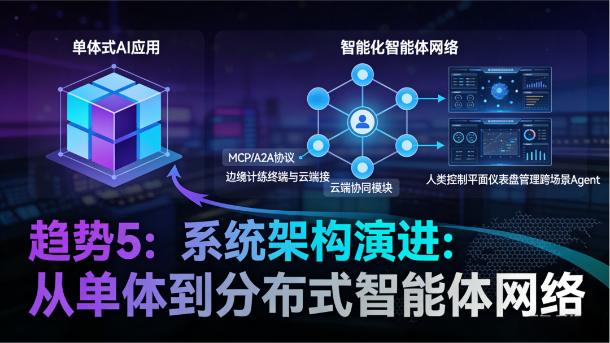

2026年AI Agent的系统架构将发生根本性变化，从单体式应用向分布式智能体网络演进。IBM预测2026年将出现Agent控制平面和多Agent仪表盘，用户从单一入口管理所有Agent任务。

麦肯锡进一步指出，为适配智能体商业发展，企业需额外掌握并部署模型上下文协议（Model Context Protocol，MCP）、智能体间通信协议（Agent-to-Agent Protocol，A2A）、智能体支付协议（Agent Payment Protocol，AP2）等集成技术，同时重构身份管理与客户忠诚度体系。

从单体向智能体网络过渡，会为Agentic AI系统带来一系列变化。

Agentic AI系统将采用控制平面架构。Agent控制平面提供统一的管理界面，支持跨环境（浏览器、编辑器、邮箱、企业系统）统一调度，实现并行工作：编码同时测试、重构同时文档、后台任务运行同时用户专注其他工作。

AI Agent走向分布式部署模式。AI Agent的部署将从集中式向分布式转变，支持边缘计算环境下的本地部署和云端协同。这种架构能够减少延迟、提高响应速度，同时保护敏感数据的安全性。

标准化协议推动更高级别的互操作性。2026年是多Agent系统进入生产环境的关键年份，这一转变依赖于协议成熟度和收敛性。MCP、ACP(Agent Communication Protocol)和A2A、AG-UI、A2UI等标准化协议的推广，将实现不同厂商Agent间的互操作性，形成开放的Agent生态系统。

趋势6：人机协同Agent团队成为组织运营新常态

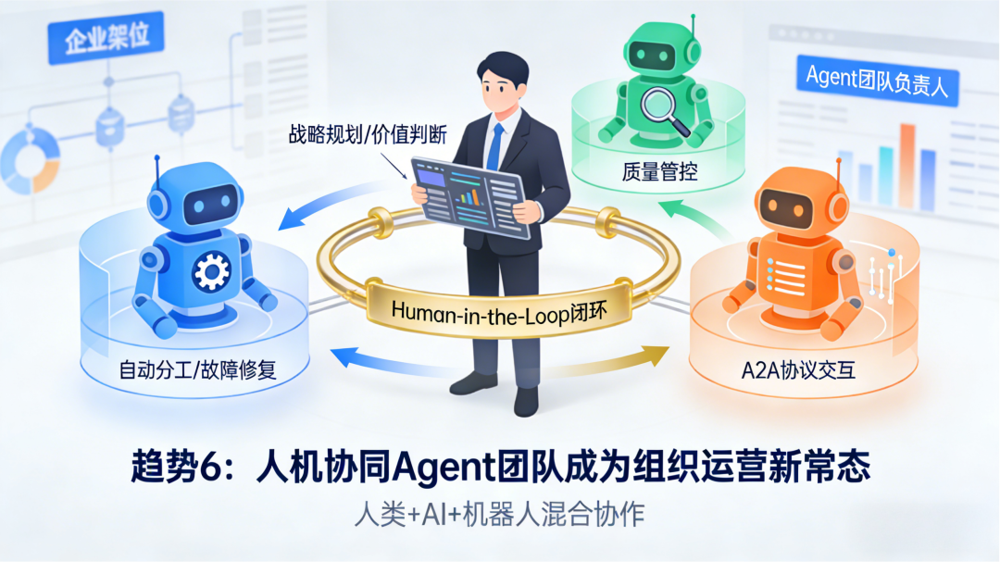

Agent团队不单指由智能体构成的团队，也是智能体与人组成的人机混合团队。多智能体技术的兴起，带来了大量的智能体协作体系，与此同时需要更多人力劳动者参与其中，负责管理、监督等一系列工作。由此诞生了智能体管理者这个职能角色。

2026年，每个员工都将成为智能体管理者，工作重心从执行转向战略方向和结果监督。企业组织架构将进行调整，出现Agent团队负责人等新岗位，负责Agent资源调配、任务分配和质量管控。

IBM与Forrester的预测报告显示：2026年多Agent团队将实现自主分工、互相检查、自动修复故障，无需人工干预；人机协作也将基于Agent展开，企业应用将从用户中心设计转向员工+Agent的协同设计，支持数字劳动力与人类协作。

SearchUnify认为，2026年，Agentic AI将会走向协作生态。人类负责长期规划、监管与价值判断，AI agents负责执行、优化与反馈循环，进而形成“人-机混合工作流”模式。这种人机混合协作模式会成为组织调整人才结构、重新设计业务流程的重要推动力。

人机混合协作也将是组织工作流程创新的方向，人类负责监督、战略与价值判断，AI agent承担执行与优化。

人机混合协作的典型应用就是Agentic AI运行模式所采用的人类在环（Human-in-the-Loop，HITL），人类参与到AI的决策、执行、监督或迭代过程中，并非让AI完全自主运行，核心是实现“AI自主执行+人类关键干预”的协同闭环。比如能力层的「Orchestration（编排）」模块中，人类可介入智能体的工作流调整；「Controls（管控）」模块里的政策合规验证，需人类参与敏感操作审核。

当前阶段的Agentic AI离不开人类的监督，未来的自主Agent同样需要纳入到人类可控范围之内，人机混合协作将是Agentic AI的鲜明特征。

McKinsey预计未来的工作模式将成为人类+AI agent+机器人协作的形态，人类不会被简单替代，而是转向更高层次的监督、设计与联合决策任务。

2026年开始，纯Agent团队将胜任一些无需人工干预的应用场景，基于Agent的人机协作模式也将在广大组织中兴起，Human-AI混合协作（Hybrid Agency）将成为组织运营新常态。

趋势7：企业级应用渗透率跨越式增长

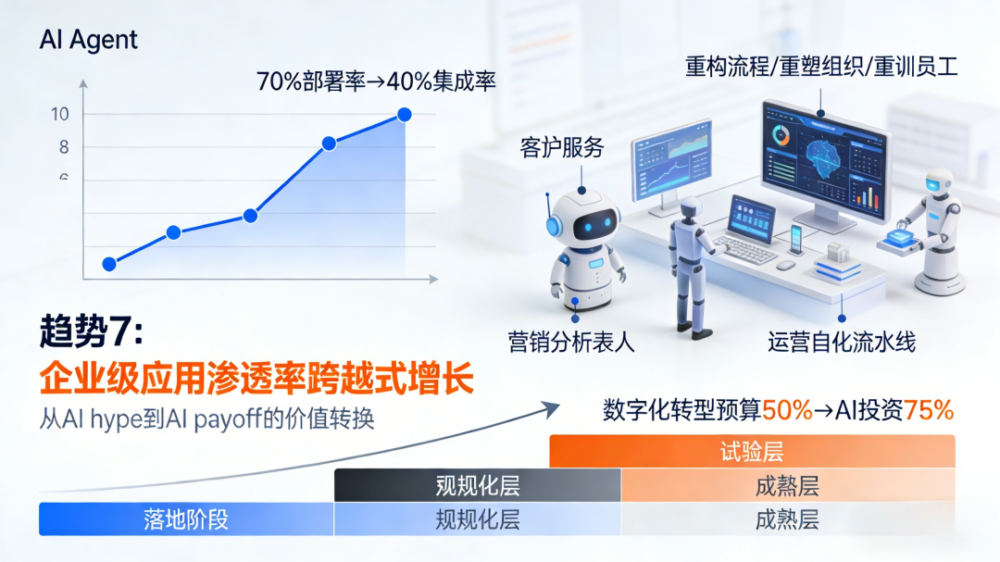

2026年企业级AI Agent应用将实现爆发式增长，多家权威机构的预测数据印证了这一趋势。其中麦肯锡的调研数据更清晰揭示了"部署热"与"规模化冷"的落地鸿沟。

麦肯锡专项洞察数据显示，尽管2026年70%的企业将部署AI Agent覆盖客户服务、营销、运营等关键职能，但落地进程存在明显分层：39%的组织已启动AI Agent试验，仅23%的企业实现单一业务职能内的规模化扩展，全公司级规模化应用的企业占比不足7%。

这一现象的核心原因在于部署Agent并非简单对接API，而是需要重构流程、重塑组织与重训员工，多数企业仍停留在试用或验证阶段。

在经历了初步的ROI测试之后，很多企业已经初步总结出了Agent的应用方向与场景，因此2026年开始主流企业都将大规模嵌入Agentic AI。Gartner预测至2026年底约40%企业应用将集成任务型AI agents，远超2025年（<5%）的水平，标志着Agentic AI从概念进入主流生产环境。

在企业投资趋势方面，德勤预测2026年50%的组织将超过50%的数字化转型预算投入AI自动化，Agentic AI的投资比例可能达到75%。IBM的研究显示，企业AI投资占IT支出的比例将从2024年的12%增长到2026年的20%，增长超过三分之二。

麦肯锡进一步补充，92%的企业计划在未来三年增加AI投资，但仅有1%的领导者认为其公司在AI部署方面已达成熟阶段（AI完全融入工作流程并产生显著业务成果）。

2026年也被行业专家视作AI必须展示硬性商业回报的关键节点。有分析认为，技术成熟虽然快速，但投资者和企业不会继续容忍“没有ROI”的项目。AI agent的成功部署必须直接对应业务成果，而不是实验式应用。因此，2026将是广大企业从AI炒作向AI回报转换的分水岭。

同时，越来越多的观点认为，2026将是模型推理与实时执行价值显现的一年，企业的关注重点将从大规模训练转向部署并让agent持续生成价值。

可以预见，在各种因素的影响之下，随着Agentic AI与企业融合速度的提示与落地难题的解决，2026年将会有更多组织投入该技术的ROI将会逐步上升，将会有更多企业加入投资力度，企业级应用的渗透率将会实现跨越式增长。

趋势8：行业专用Agent深度渗透

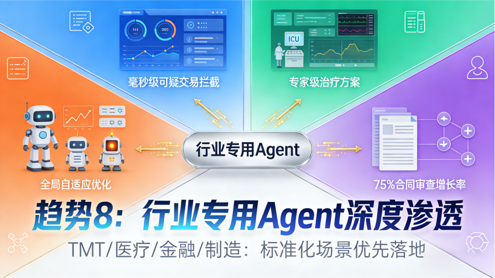

2026年行业专用Agent将成为投资热点和应用主流，市场从通用Agent转向为特定领域和工作流设计的专用系统，这些Agent对上下文、约束条件和成功标准有更清晰的理解。

编程领域Agent的发展就是一个很好的案例，极速迭代的新技术让编程Agent日新月异，快速发展出了vibe coding等模式的Agent产品与解决方案。在vibe coding的影响下，2025年还诞生了vibe workflow、vibe video等智能体概念，对应于Agentic Workflow、video等垂直领域。

在国内，影音领出现了多种形态的AI Agent产品与模式，AI漫剧的火爆推动更多漫剧Agent产品的诞生。

麦肯锡明确指出，AI Agent在IT服务管理、知识管理领域的应用最为普遍；分行业看，科技、媒体与电信（TMT）行业、医疗健康行业的AI Agent渗透度最高，远超其他行业，核心原因在于这些领域流程清晰、标准化程度高、数据充分且容错率高。

金融行业应用：金融合规Agent能够监控监管变化、识别受影响政策、更新内部工作流并创建完整审计链。智能投顾Agent团队提供个性化投资建议和风险评估，交易系统中的Agent能够毫秒级识别并阻止可疑交易。

医疗健康领域：医疗诊断Agent整合多源医疗数据，提供个性化治疗方案和预后评估，准确率达到专家水平。在ICU环境中，Agent实时监控生命体征并标记异常，基于治疗计划安排随访，生成诊断笔记和摘要。

制造业智能化：2026年的智能工厂将出现由多个AI智能体组成的协作网络，这些智能体分别负责供应链预测、生产工艺优化、设备预测性维护、质量控制等，并能相互通信、动态调整，实现生产系统的全局自适应优化。

法律与合规应用：LegalTech和RegTech领域，具备多步推理能力的AI Agent正在革新业务流程自动化。2025年LegalOn合同调查显示，AI用于合同审查的比例从2024年初的8%增长到2025年的14%，同比增长75%，近三分之二的公司正在积极评估AI解决方案。

事实证明，越是以往难以实现端到端自动化的行业及应用场景，在引入Agentic AI之后往往出现更好的降本增效提质表现，行业专用Agent的潜力巨大。在多模态、多Agent等技术以及跟多Agent协议的加持之下，2026年成为是专用Agent的表现之年。

2026年也将是各种AI Agent应用的爆发元年，广泛应用于科研、金融、工业制造、教育、互联网、医疗卫生、医药研发、消费等领域中小企业成为应用主力军，通过SaaS模式快速获取Agent能力，实现数字化转型。

趋势9：Agentic AI重构商业模式经济价值初显

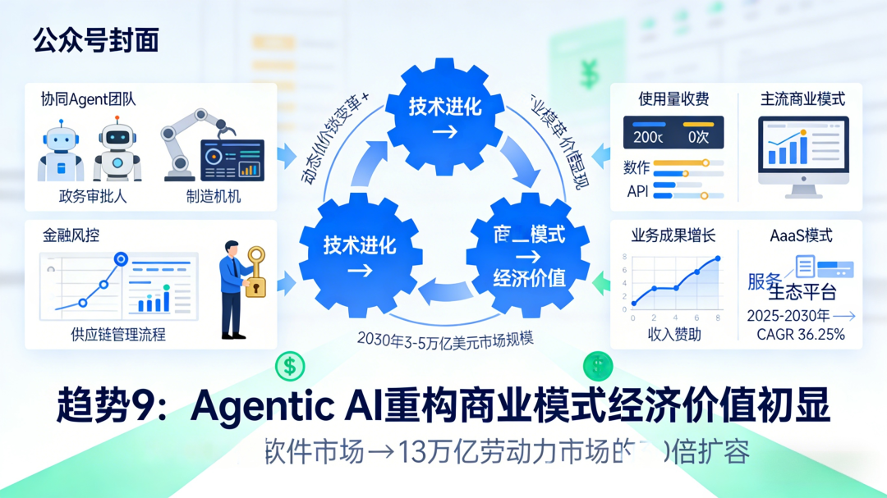

随着AI Agent从单个专家进化为协同作战的团队，广泛渗透进入政务审批、智能制造、金融风控、供应链管理等关键领域，2026年智能体经济将进入深化期，成为智能体商业化的关键拐点，推动商业逻辑发生根本性变革。

麦肯锡对智能体商业规模的预测显示，这一领域将迎来长期爆发：到2030年，仅美国B2C零售市场的智能体商业协调收入就可达1万亿美元，全球智能体商业市场规模将高达3-5万亿美元，其影响广度堪比web和移动商业革命，且发展速度更快。

麦肯锡认为，生成式AI（含AI Agent）每年可为全球经济解锁4.4万亿美元及以上价值，软件企业将捕获其中10%-15%；仅营销和销售领域，AI Agent就将贡献60%以上的AI增量价值。

a16z指出，Agentic AI将会重构在市场规模。AI的目标市场正从4000亿美元的软件支出转向13万亿美元的劳动力市场，实现30倍的市场扩容，这从根本上改变了商业逻辑。

Agentic AI带来的新型技术、产品与服务，会催生新型商业模式的涌现。2026年，以下两种商业模式将会成为Agent市场的主流：

按使用量收费：根据Agent执行的操作次数、计算时间、API调用次数或任务完成情况收费；

按价值收费：基于AI Agent产生的实际业务成果收费，如客户支持工单解决数量、招聘成功人数、收入增长贡献等；

Agent即服务（AaaS）：2025年Agent即服务市场规模估计为157.4亿美元，预计到2030年将达到739亿美元，2025-2030年复合年增长率为36.25%。

AI Agent正在推动形成新的产业生态系统，包括Agent开发平台、Agent市场、Agent运营服务等。这意味着，企业不再需要构建所有Agent能力，而是可以从生态系统中获取所需的专业服务，实现快速部署和灵活扩展。

生态的初步形成，正在加速Agentic AI的行业应用速度，并进一步反哺生态的壮大。2026年，由Agentic AI重构的商业模式所带来的经济价值，将会比2025年有着长足的进展，初步呈现规模级。

趋势10：治理与安全成为部署前提

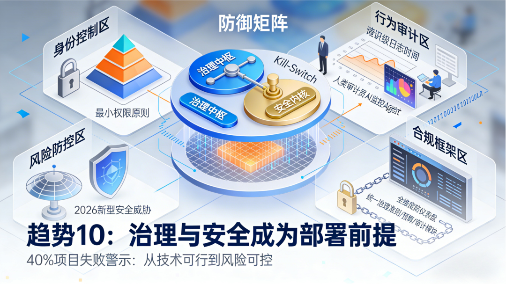

随着Agent开始做决策和执行操作，治理已成为部署Agentic AI的必要条件，特别是在受监管、安全或数据隐私要求高的环境中。

治理的核心机制为：审批阈值+质量门禁+可回滚/可审计，确保风险可控，Agentic AI的设计逻辑将从能否执行转向执行时谁负责，问责制成为Agent产品核心特性。

Gartner预测：40%以上agentic AI项目将在2027年前被取消，原因包括成本、价值不清、风险控制不够等。同时安全专家指出，这一失败率可能更高，因为许多组织缺乏明确定义、身份控制、访问策略等基本治理基础设施。

因此，更多企业将在2026年不得不构建完整的AI安全治理体系、权限/身份控制与监控机制。这意味着，Agent安全、行为异常检测、Kill-Switch机制等将成为技术栈必备能力。

在这其中，数据质量、访问、实时性成为agent成功落地的前提，弱治理会导致模型偏差、失败决策等风险，数据治理将是Agent部署成功的关键基础。

IDC预测，到2027年，40%的亚太地区企业将用统一协调的治理取代孤立的AI监督

建立Agent行为准则、权限管理、预算控制和审计跟踪系统，防止Agent越权操作和资源滥用。这种情况下，统一的Agentic AI治理框架将开始在广大组织中普及。

2026年AI Agent的安全风险将呈现新的特征，传统的安全防护措施已无法应对Agent带来的自主威胁、Shadow AI系统风险等新型威胁。同时Agentic系统治理必须涉及安全架构设计，对Agent提出了安全要求。

这就需要Agentic AI框架需要涉及访问控制和最小权限、工具允许列表和参数约束、输入验证和内容硬化、内存治理、可观察性和取证级日志记录等多种安全要求。

同时Agent安全与反向收割，也将成为新的技术焦点，用以防止恶意利用Agent进行数据窃取、系统攻击等行为。引入Agent防火墙，监控和过滤Agent的外部请求和内部操作，保障企业数据安全。

2026年开始随着Agent应用量的激增，安全会成为Agentic AI部署与应用的基本战略需求，涉及身份验证、行为监控、违规保护等方面，这使得安全与身份成为必备治理能力。

全文完

王吉伟频道新书《一本书读懂AI Agent：技术、应用与商业》已出版，轻松读懂系统掌握AI Agent技术原理、行业应用、商业价值及创业机会，欢迎大家关注。

特别声明

本文为澎湃号作者或机构在澎湃新闻上传并发布，仅代表该作者或机构观点，不代表澎湃新闻的观点或立场，澎湃新闻仅提供信息发布平台。申请澎湃号请用电脑访问https://renzheng.thepaper.cn。